# S&S 笔记

# 学习视频：[https://www.bilibili.com/video/BV1g94y1Q76G](https://www.bilibili.com/video/BV1g94y1Q76G)

# 编号：101G06D04

# 划重点（抓瞎版）

> LT 和 ZT 各至少出一道超级大题，其余以小计算题形式出现

> 以下“例题”为课后习题

| 章节<br/>                                | 考点<br/>                                                                                                                                                                                                                                                                                                                                         | 注意点<br/>                                                                                                                                                                                                                                                                                                                                             |
| ---------------------------------------- | ------------------------------------------------------------------------------------------------------------------------------------------------------------------------------------------------------------------------------------------------------------------------------------------------------------------------------------------------- | ------------------------------------------------------------------------------------------------------------------------------------------------------------------------------------------------------------------------------------------------------------------------------------------------------------------------------------------------------- |
| **第一章**<br/>**信号概念**<br/>         | 1. 离散 / 连续 信号图<br/>2. **冲激函数的性质（尤其是 **$\delta\{f(t)\}$**的变换 ）**<br/>3. 信号基础变换--平移/反褶/比例变换<br/>4. 奇分量/偶分量 <br/>                                                                                                                                                                                            | 1. 在 FT 中 F(jw)的余弦量（实部）的逆变换为 f(t)的偶分量<br/>2. 看 1-5 1-11<br/><br/>                                                                                                                                                                                                                                                                   |
| <br/>                                    | <br/>                                                                                                                                                                                                                                                                                                                                             | <br/>                                                                                                                                                                                                                                                                                                                                                   |
| **第二章**<br/>**LTI**<br/>              | 1. 线性/时不变/因果的判定<br/>2. 解微分/差分方程 的 齐次解$y_n$/特解$y_p$/自由响应$y_f$/强迫响应$y_F$以及$y_{zi} ,y_{zs},y_{ss}$<br/>3. **利用线性 / 微积分性质求响应****｛**起始状态对应零输入，激励对应零状态｝<br/>4. 求冲激响应与阶跃响应<br/>5. 卷积/卷积和计算与电路上的应用｛注意利用性质，如一导一积，或直接用 s 域求解｝<br/>6. 框图<br/><br/> | 1. 离散下慎用 Z 变换，正确率不高，如 2-12<br/>2. 2-16 2-17 典型求卷积积分/卷积和，注意积分限<br/>3. **注意时移特性！！是整体的！！**<br/>4. 看 2-9<br/><br/>                                                                                                                                                                                            |
| **第三章**<br/>**FS/FT**<br/>            | 1. 傅里叶级数的三角/复数指数形式以及其转化、奇谐/偶谐<br/>2. **FT 的性质** 正逆变换 / 熟练掌握 **矩形波、三角波**转换 <br/>3. 三角信号调制，周期信号 的 FT 表达式，卷积<br/>4. 理想低通滤波器<br/>5. 求 LTI 响应<br/><br/>                                                                                                                        | 1. FS 中三角形式$\sum_{n=1}^{+\infty}$,指数形式$\sum_{n=-\infty}^{+\infty}$<br/>2. 考前过一遍 FS 典型信号 <br/>3. <br/>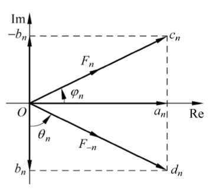<br/>1. 时域**微分定理** 可以用画图解决 见 3-15  3-16<br/>2. 3-23 周期信号的 FT 表达典型例题<br/>3.    <br/>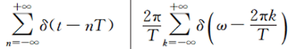<br/><br/>1. 3-25 解 LTI<br/><br/> |
| **第四章**<br/>**抽样、调制与解调**<br/> | 1. 最低抽样频率 $f_s$ 奈奎斯特频率，$T_s$ 奈奎斯特间隔选择/判断/求解<br/>2. 调幅与解调<br/>                                                                                                                                                                                                                                                           | 5-1 **5-2** **5-10 5-11** 一共就没几道题<br/><br/>                                                                                                                                                                                                                                                                                                      |
| **第五章**<br/>**LT**<br/>               | 1. 单/双边拉氏变换、ROC<br/>2. 基于**性质和典型变幻**下的正变换、部分分式展开法逆变换，卷积｛初值/终值定理｝<br/>3. 系统函数 ，**频响（三角信号、阶跃信号、强迫响应）求****稳态响应**<br/>4. 解微分方程，电路等效计算<br/>5. 零极点图、幅频相频特性曲线手绘、框图<br/>                                                                            | 
$$
s = \sigma+j\omega 
$$

<br/>1. **记得写 ROC**<br/>2. 微分性质 / 周期性质 / 初值终值定理<br/>3. 注意三角*t 后的逆变换<br/>4. **注意时移特性！！是整体的！！ ****见 6-3 a  **	1. **(t-2)u(t-2) 而不是 t u(t-2) **<br/>5. 6-8 电路典型<br/>6. 6-19 6-20 6-21 解 LTI / H（s） 典型 <br/>7. 6-27 / 6-30｛求初始条件｝ 框图典型<br/><br/>                         |
| **第六章**<br/>**ZT**<br/>               | 1. 单/双边 Z 变换、ROC<br/>2. 基于**性质和典型变幻**下的正变换、部分分式展开法逆变换，卷积｛初值/终值定理｝<br/>3. 系统函数 ，频响（三角信号、阶跃信号、强迫响应）**求****稳态响应**<br/>4. 解差分方程<br/>5. 零极点图、幅频相频特性曲线手绘、框图<br/>                                                                                           | 
$$
z = e^{sT}
$$

<br/>1. **记得写 ROC**<br/>2. 微分性质 / 周期性质 / 初值终值定理<br/>3. 注意三角*$r^n$<br/>4. **注意时移特性！！是整体的！！**<br/>5. 例 7-7（3） 求差分方程｛配凑法解三角｝<br/>6. 例 7-20 7-21 初值定理 + 零极点图 + 系统函数 + 幅频特性曲线<br/>7. 7-28 框图<br/>                                                                            |

| FT<br/>                                                                                                                                               | LT<br/>                                                                                               | ZT<br/>                                                                                                                                               |
| ----------------------------------------------------------------------------------------------------------------------------------------------------- | ----------------------------------------------------------------------------------------------------- | ----------------------------------------------------------------------------------------------------------------------------------------------------- |
| <br/><br/>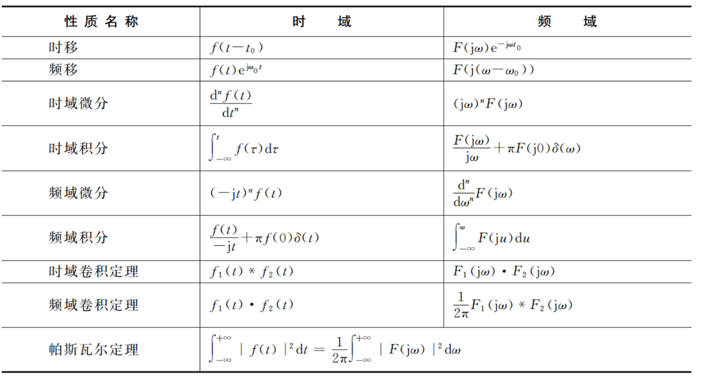<br/><br/> | <br/>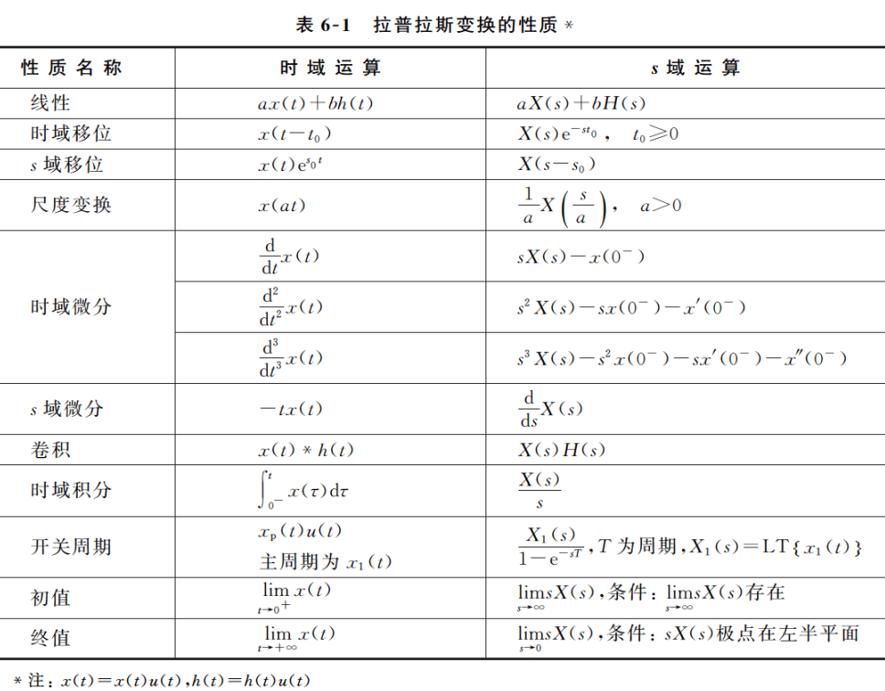<br/><br/> | <br/>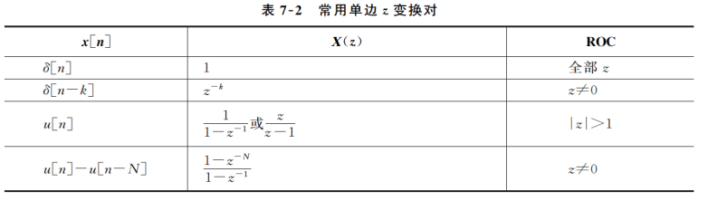<br/><br/><br/> |

# 前瞻

## 学习目的：**用拉氏变换解决微分方程，Z 变换解决差分方程**

## 学习难点：分清 LT 和 ZT

> [参考文章](https://www.zhihu.com/question/21064916)

## 高等数学基础：常系数微分方程 + 差分方程

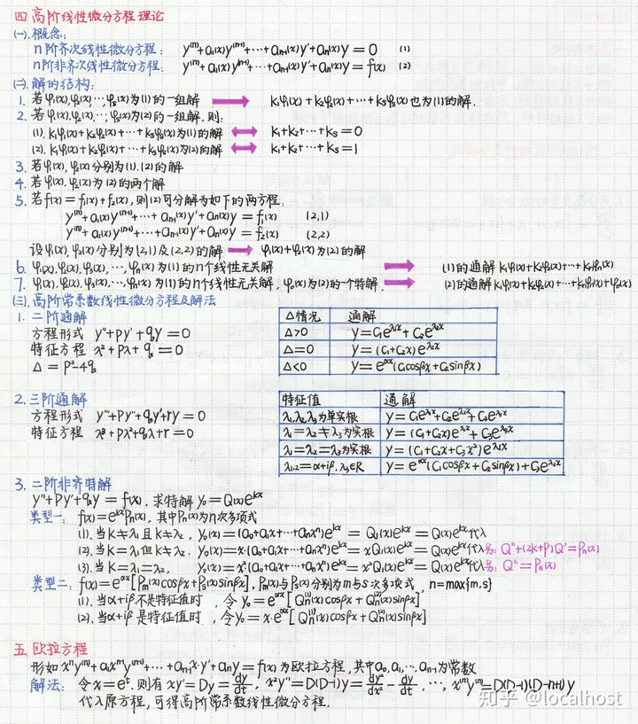
**积化和差**

## 电路知识

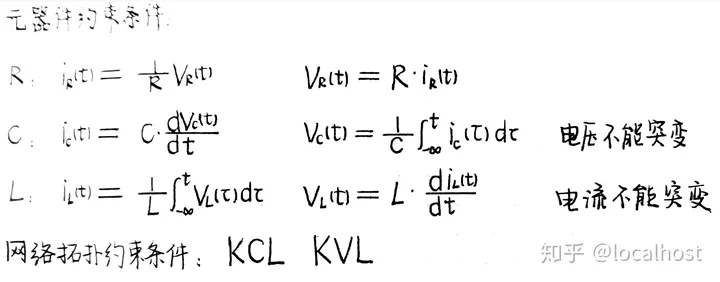

## 知识框架

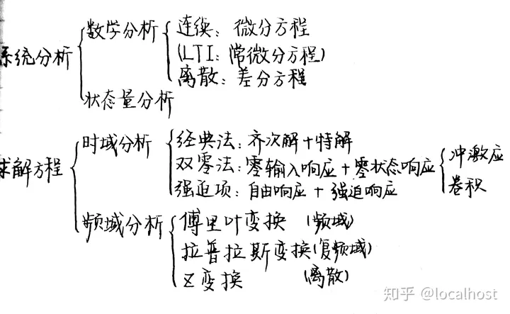

# 信号与系统基本概念

## 概念：

信息：能让我看清世界的**咒语（状态描述）——mantra**
信息量：与承载发生可能性成负相关
$  =-\log_{2}\left[p(x)\right]$
信号（signal）：承载咒语的媒介（光、电、声音）
系统（system）：input&output

## 分类：

维度：一维（声音）、二维（rgb 图像）、三维（视频）
性质：确定性信号/随机信号
自变量范围：时域/频域有限信号
一维信号：连续 x(t){模拟、量化}、离散 x[n]{抽样、数字}


周期性：$x(t)=x(t+mT)$、$x[n]=x[n+mN]$

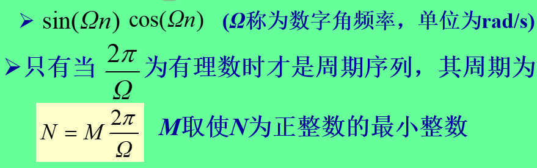

对称性：奇信号/偶信号/奇谐信号/偶谐信号

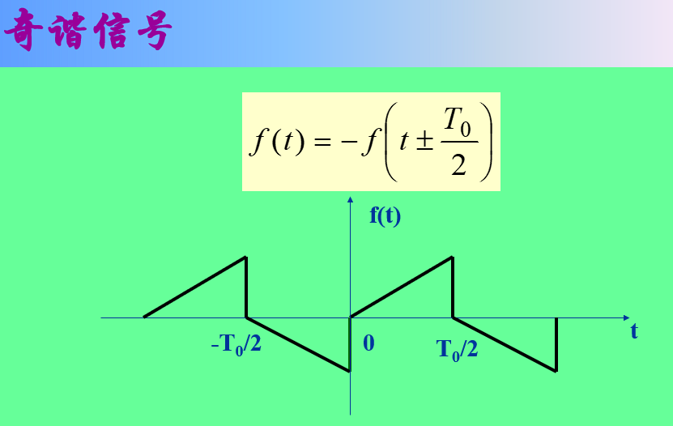

> [!TIP]
> **一个信号可被唯一地拆分为一奇一偶两个子信号**

> $$
> x(t)=[\frac{x(t)+x(-t)}{2}]+[\frac{x(t)-x(-t)}{2}]=x_e(t)+x_o(t)
> $$

## E&P

在一定范围内：

$$
\begin{aligned}E&=\sum_{n=n_1}^{n_2}x^2[n],P = \frac{1}{n_2-n_1+1}\sum_{n=n_1}^{n_2}x^2[n]\end{aligned}
$$

$$
\begin{aligned}E&=\int_{t_{0}}^{t_{1}}|x(t)|^{2}dt,P&=\frac{1}{t_{1}-t_{0}}\int_{t_{0}}^{t_{1}}|x(t_{1})|^{2}dt\end{aligned}
$$

## 复指数信号

### 概念

**公式：**$x(t)=A\mathrm{e}^{(\sigma+\mathrm{j}\omega_0)t}=A\mathrm{e}^{st}$

## 典型信号

### 连续信号

#### 阶跃信号

$$
u(t)=\begin{cases}0&t<0\\[2ex]1&t>0\end{cases}
$$

0 处的值不影响（有限个断点不影响函数积分，即两函数仍然相等【勒贝格定义】）

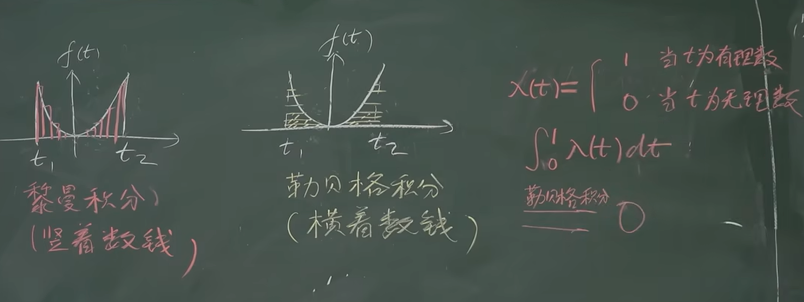

#### **冲激函数--无线窄的方波**

$$
\delta(t)=\begin{cases}+\infty\\0\end{cases}
$$

注意，这**一奇异信号由****阶跃信号求导**而来
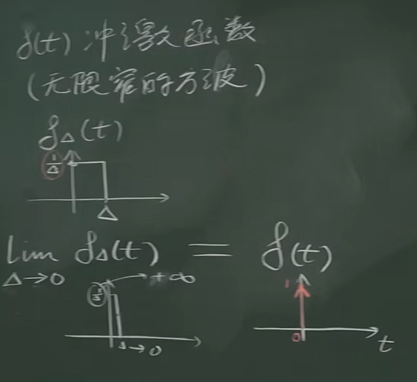

##### **冲激函数的性质**

**补充：注意微分/积分与 阶跃信号的关系**
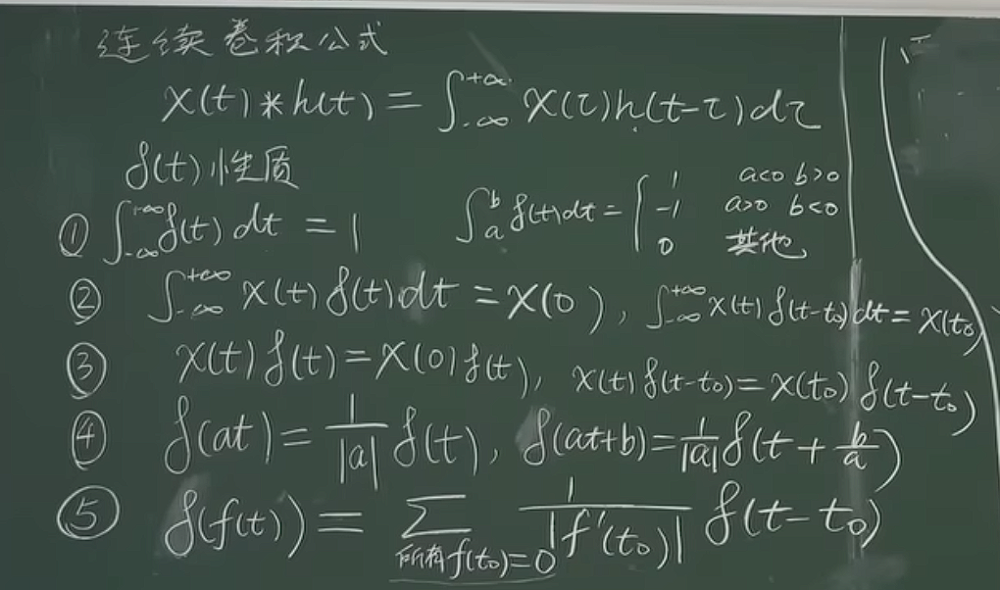

1. $$
   \int_{-\infty}^{+\infty}\delta\left(t\right)dt=1,\int_{a}^{b}\delta(t)dt=\begin{cases}1\quad(a<0,b>0)\\-1\quad(a>0,b<0)\\0\quad else\end{cases}，偶对称
   $$

   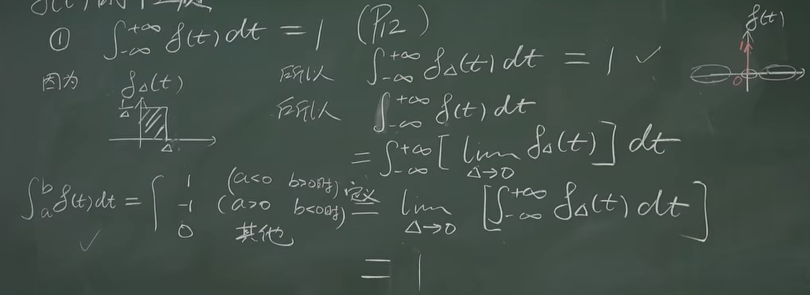
2. $\int_{-\infty}^{+\infty}x\left(t\right)\delta\left(t\right)dt=x\left(0\right)$ 抽样
   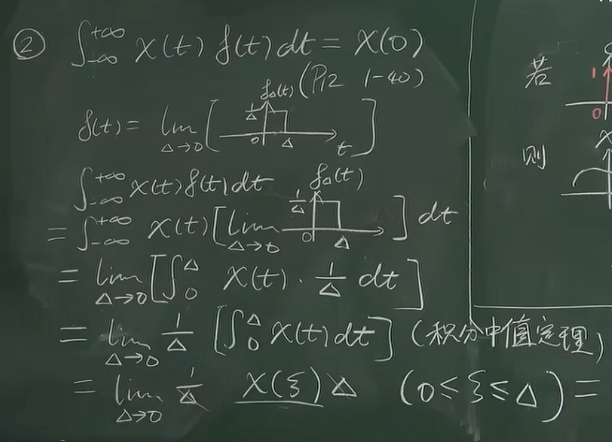
3. $$
   f_1(t)=x\left(t\right)\delta\left(t\right)=x\left(0\right)\delta\left(t\right)=f_2(t)
   $$

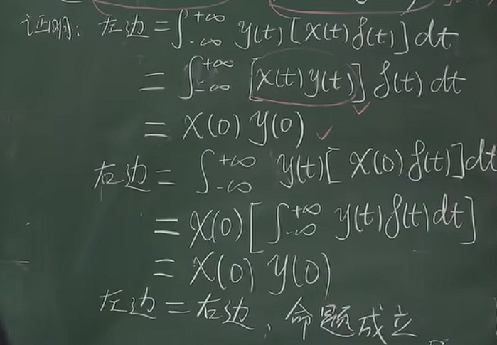

1. $$
   \delta\left(at\right)=\frac{1}{|a|}\delta\left(t\right)
   $$
2. $\delta\left(f\left(t\right)\right)=\sum_{\text{所有}f\left(t_{0}\right)=0}\frac{1}{\left|f^{\prime}\left(t_{0}\right)\right|}\delta \left(t-t_{0}\right)$。此为第四点的扩展
3. $$
   \lim_{w\to+\infty}\frac{\sin\left(wt\right)}{\pi t}=\delta\left(t\right)
   $$
4. $$
   x(t)*\delta(t) = x(t)
   $$
5. 对于冲激偶函数，有：${\int_{-\infty}^{\infty}f(t)\delta^{\prime}(t)\mathrm{d}t=-f^{\prime}(0)}$

#### **抽样函数**

傅里叶变换后为矩形，用于抽样

$$
Sa(t)={\frac{\sin t}{t}} \quad sinc(t）={\frac{sin(\pi t)}{\pi t}}
$$

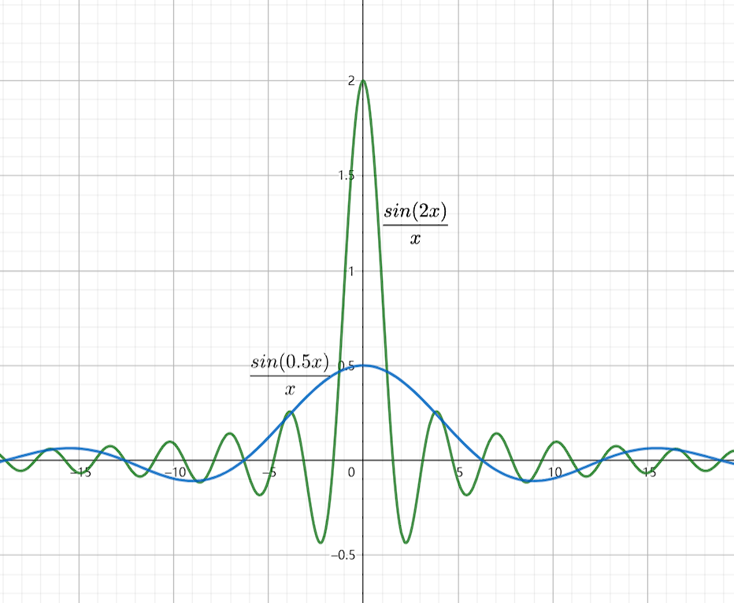

$$
特别的，有\int_0^\infty\frac{\sin t}t\operatorname{d}t=\frac\pi2,\quad\int_{-\infty}^\infty\frac{\sin t}t\operatorname{d}t=\pi ,\quad  \int_{-\infty}^{+\infty}\frac{\sin\left(wt\right)}{t}dt=\pi\left(w>0\right)
$$

### 离散信号

#### 单位脉冲信号（类比冲激信号）

$$
\delta[n]=\begin{cases}1,&n=0\\\\0,&n\neq0\end{cases}
$$

用于采样。因此，一个序列可用$x[n]=\sum_{n_0=-\infty}^{+\infty}x[n_0]\delta[n-n_0]$表示

#### 单位阶跃信号（类比阶跃信号）

$$
u[n]=\begin{cases}1,&n\geqslant0\\\\0,&n<0\end{cases}
$$

$$
有 \quad u[n]=\sum_{n_0=-\infty}^{+\infty}u[n_0]\delta[n-n_0]=\sum_{n_0=1}^{+\infty}\delta[n-n_0]
$$

#### 矩形序列

$$
R_N[n]=\begin{cases}1,&0\leqslant n\leqslant N-1\\\\0,&\text{else }\end{cases}
$$

#### 单边指数序列

$$
x[n]=a^nu[n]
$$

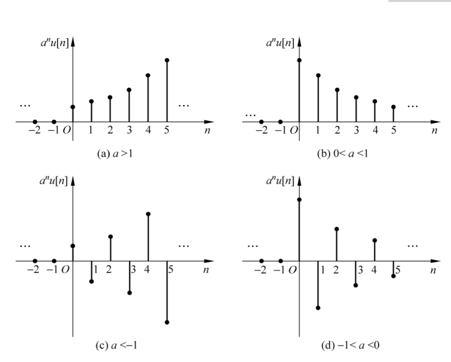

#### 三角序列

$$
x[n]=\sin(\Omega_0n)\\\\x[n]=\cos(\Omega_0n)
$$

#### 复指数序列

$$
x[n]=\mathrm{e}^{\mathrm{i}\boldsymbol{\Omega}_0n}=\cos(\boldsymbol{\Omega}_0n)+\mathrm{jsin}(\boldsymbol{\Omega}_0n)
$$

#### 周期序列

$$
有 ：\sin(\Omega_0(n+kN))\equiv\sin(\Omega_0n)
\\\
即：N\Omega_0=2\pi m
\\\
得到条件：\frac{2\pi}{\Omega_0}=\frac Nm\quad\text{或}\quad 最小正周期N=\frac{2\pi}{\Omega_0}m \quad 是\bold{有理数}
\\\
-\pi\leqslant\Omega_0\leqslant\pi\quad\text{或}\quad0\leqslant\Omega_0\leqslant2\pi 
$$

## 信号基础变换--平移、反褶、比例变换

> [!TIP]

## Remember,对于离散信号，放大要补零，缩小即失真

## 系统

### 连续系统与离散系统

**连续为微分模型、离散为差分模型 **

### **线性系统**：同时满足齐次性和叠加性

> [!TIP]
> **具有频率保持性**
> 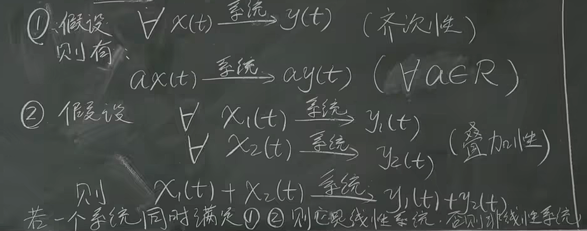
> 微分器、积分器。如$tx(t)、\frac{dx\left(t\right)}{dt}、\int_{-\infty}^{t}x\left(t\right)d\tau $,**满足每一项都是一次项 a·x(t)（常系数（微积分）方程-）**

### **因果系统：**输出只由现在和过去的输出决定，系统响应 迟于 激励信号变化

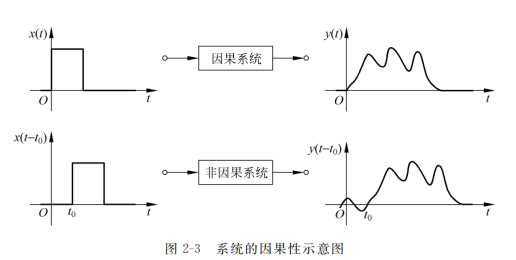

### **即时**（**无记忆）系统/动态系统：**

y(t)的值仅仅取决于 x(t) ，即仅为 **x(t)/x[n] =**
**因果系统**包含**无记忆系统**

### **可逆系统：**存在**反函数**。如积分器是可逆，而微分器不可逆

### 集总参数系统（常微分方程）/分布参数系统（偏微分方程）

### **稳定系统：**输入有界**，则**输出**有界**

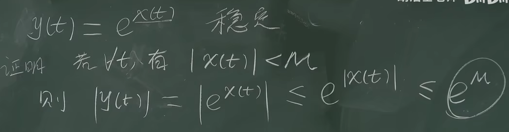
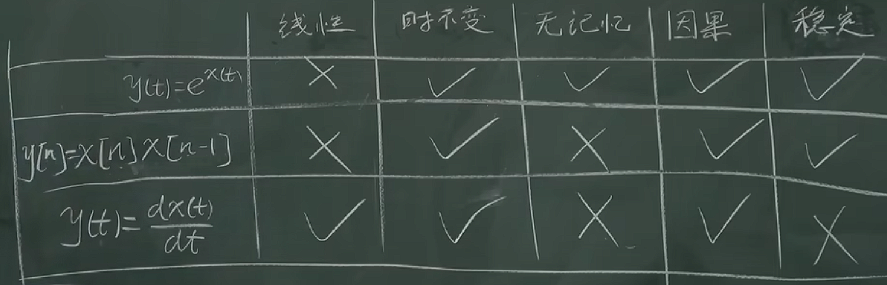

# 线性时不变系统(LTI)的时域分析

## 分析原因：

线性系统意味着系统满足齐次与叠加，即在现实下随着放大因子变大而无损耗、无边际，而不可能；同时叠加性意味着系统随输入数量增加而满足分配率，即无信息丢失，而不可能，故不存在绝对的线性系统。
**线性系统是对现实的近似简单估计**
时不变系统意味着延迟的同步性，即随时间变化无磨损无丢失，而不可能
**无法研究不可控的时间，故选择简单的时变系统，并最大近似**
**如果将输入信号用一组基本信号的线性组合来表示，那么输出信号就是将这些****基本信号的响应加权叠加****的信号**

## 通过常系数微分方程描述连续 LTI

> 看高数上最后一章
> 通解以高数为准（其实都是对的，高数上的更简洁）

## 通过常系数差分方程描述离散 LTI

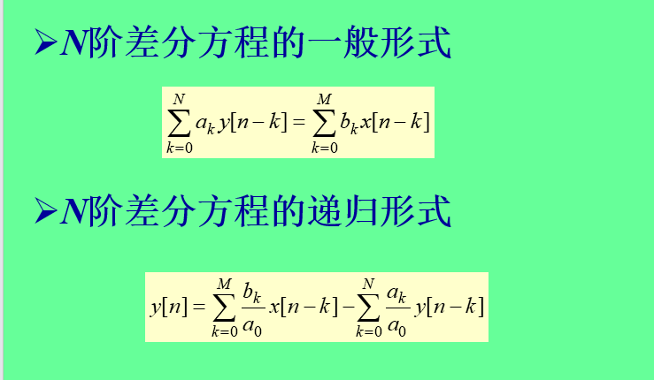
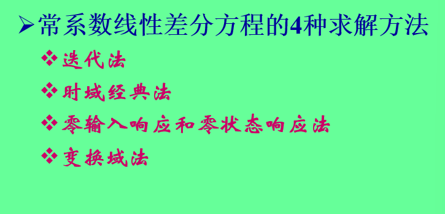
**例题**
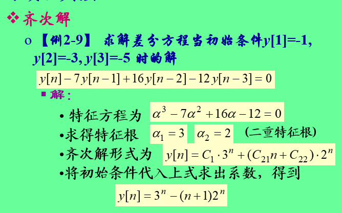
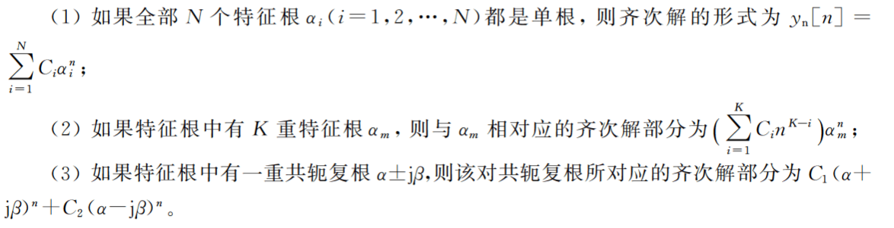
**特解类比常系数非齐次微分方程特解形式**

## 时域响应:零输入(无外部激励 RLC 电路变化)/零状态(0-给激励)

> 约等于**齐次解/通解，****但不等于**
> 右端最好不要出现冲激信号

### 概念

1. **响应区间**：$0^+ >> \infty$
2. **起始状态**：$0^-
   $
3. **初始条件**：$0^+$ **用于决定齐次解的系数**
4. 瞬态响应：趋于无穷时靠近 0 的分量
5. 稳定响应：趋于无穷时保留的分量

### 求解

> [!TIP]

##### 基于 待定系数法 求解 冲击函数 零状态 0+

[https://blog.csdn.net/HollyRan/article/details/104882403](https://blog.csdn.net/HollyRan/article/details/104882403)
**算好后 右边的冲激信号就可以滚蛋啦**

**方法如下：**

1. 设 左边最高项 = 等式右边最高阶次项
   例如，对

$$
\mathrm{\frac{d^3}{dt^3}y(t)+4\frac{d^2}{dt^2}y(t)+5\frac{d}{dt}y(t)+2y(t)=\delta^{\prime\prime}(t)+3\delta(t)}
$$

令

$$
\frac{\mathrm{d}^3}{\mathrm{d}\mathrm{t}^3}\mathrm{y}(\mathrm{t})=\mathrm{a}\delta^{\prime\prime}(\mathrm{t})+\mathrm{b}\delta^{\prime}(\mathrm{t})+\mathrm{c}\delta(\mathrm{t})+\mathrm{d}\mathrm{u}_\triangle(\mathrm{t})
$$

$\mathrm{u}_\triangle(\mathrm{t})$为 0-到 0+ 的一小段阶跃信号

1. $$
   \text{接着对}\frac{\mathrm{d}^3}{\mathrm{d}\mathrm{t}^3}\mathrm{y}(\mathrm{t})\text{依次积分且不考虑}\mathrm{u}_\triangle\text{ (t)的积分结果,则有}
   $$

$$
\frac{\mathrm{d}^2}{\mathrm{d}\mathrm{t}^2}\mathrm{y}(\mathrm{t})=\mathrm{a}\delta'(\mathrm{t})+\mathrm{b}\delta(\mathrm{t})+\mathrm{c}\mathrm{u}_\triangle(\mathrm{t})
$$

$$
\frac{\mathrm{d}}{\mathrm{dt}}\mathrm{y(t)}=\mathrm{a\delta(t)}+\mathrm{bu}_\triangle(\mathrm{t})
$$

$$
\mathrm{y(t)=au_\triangle(t)}
$$

这里暂时忽略积分出来的 y''(0-) y'(0-) y(0-)

1. 代入原方程，通过待定系数解出系数

$$
\begin{cases}&\mathrm{a}&=&1\\&\mathrm{b+4a}&=&0\\&\mathrm{c+4b+5a}&=&3\\&\mathrm{d+4c+5b+2a}&=&0&\end{cases}
$$

得

$$
\begin{cases}&\text{a}&=&1\\&\text{b}&=&-4\\&\text{c}&=&14\\&\text{d}&=&-38\end{cases}
$$

1. 最后得到结果，就是 0- + 系数

$$
\begin{gathered}
\mathrm{y(0+)=y(0-)+\int_{0-}^{0+}a\delta(t)\:dt} \\
\mathrm{y^{\prime}(0+)=y^{\prime}(0-)+\int_{0-}^{0+}b\delta(t)\:dt} \\
\mathrm{y^{\prime\prime}(0+)=y^{\prime\prime}(0-)+\int_{0-}^{0+}c\delta(t)\:dt} 
\end{gathered}
$$


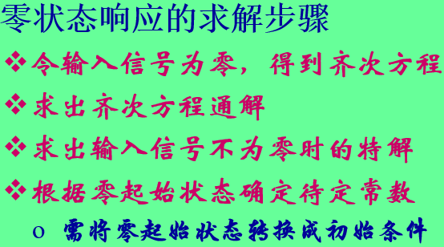
**注意：**
求**零输入**时**根据** $0^+=0^-$
求**零状态**时将**起始状态转换成初始条件** $0^+ - 0^-$

**零输入**(**部分齐次解**)+
**零状态**(**部分齐次解 + 特解**)
**特解直接代入**
**其他基于 0+**

**零状态更复杂**
**例题**

### 冲击响应与阶跃响应

> **积分与微分的关系**
> 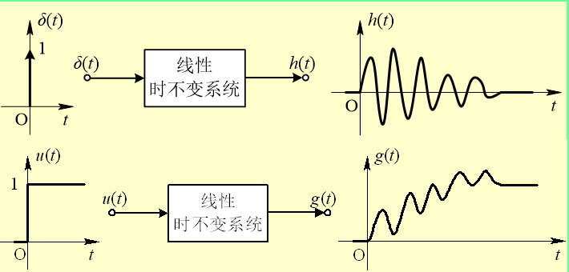

#### 冲击响应 h(t)求解方法

##### 冲击函数匹配法

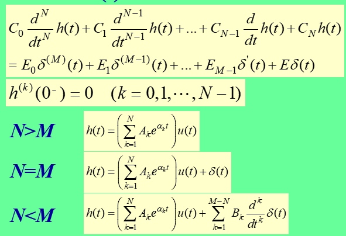

**例题**
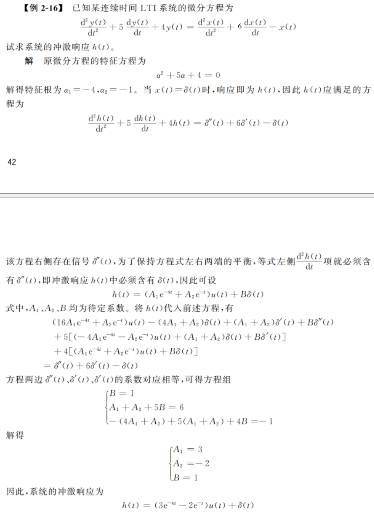

看两边阶数
左边阶数若 <= 右边，则必然出现冲激信号

利用$\delta(t)=\frac{du(t)}{dt}\quad\delta^{^{\prime}}(t)=\frac{d\delta(t)}{dt}$
解决

因为是瞬间的冲激，所以相当于齐次方程
**也可以用拉氏变换求零状态响应解决**
（忽略 x0-和 y0-）

#### 阶跃响应 g(t)求解方法

**例题**
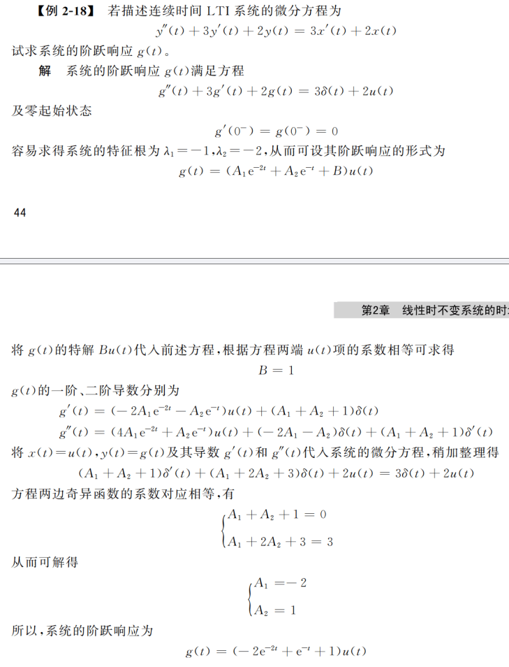

方法同冲激信号求解方法，但
因为右边有值，多了一个**特解**

同理，可用拉式变换求解

### 妙妙总结

> [!TIP]

### 记得最后加上

### u(t)！！u(t)！！u(t)！！u(t)！！u(t)！！u(t)！！u(t)！！

##### 激励 求 零状态

##### **起始状态 和 初始条件 **求 零输入

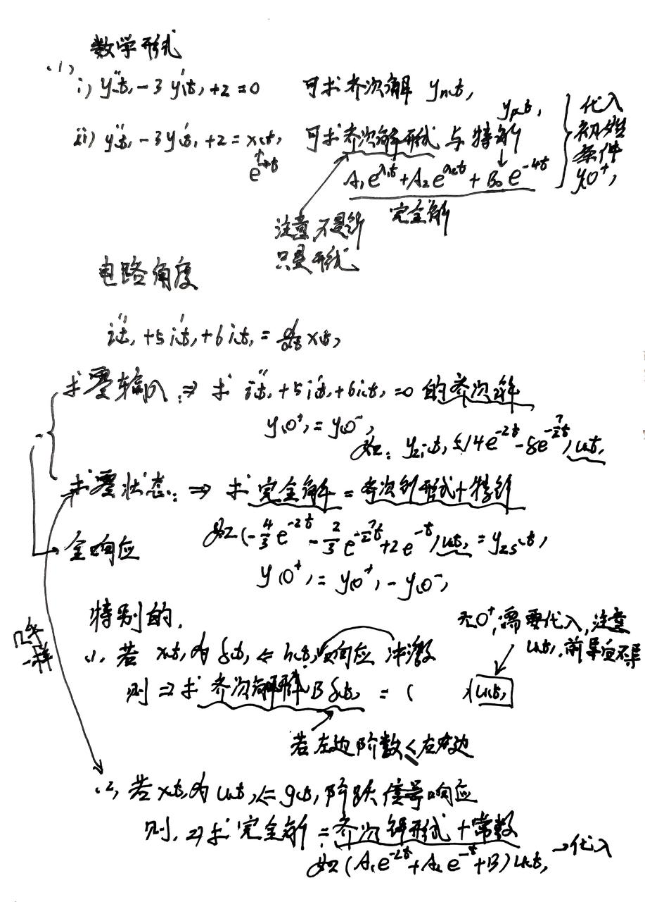

#### 妙妙例题

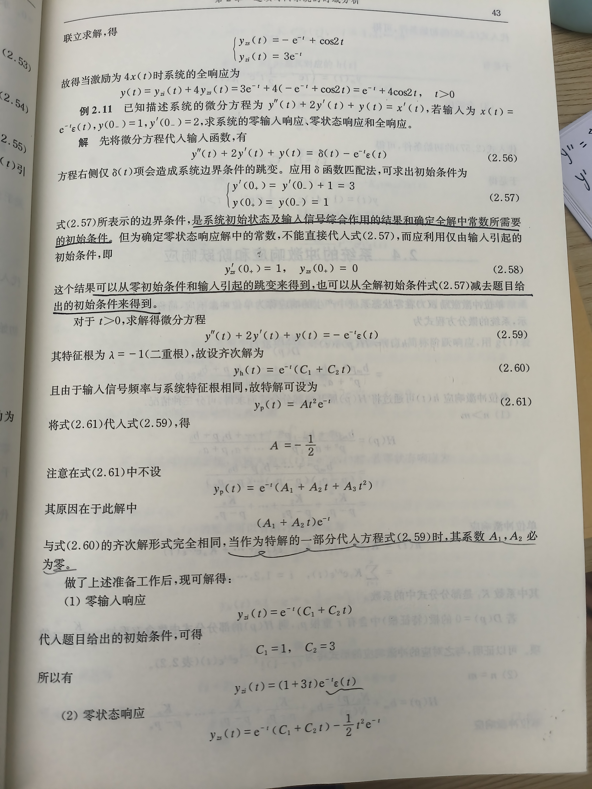
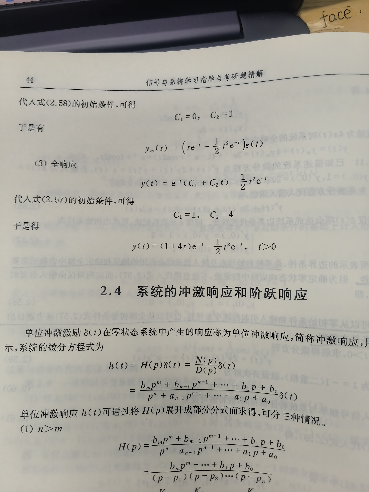
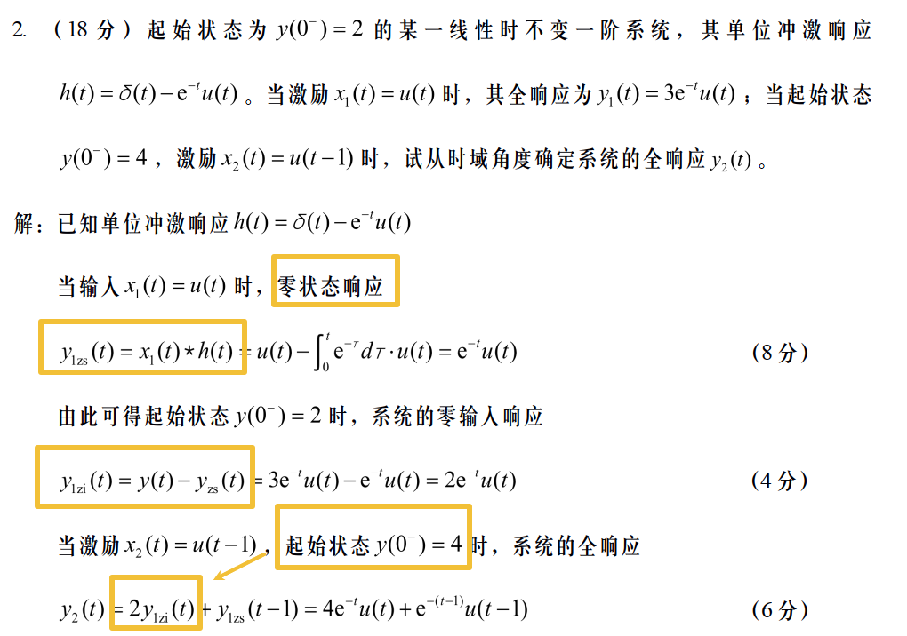

### 离散 LTI 系统的单位样值响应

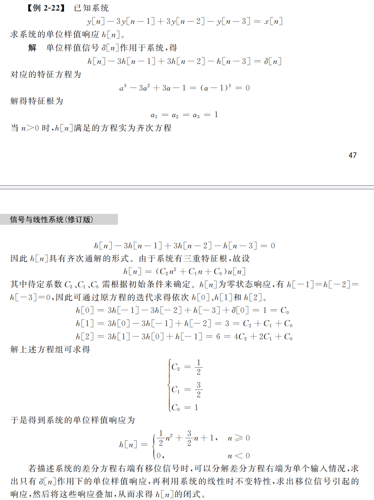
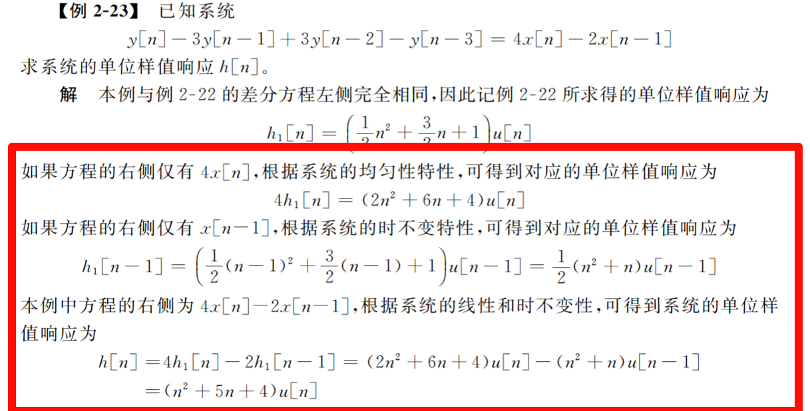

**离散下的 h[t]只考虑齐次解（求零输入响应）**

**高次下 用 Z 变换比较困难，建议老老实实算**

叠加性 齐次性
**利用 LTI 特性计算，先看成 x[n]**

## 通过卷积计算线性时不变系统下的变换

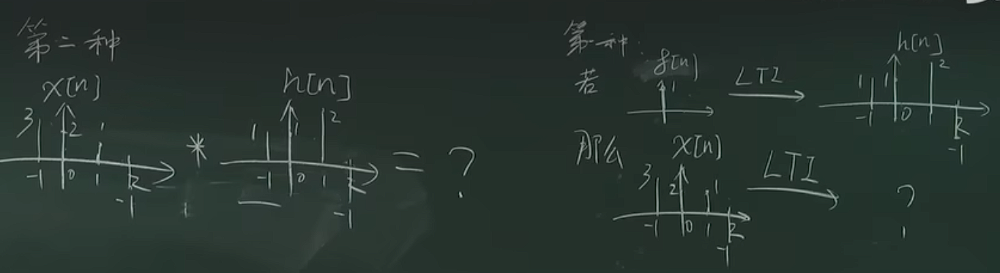
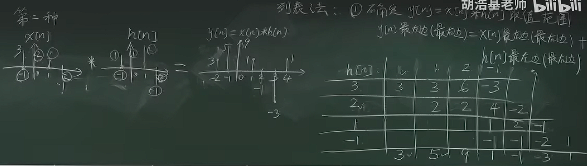

### **卷积，一种类似于加减乘除的定义的计算方法，是一种叠加相乘再求和的过程,也是****拉氏变换域下的乘积**

理解卷积：[www.bilibili.com/video/BV1Di4y1o7vX](http://www.bilibili.com/video/BV1Di4y1o7vX)——火车进隧道

$$
卷积和公式：x[n]*h[n]=\sum_{k=-\infty}^{\infty}x[k]h[n-k]
$$

$$
卷积积分：y(t)=\int_{-\infty}^{+\infty}x(\tau)h(t-\tau)\mathrm{d}\tau  = x(t) * h(t)
$$

**卷积积分计算：**

## LTI 系统特性

$\begin{aligned}\text{LTI系统稳定的充要条件为}{\int_{-\infty}^{+\infty}|h(t)|dt<+\infty(\text{有界})}\quad 或者{\sum_{k=-\infty}|h(n)|<+\infty(\text{有界})}\end{aligned}$$\text{LTI系统因果的充要条件为}h(t)=0，当t<0时;h[n]=0,当n<0时.$**即负轴为 0**
记忆性：


## LTI 系统的框图表示

> 倍乘、加法、积分（连续的）、延时（离散的）
> 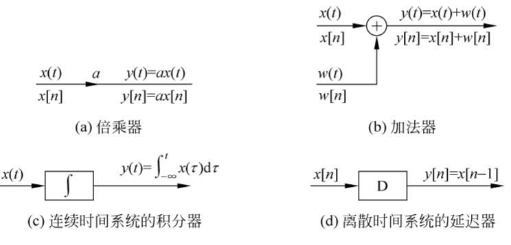
> **注意要把微分转化为积分**

### 差分方程框图

$$
\text{y}[n]+a_1\text{y}[n-1]+a_0\text{y}[n-2]=b_2x[n]+b_1x[n-1]+b_0x[n-2]
$$

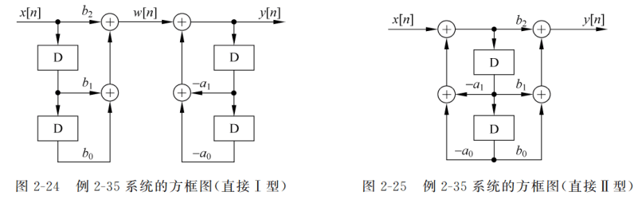

> 直接 I 和直接 II 型
> 要先移项
> 注意箭头方向，← 为输入，→ 为输出

### 微分方程框图

> 移项，转化为积分
> 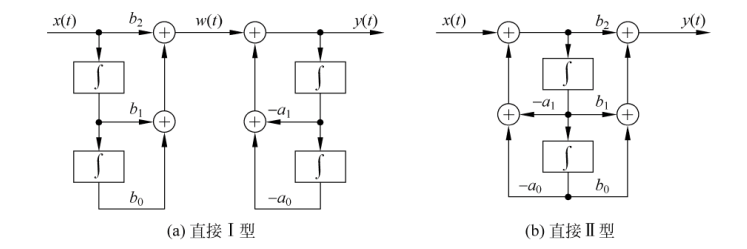
> I 型左边的 + 为 x，II 型右边的 + 为 x

# 导论

# 连续时间下的傅里叶分析与 FT

### 概念

**函数的正交性特点****：**

> [!TIP]

# 结论先行，便于查阅

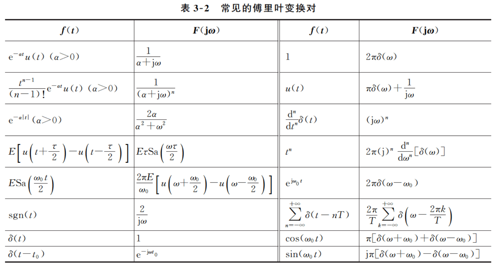
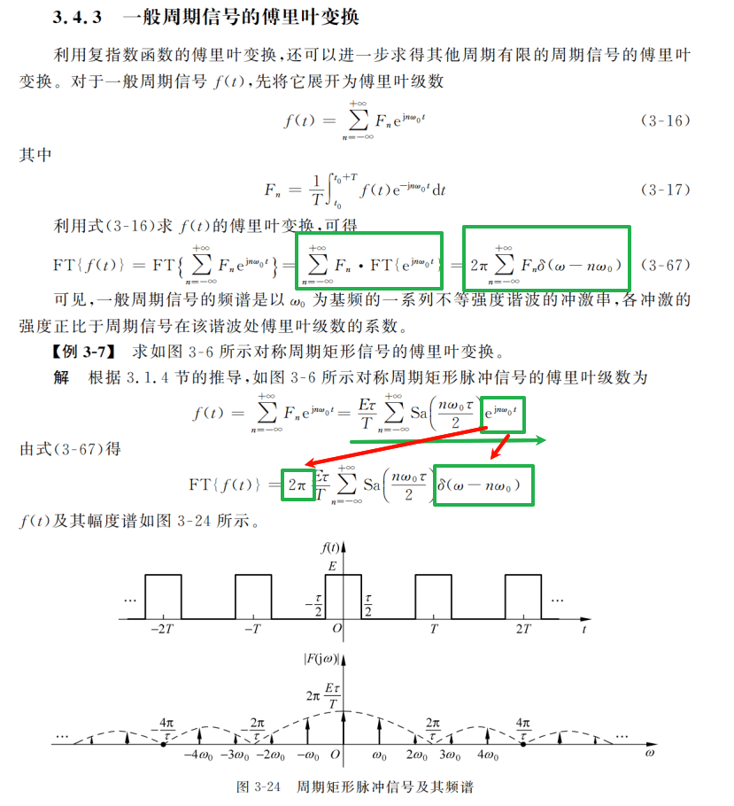
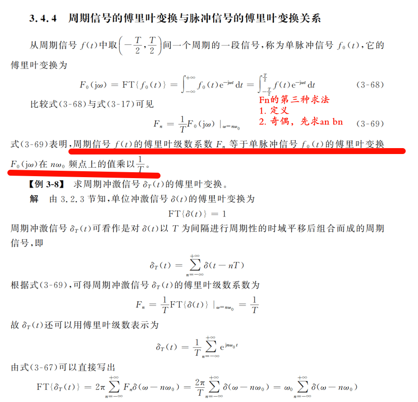

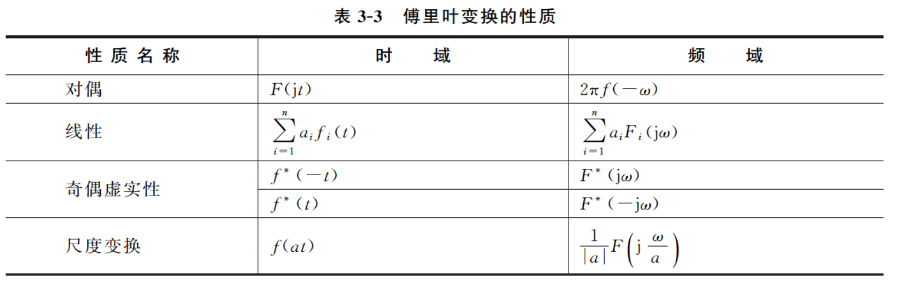
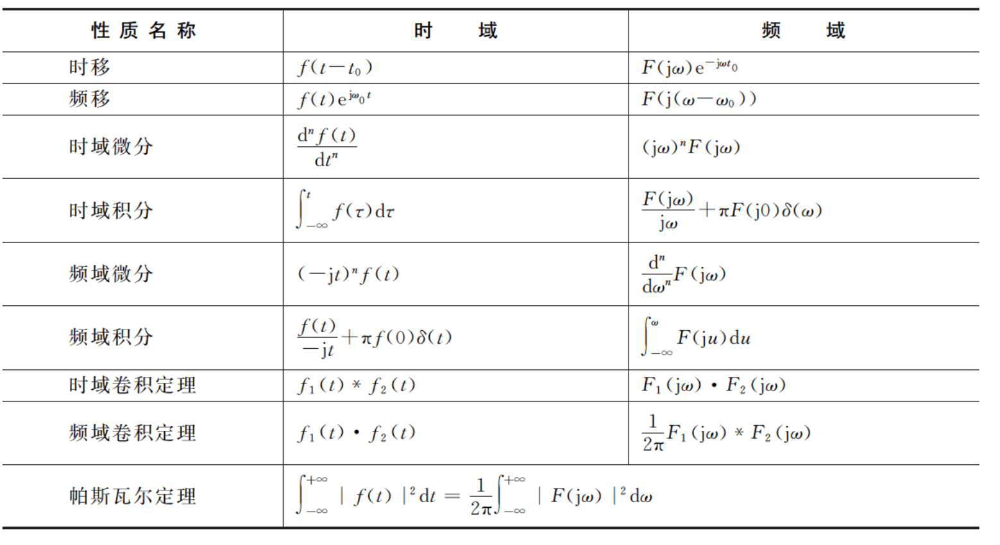

### **对周期函数的傅里叶级数表示 -- FS**

**参考文章：**[从正交函数到傅里叶级数](https://zhuanlan.zhihu.com/p/345370196)

> 在一个周期内的三角函数性质
>
> 1. $$
>    \int_{t_0}^{t_0+T}\cos n\omega_0t\cdot\sin m\omega_0tdt=0 \quad sin与cos正交
>    $$
> 2. $\int_{t_0}^{t_0+T}\cos n\omega_0t\cdot\cos m\omega_0tdt=\begin{cases}0&m\neq n\\\dfrac{T}{2}&m=n\end{cases} \quad 当w不一致时正交$ ｛相等后平方，积分不为 0｝
> 3. $$
>    \int_{t_0}^{t_0+T}\sin n\omega_0t\cdot\sin m\omega_0tdt=\begin{cases}0&m\neq n\\\dfrac{T}{2}&m=n\end{cases}
>    $$
> 4. $\int_{t_0}^{t_0+T}\mathrm{e}^{\mathrm{j}n\omega_0t}\bullet\mathrm{e}^{-\mathrm{j}m\omega_0t}\mathrm{d}t=\begin{cases}\begin{array}{cc}0&m\neq n\\\\T&m=n\end{array}\end{cases}$ 指数形式下的正交条件 {不消除 e 则存在周期性}

#### 前提：德里克里条件

```
**周期函数**
**函数连续/只存在第一类断点**
**函数有有限个极值点**
**能量有界 （绝对可积）**
```

#### 傅里叶级数的三角表达式

$$
f(t)=\frac{a_0}2+\sum_{n=1}^{+\infty}\left(a_ncosn\omega_0t+b_nsinn\omega_0t\right)
$$

其中，

$$
直流分量\quad \frac{a_0}2=\frac1T\int_{t_0}^{t_0+T}f(t)dt
$$

用**三角正交集表示，有**

$$
f(t)=\frac{c_0}2+\sum_{n=1}^{+\infty}c_n\cos\bigl(n\omega_0t+\varphi_n\bigr)\\f(t)=\frac{d_0}2+\sum_{n=1}^{+\infty}d_n\sin(n\omega_0t+\theta_n)
$$

#### 傅里叶级数的指数形式

$f(t)=\sum_{n=-\infty}^{+\infty}F_ne^{jn\omega_0t}$ ，**注意是****从负无穷到正无穷****，有****负数项**

#### 两种形式的系数关系

> 
> **引入了负频率**
>
> $$
> \begin{aligned}
> $$

&F_0=\frac{a_0}{2}=\frac{c_0}{2} //直流分量\\
&F_{n}=\mid F_{n}\mid\mathrm{e}^{\mathrm{j}\varphi_{n}}=\frac{1}{2}(a_{n}-\mathrm{j}b_{n})=\frac{1}{2}c_{n}\mathrm{e}^{\mathrm{j}\varphi_{n}} \\
&F_{-n}=\frac{1}{2}(a_{n}+\mathrm{j}b_{n})=\frac{1}{2}c_{n}\mathrm{e}^{-\mathrm{j}\varphi_{n}} \quad //频率（共轭\\
&\mid F_n\mid=\frac12c_n=\mid F_{-n}\mid  \\
&\varphi_{n}=-\arctan\frac{b_{n}}{a_{n}}      ：相位角\\
&F_n+F_{-n}=2\mathrm{Re}(F_n)=a_n \\
&\mathrm{j}(F_n-F_{-n})=2\mathrm{j}\mathrm{Im}(F_n)=b_n
\end{aligned}

$$
>[!TIP] 
### 三种求Fn的方式
1. 定义 -- 积分
2. 奇偶性 -- 间接计算an bn
3. 利用 FS $F_n=\frac{1}{T}F_0(\mathrm{j}\omega)\mid_{\omega=n\omega_o}$
	就是求基波w的FS再/T就是 Fn
### FS特性与典型信号（考前背一背）
> 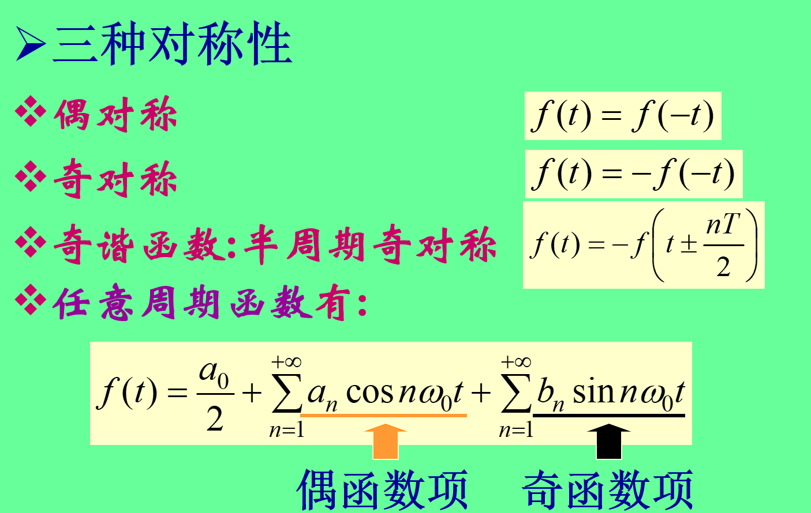
#### 周期偶函数
>[!TIP] 
### 不包含正弦分量，即bn=0.
$$f(t)=\frac{a_0}{2}+\sum_{n=1}^{+\infty}a_n\cos n\omega_0t
$$

三角表达式：$a_n=\frac4T\int_0^{\frac T2}f(t)\cos n\omega_0tdt\quad b_n=0.偶倍奇零$
指数表达式：$f(t)=\sum_{n=-\infty}^{+\infty}F_ne^{jn\omega_0t} \quad F_n=F_{-n}=\frac{a_n-jb_n}{2}=\frac{a_n}2$

##### **周期三角波**

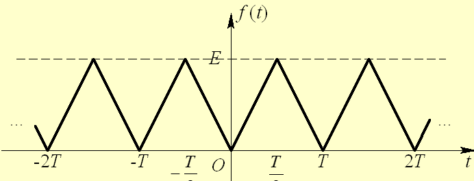

> **推导过程**

#### 周期奇函数

> [!TIP]

### 只包含正弦分量

$$
f(t)=\sum_{n=1}^{+\infty}b_n\sin n\omega_0t
$$

三角表达式：$b_n=\frac4T\int_0^{\frac T2}f(t)\sin n\omega_0tdt$
指数表达式：$f(t)=\sum_{n=-\infty}^{+\infty}F_ne^{jn\omega_0t} \quad F_n=F_{-n}=\frac{a_n-jb_n}{2}=-j\frac{b_n}2$

##### **周期锯齿波**

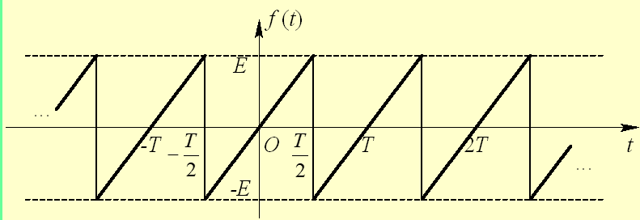

> **推导过程**

#### 奇谐函数

> **信号波形沿时间轴向左或向右平移半个周期，并作上下翻转后得出的波形与原波形重合  **
> **只包含 ****奇次项谐波**** 分量**
> 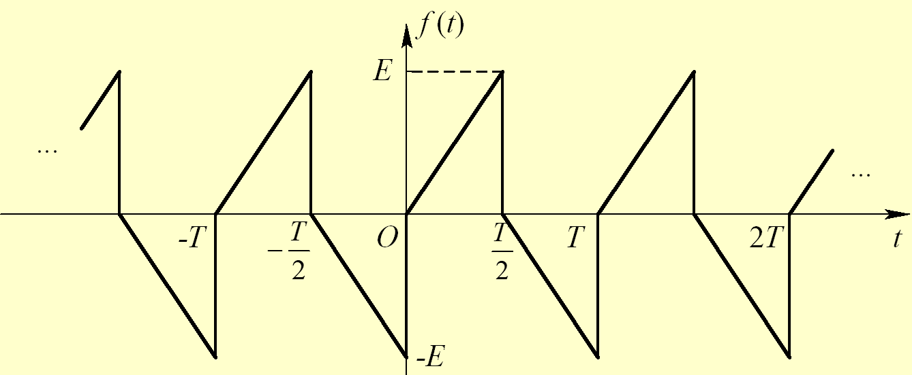

> 有：
>
> $$
> a_{n}=\frac{2}{T}\int_{-\frac{T}{2}}^{\frac{T}{2}}f(t)\cos(n\omega_{0}t)\mathrm{d}t=\begin{cases}\frac{4}{T}\int_{0}^{\frac{T}{2}}f(t)\cos(n\omega_{0}t)\mathrm{d}t&n\text{ 为奇数}\\\\0&n\text{ 为偶数}\end{cases}\\b_{n}=\frac{2}{T}\int_{-\frac{T}{2}}^{\frac{T}{2}}f(t)\sin(n\omega_{0}t)\mathrm{d}t=\begin{cases}\frac{4}{T}\int_{0}^{\frac{T}{2}}f(t)\sin(n\omega_{0}t)\mathrm{d}t,&n\text{ 为奇数}\\\\0,&n\text{ 为偶数}\end{cases}
> $$

#### 偶谐函数

> [!TIP]

### 信号波形沿时间轴向左或向右平移半个周期后得到的波形与原波形重合

### 只含有 直流分量 和 偶次项谐波分量

#### 偶谐函数和偶函数没有必然联系

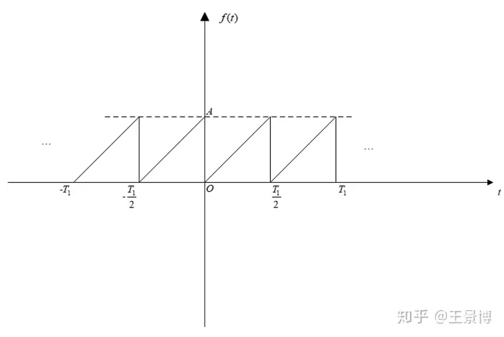

#### 周期矩形脉冲信号

> **概念：****脉冲宽度****τ、****脉冲幅度 E、信号周期 T**
> **τ 改变幅度和带宽，T 改变幅度和谱线间隔**
> **各谱线的幅度按包络线**$Sa\Bigg(\frac{\omega\tau}2\Bigg)$**变化。过零点为**$\omega=\frac{2m\pi}\tau $
> **带宽（一个频率点）为**$B_\omega=\frac{2\pi}\tau $，**主频带位于带宽之内 **
> **谱线间隔为基波频率****ω****(0)，脉冲周期****T****越大，谱线越密**
> **三角形式：**$f(t)=\frac{E\tau}T+\frac{2E\tau}T\sum_{n=1}^{+\infty}Sa\biggl(\frac{n\omega_0\tau}2\biggr)\mathrm{cos}\bigl(n\omega_0t\bigr)$
> **指数形式：**$Fn =\frac{2E}{T}\frac{\sin\biggl(\frac{n\omega_0\tau}{2}\biggr)}{n\omega_0}=\frac{E\tau}{T}\frac{\sin\biggl(\frac{n\omega_0\tau}{2}\biggr)}{\frac{n\omega_0\tau}{2}}\quad f(t) =\frac{E\tau}T\sum_{n=-\infty}^{+\infty}Sa\Bigg(\frac{n\omega_0\tau}2\Bigg)e^{jn\omega_0t}$
> 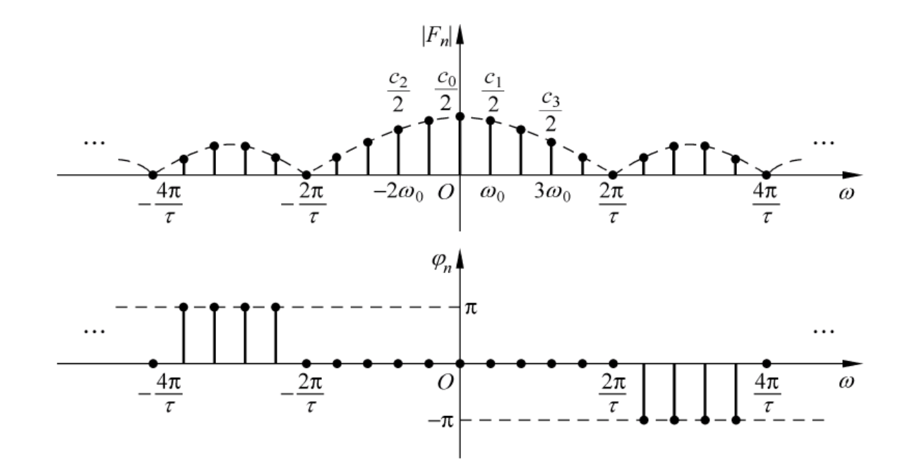
> 相位谱在时域上就是滞后，故只能为负
> 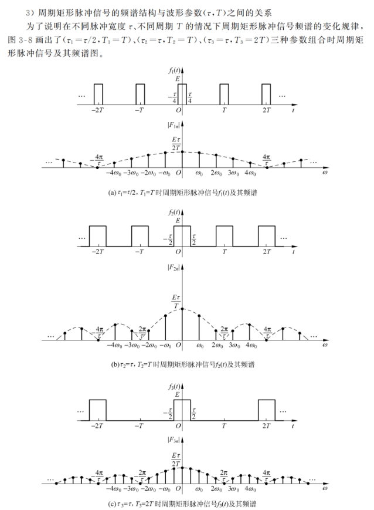

##### **对偶函数的方波，有：**

$$
为奇谐函数，故只有奇数项：f(t)=\frac{2E}\pi\Bigg(\cos\omega_0t-\frac13\cos3\omega_0t+\frac15\cos5\omega_0t-....\Bigg)
$$

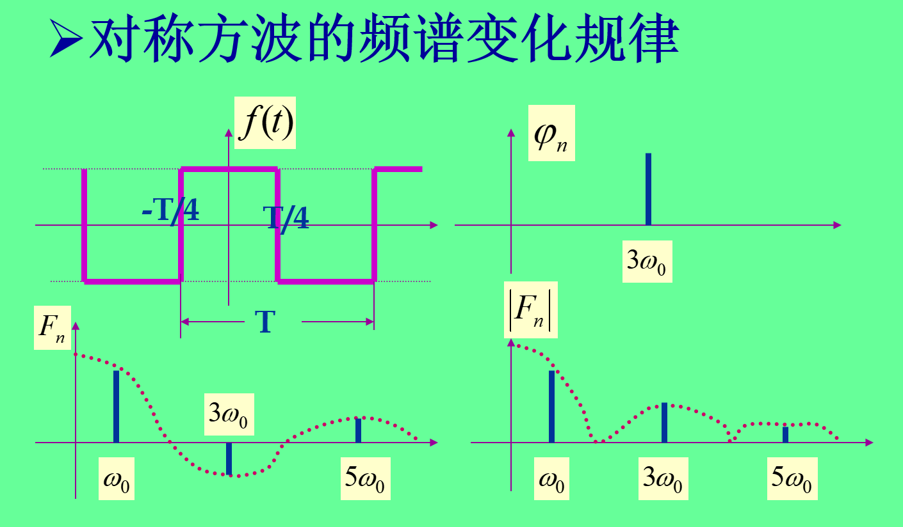

#### 周期半波余弦信号

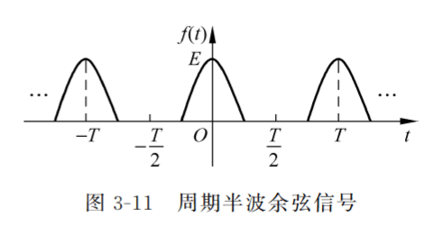

$$
f(t)=\frac E\pi-\frac{2E}\pi\sum_{n=1}^{+\infty}\frac1{n^2-1}\cos\biggl(\frac{n\pi}2\biggr)\mathrm{cos}(n\omega_0t)\\\ =\frac{E}{\pi}+\frac{E}{2}\bigg(\cos(\omega_0t)+\frac{4}{3\pi}\mathrm{cos}(2\omega_0t)-\frac{4}{15\pi}\mathrm{cos}(4\omega_0t)+...\bigg)
$$

> 以$\frac{1}{n^2}的速度收敛$

#### 周期全波余弦信号

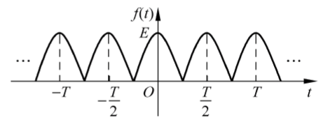

$$
f(t)=\frac{2E}{\pi}+\frac{4E}{\pi}\sum_{n=1}^{+\infty}(-1)^{n+1}\frac{1}{4n^2-1}\mathrm{cos}(2n\omega_0t)
$$

**即得**
$\begin{aligned}f(t)=&\frac{2E}{\pi}+\frac{4E}{\pi}\biggl(\frac{1}{3}\mathrm{cos}(\omega_1t)-\frac{1}{15}\mathrm{cos}(2\omega_1t)+\frac{1}{35}\mathrm{cos}(3\omega_1t)-...\biggr)\\=&\frac{2E}{\pi}+\frac{4E}{\pi}\biggl(\frac{1}{3}\mathrm{cos}(2\omega_{0}t)-\frac{1}{15}\mathrm{cos}(4\omega_{0}t)+\frac{1}{35}\mathrm{cos}(6\omega_{0}t)-...\biggr)\end{aligned}
\\
w_1 = 2w_0$

> 以$\frac{1}{n^2}的速度收敛$

#### 小结

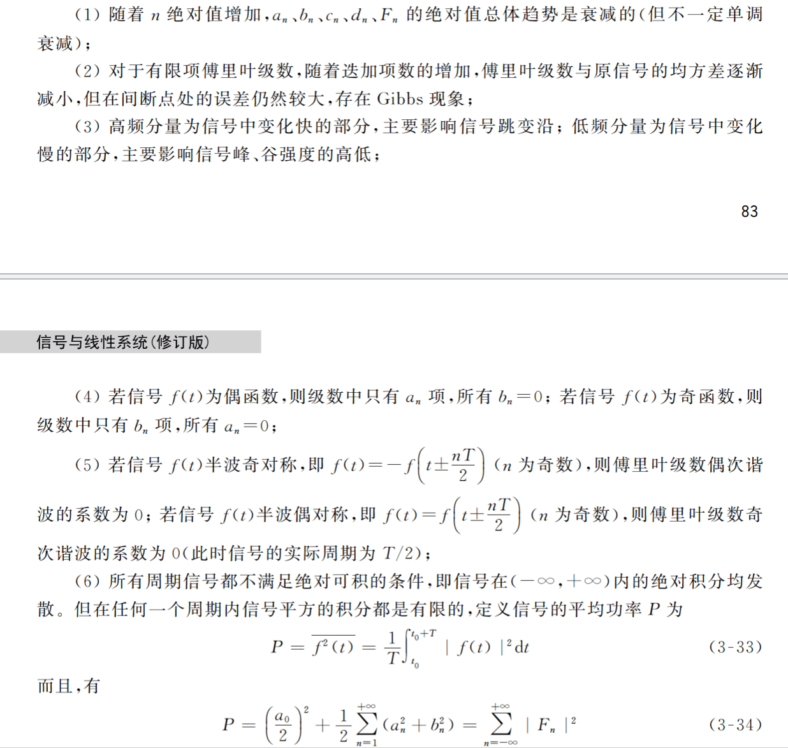

### 连续非周期 FT、逆变换与其性质

> [!TIP]

### **FT -- 将时域转化到频域：** $F(\text{j}\omega)=\int_{-\infty}^{+\infty}f(t)\mathrm{e}^{-\mathrm{j}\omega t}\mathrm{d}t$，注意，是乘一个 衰减

## 反之，有：$f(t)=\frac{1}{2\pi}\int_{-\infty}^{+\infty}F(\mathrm{j}\omega)\mathrm{e}^{\mathrm{j}\omega t}\mathrm{d}\omega $

#### 注意：

1. F(jw)是**密度函数**，联想概率论
2. 定义域无穷
3. 复指数形式 ：$\begin{gathered}
   F(\mathrm{j}\omega)=\mid F(\mathrm{j}\omega)\mid\mathrm{e}^{\mathrm{j}\varphi(\omega)} \\
   f(t)=\frac{1}{2\pi}\int_{-\infty}^{+\infty}F(\mathrm{j}\omega)\mathrm{e}^{\mathrm{j}\omega t}\mathrm{d}\omega=\frac{1}{2\pi}\int_{-\infty}^{+\infty}|F(\mathrm{j}\omega)|\mathrm{e}^{\mathrm{j}(\omega t+\varphi(\omega))}\mathrm{d}\omega
   \end{gathered}$
4. 需满足狄利克雷条件
   1. 收敛
   2. 有限极值点
   3. 广义连续

#### 单边指数信号

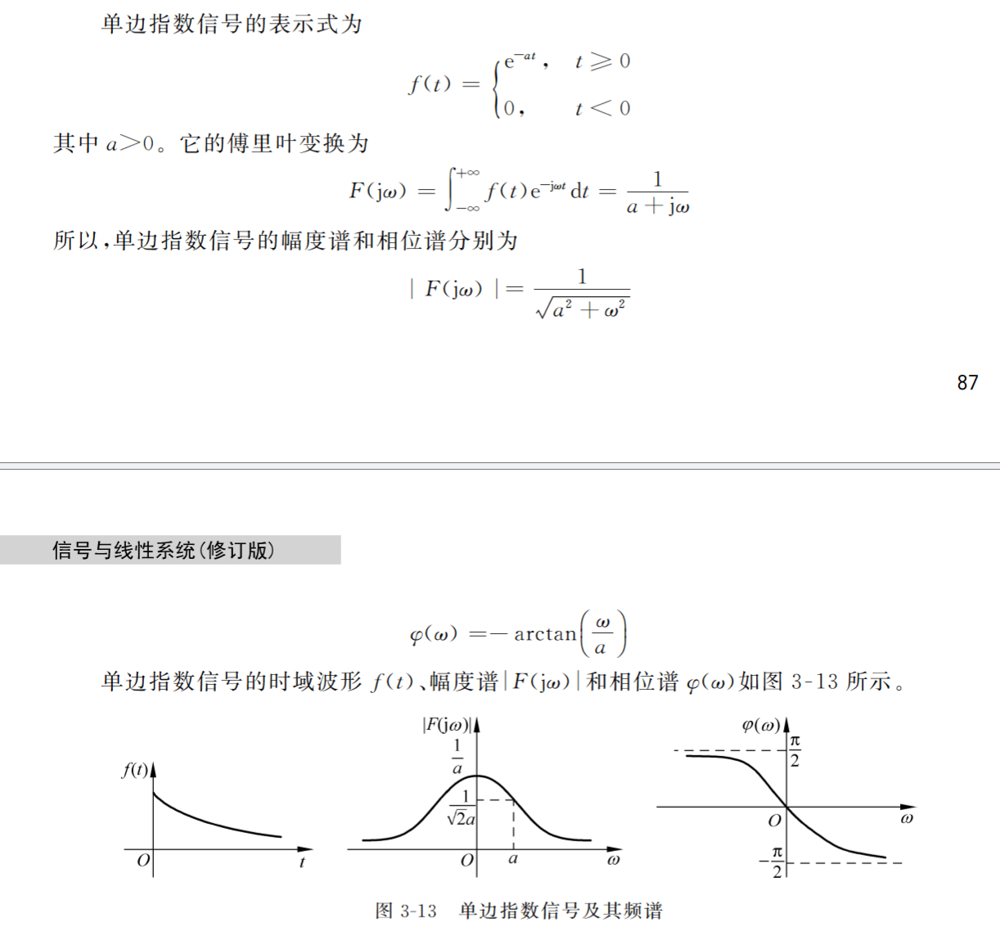

#### 双边指数信号

就是（1/a+jw)*(1/a-jw)
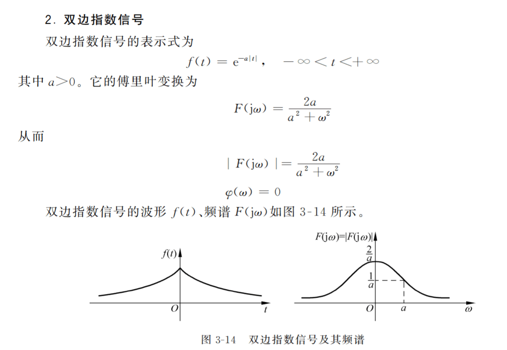

#### 对称矩形脉冲信号

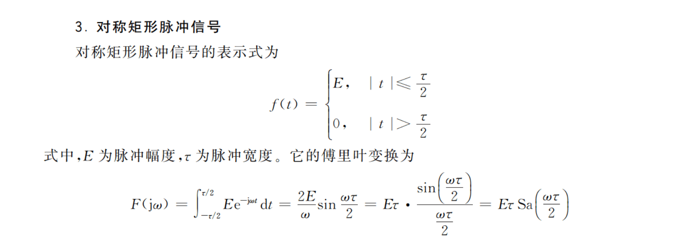
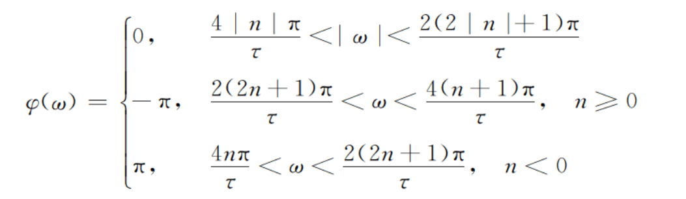
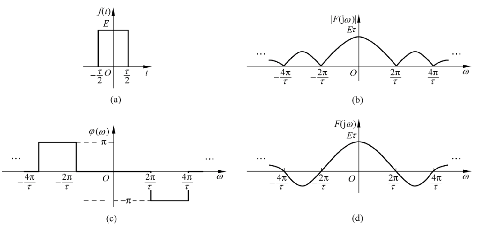

> [!TIP]

## 矩形波的幅度谱和相位谱有异曲同工之妙

#### 符号函数

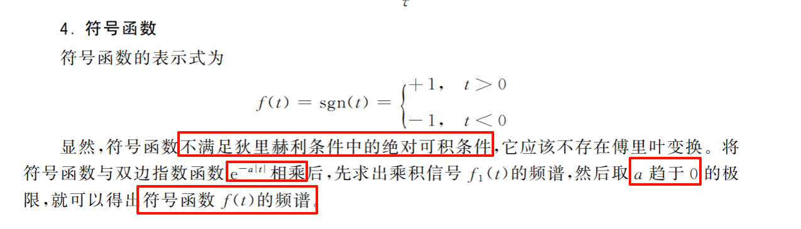
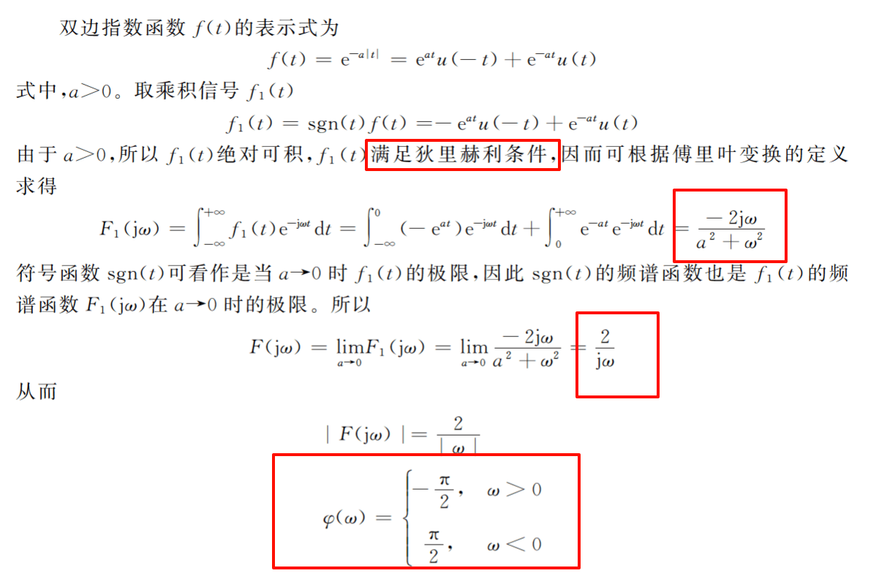
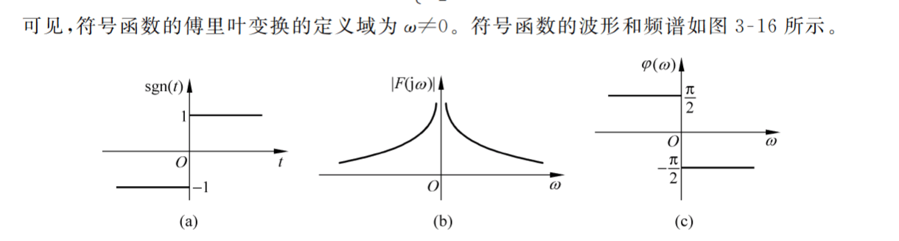

#### 冲激信号

> **冲激信号在频率内强度均匀**
> 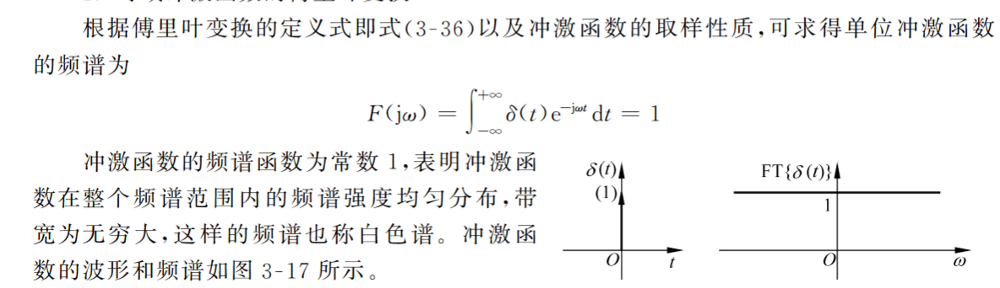
>
> **若频域内为冲激信号，则时域内为  直流分量  **

#### 阶跃信号

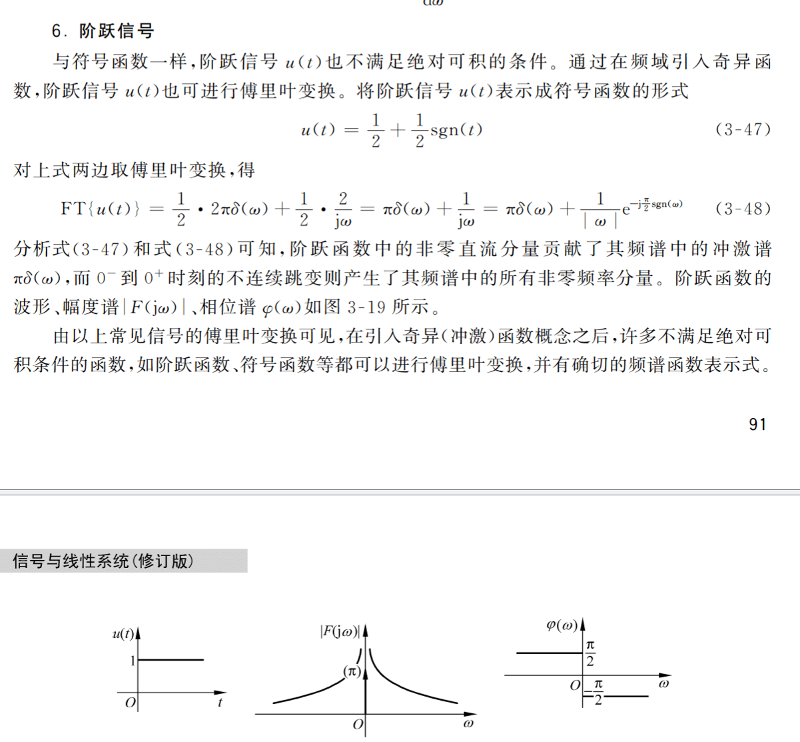

#### 性质

> $$
> 变换对：\\\ F(\mathrm{j}\omega)=\mathrm{FT}\{f(\iota)\}\\f(t)\overset{\mathrm{FT}}{\longleftrightarrow}F(\mathrm{j}\omega)
> $$
>
> $$
> 特殊的，若时域/频域=0，有：\\\ F(\mathrm{j}0)=\int_{-\infty}^{+\infty}f(t)\mathrm{d}t\\f(0)=\frac{1}{2\pi}\int_{-\infty}^{+\infty}F(\mathrm{j}\omega)\mathrm{d}\omega  \\\
> $$

不需要乘三角分量 $$

##### 对偶性

> 类似于嵌套，可用于反向快速求解

$$
F(\mathrm{j}t)\overset{\mathrm{FT}}{\longleftrightarrow}2\pi f(-\omega)
$$

> 即找出逆向 FT，加上-号，外面 *2π 即可，看例题
> 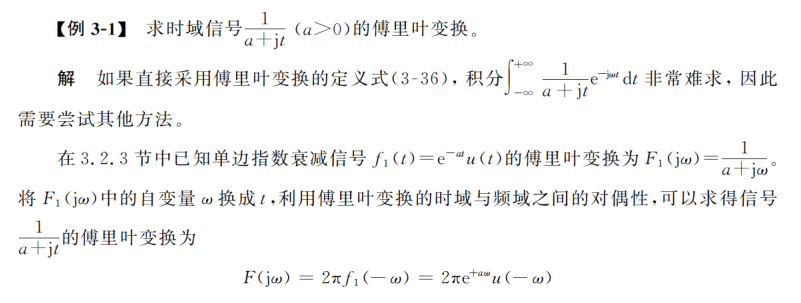

##### 线性

> 用于求组合搭积木型信号的 FT，拆分成几个简单信号再叠加

$$
\mathrm{FT}\left\{\sum_{i=1}^{n}a_{i}f_{i}(t)\right\}=\sum_{i=1}^{n}a_{i}F_{i}(\mathrm{j}\omega)
$$

##### 奇偶虚实性

> *为共轭
> 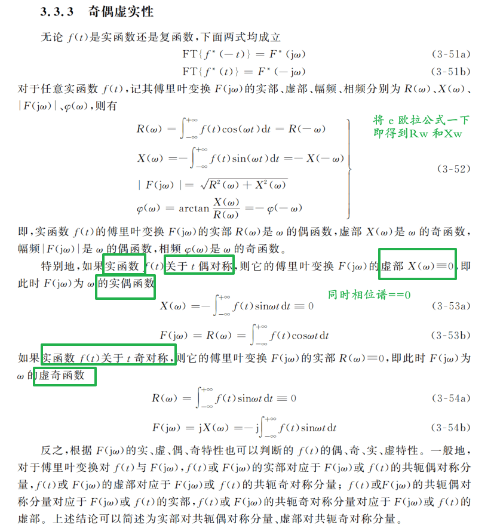
> 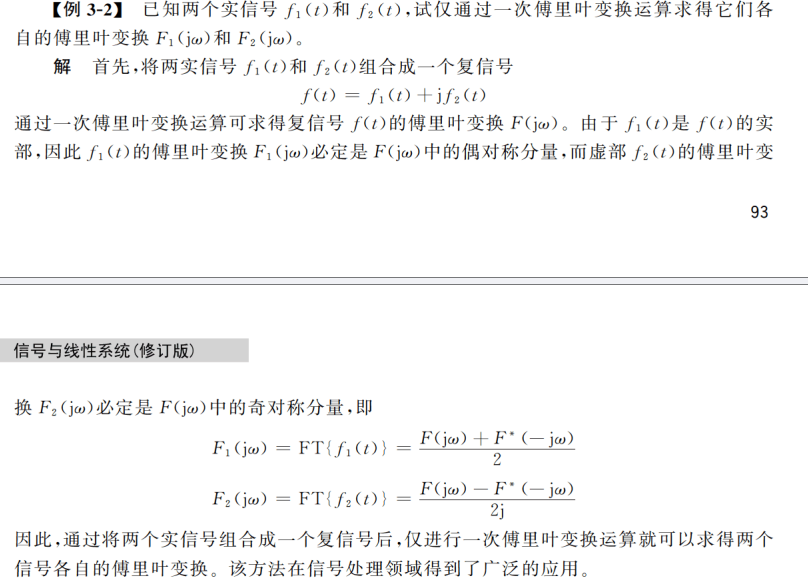
> **实部的逆向傅里叶为偶函数**
> 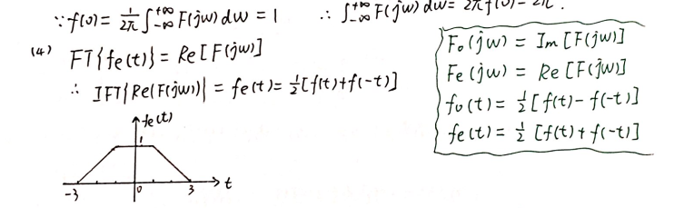

##### 尺度变换性（伸缩）

$$
\mathrm{FT}\{f(at)\}=\frac{1}{\mid a\mid}F\biggl(\mathrm{j}\frac{\omega}{a}\biggr)
$$

##### 时移和频移特性

> 时移-t = 频 *e
> 时*e = 频移

$$
\mathrm{FT}\left\{f(t-t_0)\right\}=F(\mathrm{j}\omega)\mathrm{e}^{-\mathrm{j}\omega t_0}
$$

$$
FT\left\{f(t)e^{j\omega_0t}\right\}=F\left(j(\omega-\omega_0)\right)
$$

> **其实就是移动相位**
> 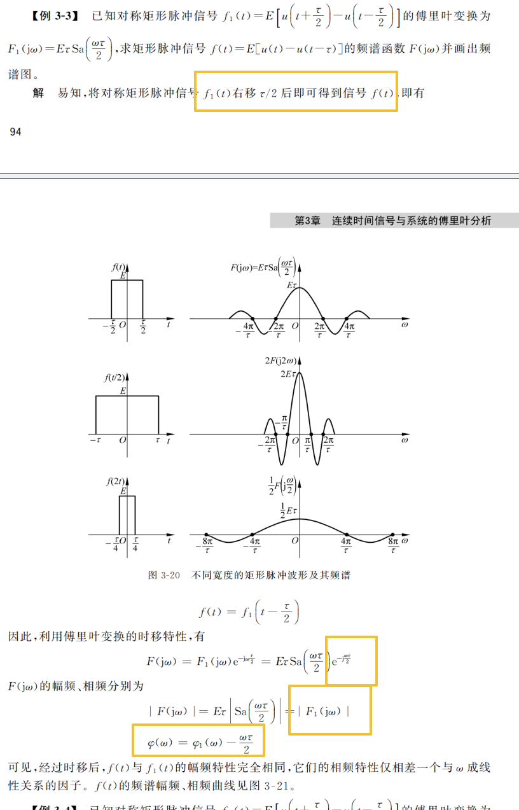
> **有种取实部和取虚部的感觉**
> **调幅操作，使变换谱分别左右移动**
> 利用卷积可得

$$
\mathrm{FT}\langle f(t)\cos(\omega_{0}t)\rangle=\frac{1}{2\pi}·\pi [F(\mathrm{j}(\omega+\omega_{0}))+F(\mathrm{j}(\omega-\omega_{0}))]\\\  \\\ \mathrm{FT}\langle f(t)\sin(\omega_{0}t)\rangle=\frac{1}{2\pi}·{\mathrm{j}}\pi[F(\mathrm{j}(\omega+\omega_{0}))-F(\mathrm{j}(\omega-\omega_{0}))]
$$

##### 微积分特性

> **类比电磁场的时谐场的复矢量表示**
> 用于导导导出冲激信号，再卷积
> **但是一般都能用画图解决**

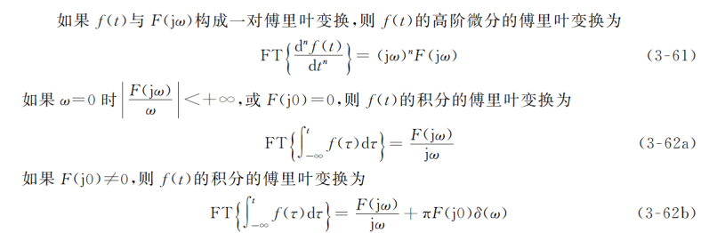
脉冲三角波
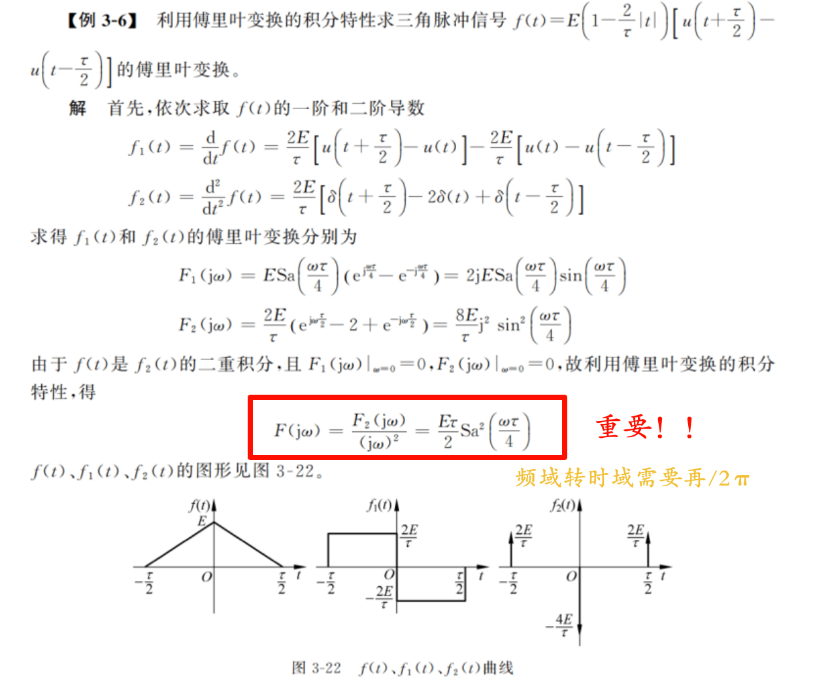

##### 帕斯瓦尔定理

$$
\int_{-\infty}^{+\infty}\mid f(t)\mid^2\mathrm{d}t=\frac{1}{2\pi}\int_{-\infty}^{+\infty}\mid F(\mathrm{j}\omega)\mid^2\mathrm{d}\omega 
$$

> 左边为 W -- 总能量；右边为 能量谱
> 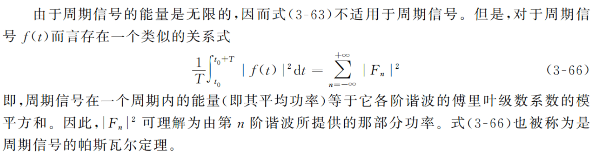

### 连续周期信号的 FT

#### 三角信号


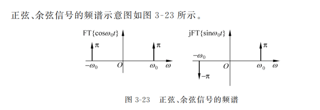

#### 一般信号


### 卷积定理

#### 重要公式：

$$
\mathrm{FT}\{f_1(t) *  f_2(t)\}=F_1(\mathrm{j}\omega)\bullet F_2(\mathrm{j}\omega)
$$

$$
Y(\mathrm{j}\omega)=X(\mathrm{j}\omega)H(\mathrm{j}\omega).其中单位冲激响应h(t) \\\ H(\text{j}\omega)=\int_{-\infty}^{+\infty}h\left(t\right)\mathrm{e}^{-\text{j}\omega t}\mathrm{d}t
$$

$$
FT\left\{f_1(t)\cdot f_2(t)\right\}=\frac1{2\pi}F_1(j\omega)*F_2(j\omega)
$$

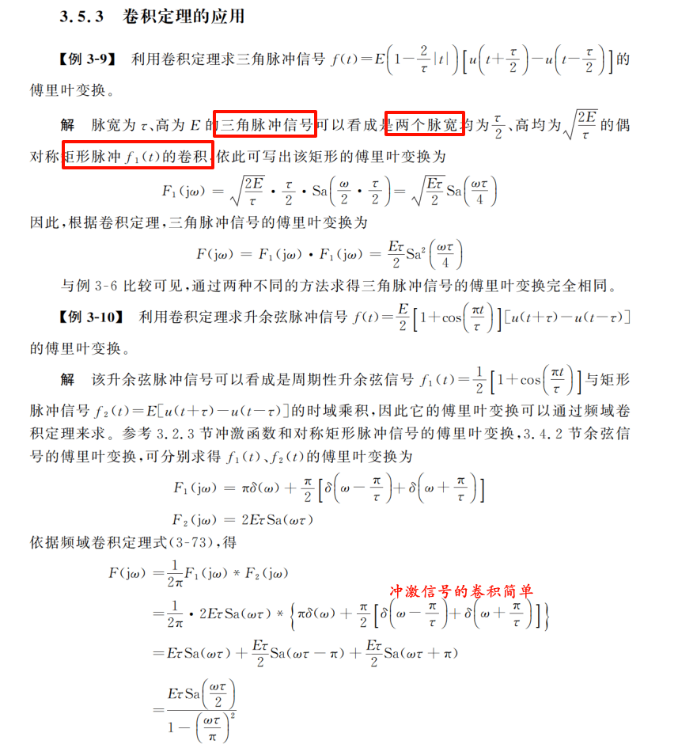

### LTI 频响与理想滤波器

> **概念**：
> 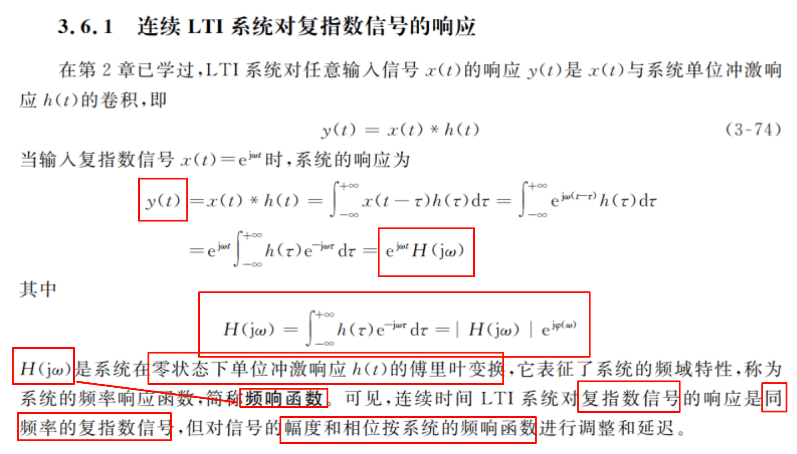
> **频响函数的两种定义**：
> 上面那种：基于 单位冲激响应 的定义
> 下面这种：基于 零状态响应 的定义
>
> $$
> 频响函数：\begin{aligned}
> $$

H(j\omega)& =\frac{Y(j\omega)}{X(j\omega)}  \\
&=|H(j\omega)|e^{j\varphi(\omega)}
\end{aligned}$$

#### 求解方法

##### 直接开干

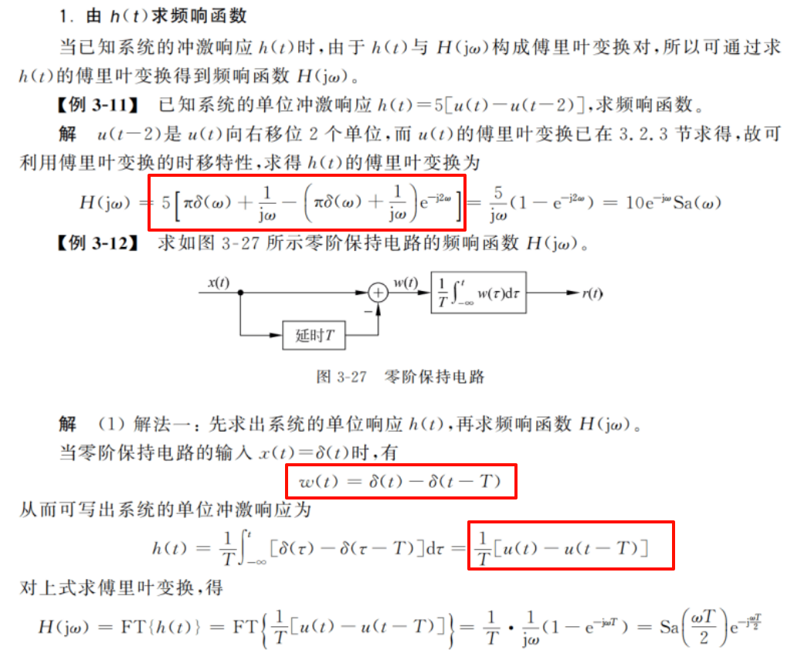

##### 微分方程解电路

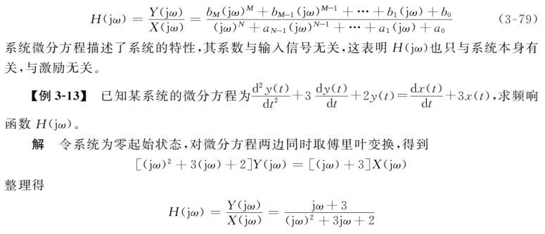

#### 理想滤波器

> 低通 高通
> 带通 带阻
> 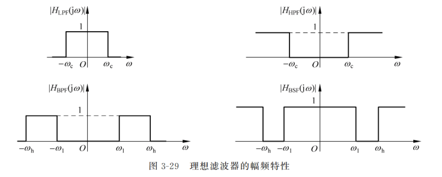

##### 理想低通滤波器

> 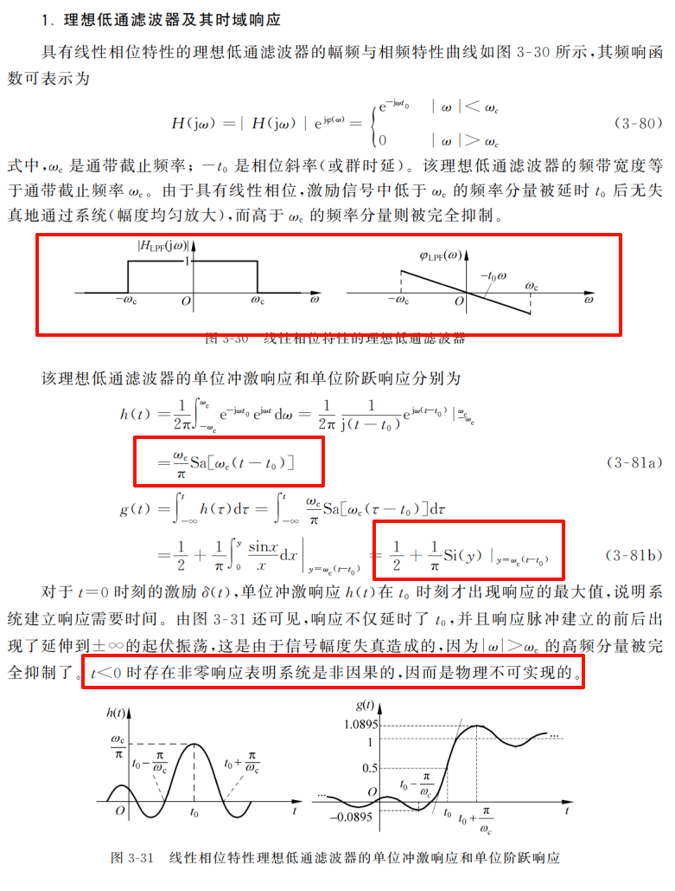
> 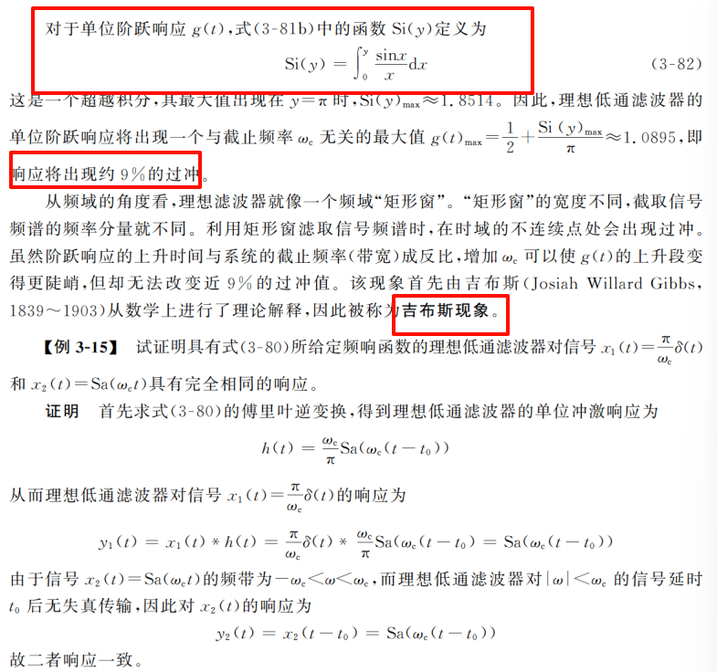
>
> ###### 物理可实现型判断
>
> 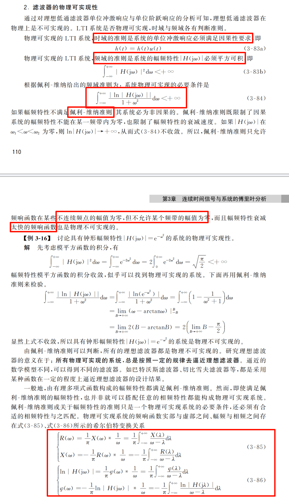

### 连续 LTI 系统的频域求解

> 非常流程化
> 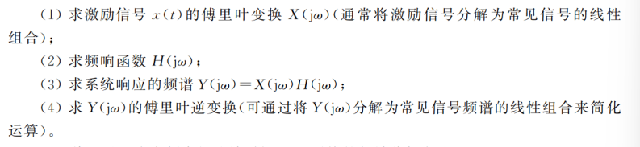
> 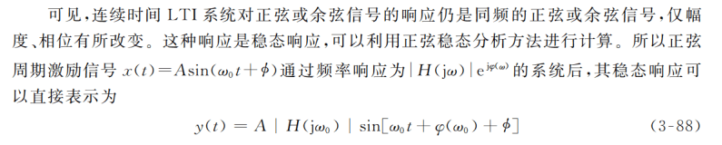
> [!TIP]

### LTI 系统改变幅频和相频（延迟）--类比模电的频响函数


> 特别注意 周期冲激序列  的 FS 对
> 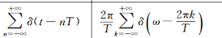
> 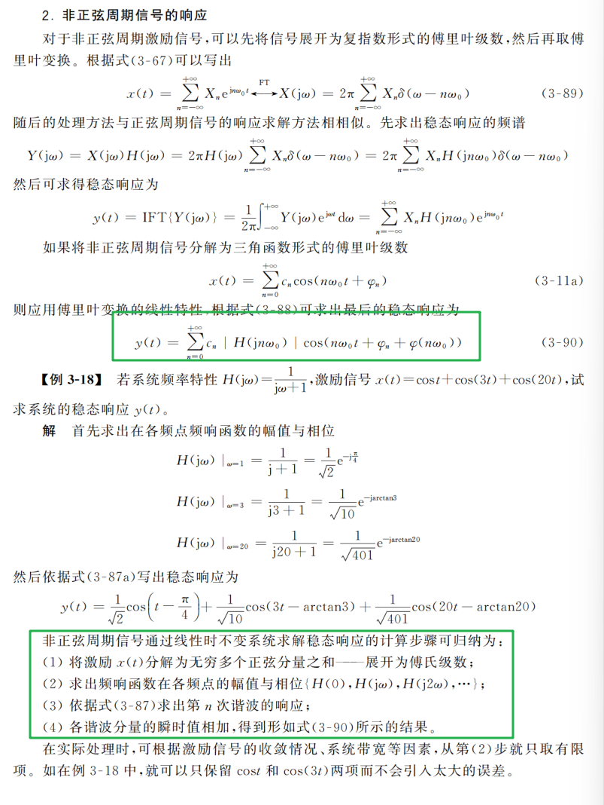

##### 电路下的求解

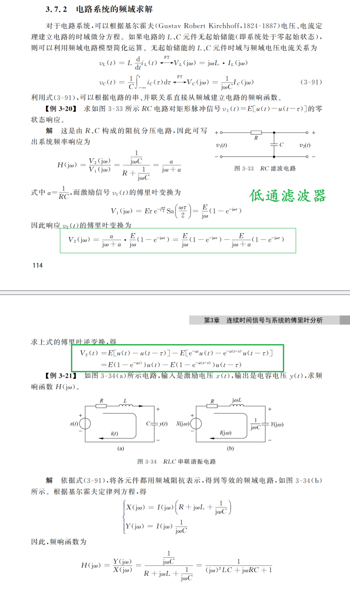

# 抽样、调制与解调

## 抽样定理

重新认识抽样函数

$$
\mathrm{Sa}(t)=\frac{\mathrm{sin}t}{t}
$$

### 内插公式

#### 零阶抽样保持

> 阶跃 阶梯状
> 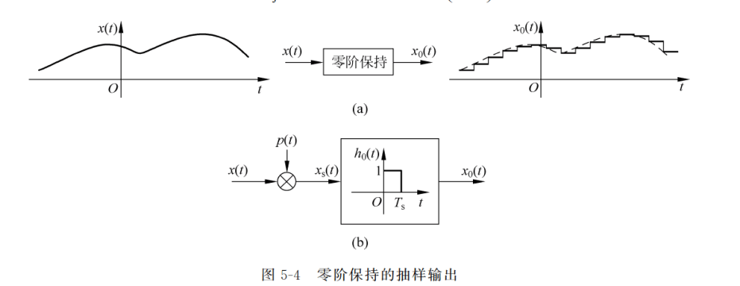
> 其中，抽样信号为

$$
x_s(t)=\sum_{n=-\infty}^{+\infty}x(nT_s)\delta(t-nT_s)
$$

抽样信号频谱为

$$
X_s(\mathrm{j}\omega)\:=\:\frac{\omega_s}{2\pi}\sum_{s=-\infty}^{+\infty}X(\mathrm{j}\omega-\mathrm{j}n\omega_s)
$$

过理想低通滤波器（矩形脉冲信号）

$$
\begin{aligned}&h_{0}(t)\:=\:u(t)-u(t-T_{s})\\&H_{0}(\mathrm{j}\omega)\:=\:\frac{1}{\mathrm{j}\omega}(\:1-\mathrm{e}^{-\mathrm{j}\omega T_{s}}\:)\:=\:T_{s}\mathrm{Sa}\biggl(\frac{\omega T_{s}}{2}\biggr)\mathrm{e}^{-\mathrm{j}\frac{\omega T_{s}}{2}}\end{aligned}
$$

得到输出

$$
x_0(t)=x_s(t)*h_0(t)=\sum_{-\infty}^{+\infty}x(nT_s)\left[u(t-nT_s)-u(t-(n+1)T_s)\right]
$$

**但精度较差 **
进一步，得到输出信号的频谱

$$
X_0(\mathrm{j}\omega)=X_s(\mathrm{j}\omega)H_0(\mathrm{j}\omega)=\mathrm{Sa}\biggl(\frac{\omega T_s}{2}\biggr)\mathrm{e}^{-\mathrm{j}\frac{\omega T_s}{2}}\sum_{n=-\infty}^{+\infty}X(\mathrm{j}\omega-\mathrm{j}n\omega_s)
$$

优化框图，再经过一个具有频率响应 H。 r (jw) 的 LTI 系统，要求该 LTI 系统的输出 y (t) 与原始信号 x(t) 相同
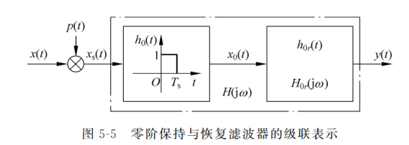
得到

$$
H_{0r}(\mathrm{j}\omega)=\frac{\mathrm{e}^{\mathrm{j}\frac{\omega T_{s}}{2}}}{\mathrm{Sa}\left(\frac{\omega T_{s}}{2}\right)}H_{\mathrm{LPF}}(\mathrm{j}\omega)
$$

#### 一阶保持 线性内插

> 即通过三角波的叠加恢复信号
> 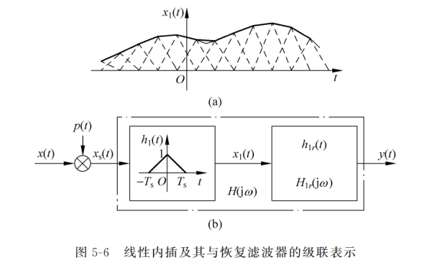
> 相关函数有

$$
\begin{aligned}&h_{1}\left(t\right)=\left(1-\frac{\mid t\mid}{T_{s}}\right)[\:u(t+T_{s})-u(t-T_{s})\:]\\&H_{1}\left(\mathrm{j}\omega\right)=\:T_{s}\:\mathrm{Sa}^{2}\left(\frac{\omega T_{s}}{2}\right)\end{aligned}
$$

```
 $\begin{aligned}x_{1}(t)&=x_{s}(t)*h_{1}(t)\\&=\sum_{n=-\infty}^{+\infty}x(nT_{s})\left(1-\frac{\mid t-nT_{s}\mid}{T_{s}}\right)[u(t-(n-1)T_{s})-u(t-(n+1)T_{s})]\end{aligned}$
```

$$
X_1(\text{j}\omega)=H_1(\text{j}\omega)X_s(\text{j}\omega)=\text{Sa}^2\left(\frac{\omega T_s}{2}\right)\sum_{n=-\infty}^{+\infty}X\left(\text{j}\omega-\text{j}n\omega_s\right)
$$

## 模拟调制

> 即搬移低频信号频谱到高频载波信号上，包括调频（FM） 调幅（AM）和调相
> => 需要传送的**调制基带信号 g(t) **，去调整高频（受天线长度限制）的**载波信号 c(t)，形成窄带信号 s(t)**
> AM： 25 - 1605k HZ
> FM： 88M - 108M HZ
> **调幅分为 AM SC-AM（抑制载波调幅） PAM（脉冲调幅）**

### 正弦信号下的 AM

**输出调幅信号 = 基带信号 · 载波信号**

$$
s(t)=g(t)\bullet c(t)
$$

**载波信号 c(t)**

$$
c(t)=\cos(\omega_ct+\theta_c)
$$

$\omega_c$称为**载波频率**

初相下的频谱 C(jw)

$$
C(j\omega)=\pi\Big[\delta(\omega+\omega_{c})+\delta(\omega-\omega_{c})\Big]
$$

得窄波信号 S(jw)

$$
\begin{gathered}
S(j\omega) =\frac1{2\pi}G(j\omega)*\pi\Big[\delta(\omega+\omega_c)+\delta(\omega-\omega_c)\Big] \\
=\frac12\Big[G\Big(j(\omega+\omega_c)\Big)+G\Big(j(\omega-\omega_c)\Big)\Big] 
\end{gathered}
$$

**例题**

### SC-AM（抑制载波）

> 将不含直流分量的基带信号放在载波信号上

```
 得到的窄波信号相同
```

$$
\begin{gathered}
S(j\omega) =\frac1{2\pi}G(j\omega)*\pi\Big[\delta(\omega+\omega_c)+\delta(\omega-\omega_c)\Big] \\
=\frac12\Big[G\Big(j(\omega+\omega_c)\Big)+G\Big(j(\omega-\omega_c)\Big)\Big] 
\end{gathered}
$$

给个图理解一下

### AM

> 与 SC-AM 不同的是，基带信号 g(t) 中 **包含 **直流信号，即有一个向上的抬升，使得包络线更清晰
> 一样的，有

$$
s(t)=g(t)\bullet c(t)
$$

但基带信号中的直流分量**必须使包络线 >0 ，即**

$$
g(t)=A_{0}+x\:(t)
$$

$$
A_0\geqslant\mid x(t)\mid_{\max}
$$

所以 s(t) 可改写为

$$
s(t)=A_0\cos(\omega_\mathrm{c}t)+x(t)\cos(\omega_\mathrm{c}t)
$$

下图为满足（左）与不满足（右）的情况
**对于频谱图来说，较 SC-AM 多了直流分量 FT 后的脉冲**

### PAM--脉冲幅度调制

> 即 将载波 c(t) 改为周期矩形脉冲信号
> 由此前知识，我们知道了周期矩形脉冲信号的 FT

$$
C(\text{j}\omega)\:=\:\frac{2\pi}{T_0}\sum_{n=-\infty}^{+\infty}E\tau\text{Sa}\Bigg(\frac{n\omega_0\tau}{2}\Bigg)\delta\left(\omega-n\omega_0\right)
$$

得到调制信号即为此前所求的 **非理想抽样信号，即**

$$
S_s(j\omega)=\frac{E\tau}{T_s}\sum_{n=-\infty}^\infty Sa\Bigg(\frac{n\omega_s\tau}{2}\Bigg)G(j(\omega-n\omega_s))
$$

与正弦信号相比，矩形信号可以搬移无数多次
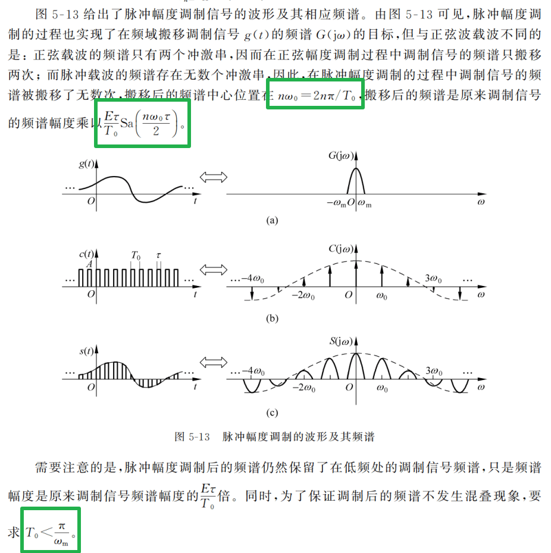

## 解调

### 同步解调


> 同步，即**接收端 c(t) 与发射端同步（****同频同向****）**
> **H****(j****w****)是幅度为 2，截止频率为****w(M)****低通滤波器**
> 通过载波的频率迁移后，再用低通滤波取主周期
> **物理上可实现的低通滤波器**
> 多说无益，上例题
> 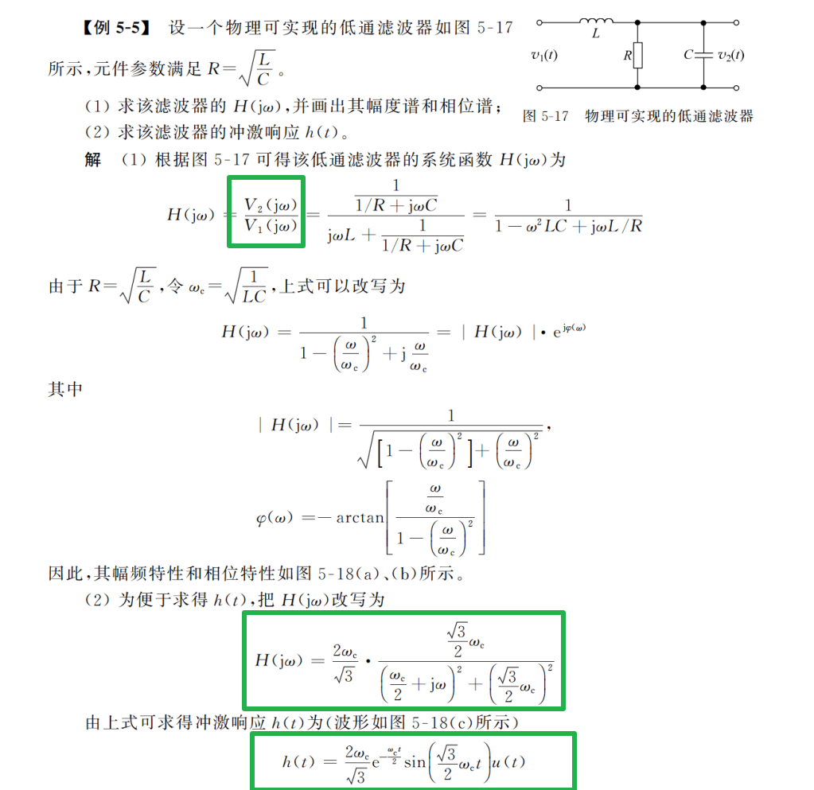

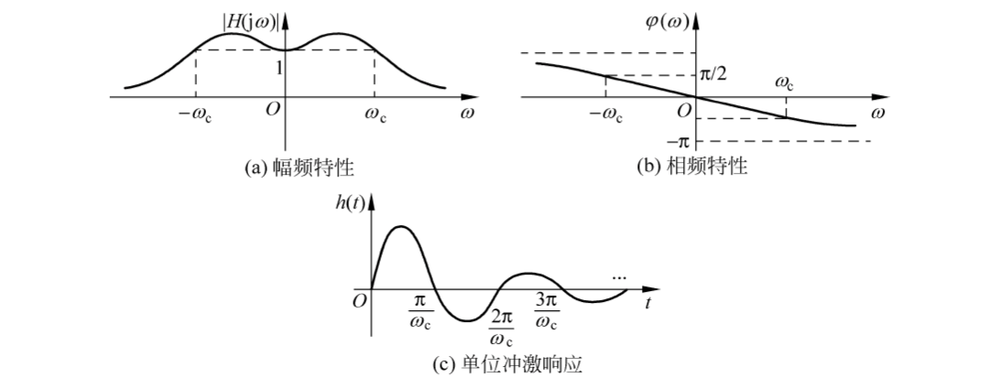

#### 正弦信号下的同步解调

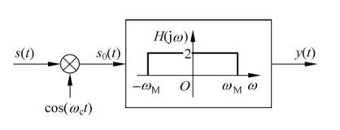

> 若带宽有限，则可用信号 s(t)再次调制相同的**正弦载波**
> 然后再通过一个具有合适截止频率的**理想低通滤波器**就可以了

$$
s_0(t)=\frac{1}{2}g(t)\cos(2\omega_\text{c}t)+\frac{1}{2}g(t)
$$

一样的，看图说话
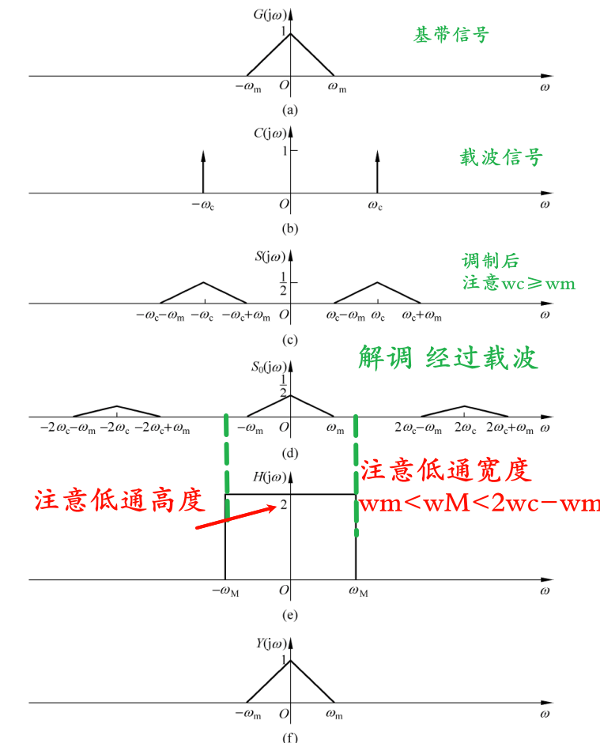

#### SC-AM

> 一毛一样

$$
\begin{aligned}s_{0}(t)&=s(t)\bullet c(t)=[g(t)\bullet c(t)]\bullet c(t)=g(t)\bullet c^2(t)\\&=g(t)\bullet\frac{1+\cos(2\omega_\mathrm{c}t)}2=\frac12g(t)+\frac12g(t)\bullet\cos(2\omega_\mathrm{c}t)\end{aligned}
$$

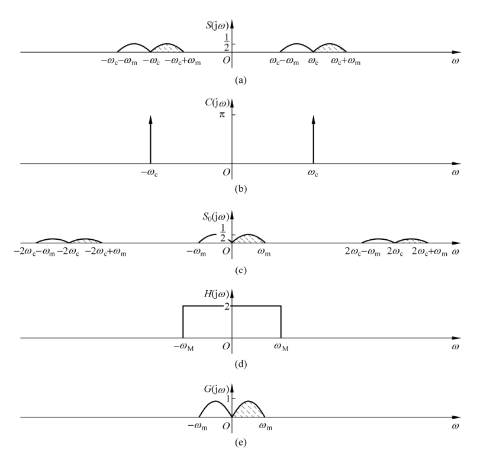

#### AM

> 需要多一个隔直电路来过滤直流分量

$$
\begin{aligned}
s_{0}\left(t\right)& =s(t)\bullet c(t)=[\:g(t)\bullet c(t)\:]\bullet c(t)=[\:A_{0}+x(t)\:]\bullet c^{2}(t)  \\
&=\:[\:A_0+x(t)\:]\cdot\frac{1+\cos(2\omega_\text{c}t)}{2} \\
&=\frac{1}{2}\left[A_{0}+x(t)\right]+\frac{1}{2}\left[A_{0}+x(t)\right]\bullet\cos(2\omega_{\mathrm{c}}t)
\end{aligned}
$$

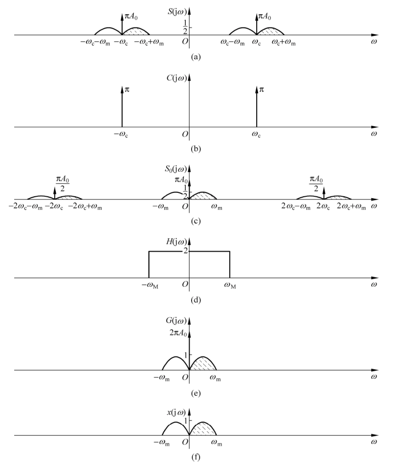

### 非同步解调

> 可以由二极管、电阻、电容来构成包络检波器，通过对包络的分析完成解调
> 成本低，但需要 AM 给一个$A_0$直流来规避失真，对发射机功率有一定需求

### 对 PAM 的解调

> 了解一下
> 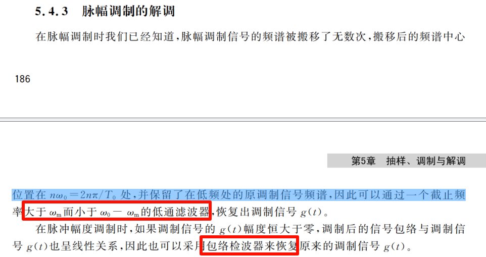

## 频分复用和时分复用

> 类比计网的信道多路复用

### 频分复用

> 通过不同频率的载波信号搬移到不同的频段上
> 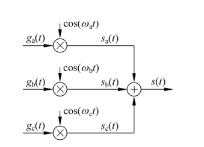
> **看图**
> 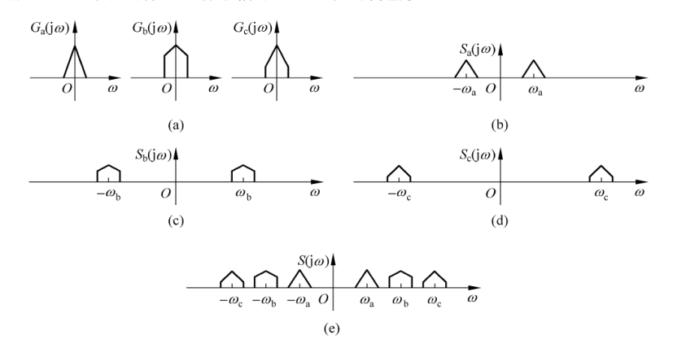
> **解调下分别选取即可**
> 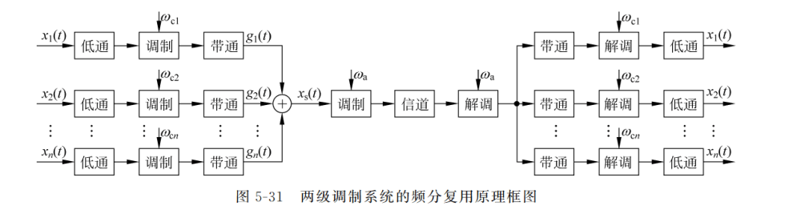
> 对某一信号先给一个带通，后续步骤一致

$$
\mathrm{FT}\{s_\mathrm{a}(t)\bullet\cos(\omega_\mathrm{a}t)\}=\frac{1}{2}G_\mathrm{a}(\mathrm{j}\omega)+\frac{1}{4}[G_\mathrm{a}(\mathrm{j}\omega+2\mathrm{j}\omega_\mathrm{a})+G_\mathrm{a}(\mathrm{j}\omega-2\mathrm{j}\omega_\mathrm{a})\:]
$$

$$
\begin{aligned}s_{\mathrm{a}}(t)\bullet\cos(\omega_{\mathrm{a}}t)&=\:[\:g_{\mathrm{a}}(t)\cos(\omega_{\mathrm{a}}t)\:]\bullet\cos(\omega_{\mathrm{a}}t)\:=\:g_{\mathrm{a}}(t)\:\bullet\:\cos^{2}(\omega_{\mathrm{a}}t)\\&=\frac{1}{2}g_{\mathrm{a}}(t)+\frac{1}{2}g_{\mathrm{a}}(t)\bullet\cos(2\omega_{\mathrm{a}}t)\end{aligned}
$$

### 时分复用

> 分配指定时间段给不同信道
> 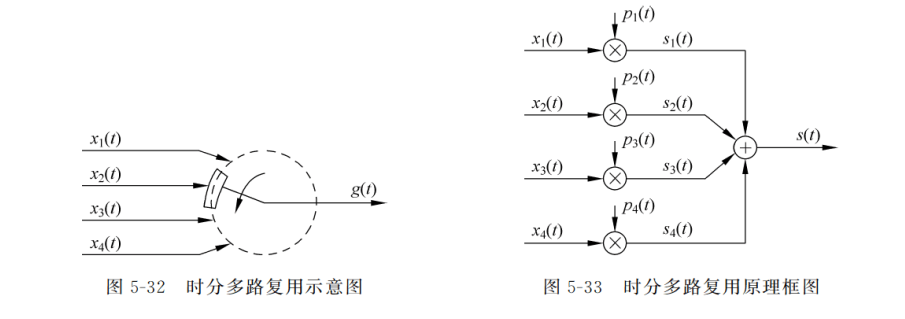

### 比较

Ø **FDM 是用频率来区分同一信道上同时传输的信号，各信号在频域上是分开的，而在时域上是混叠在一起的；**
Ø **TDM 是在时间上区分同一信道上传输的信号，各信号在时域上是分开的，而在频域上是混叠在一起的。 **

# 拉普拉斯变换与连续时间系统

## 拉氏变换

> **解决信号不满足 FT 变换条件（狄利克雷条件）以及 FT 无法求零输入的限制问题**
> **同样的，先给出先决信息以便速查**
> 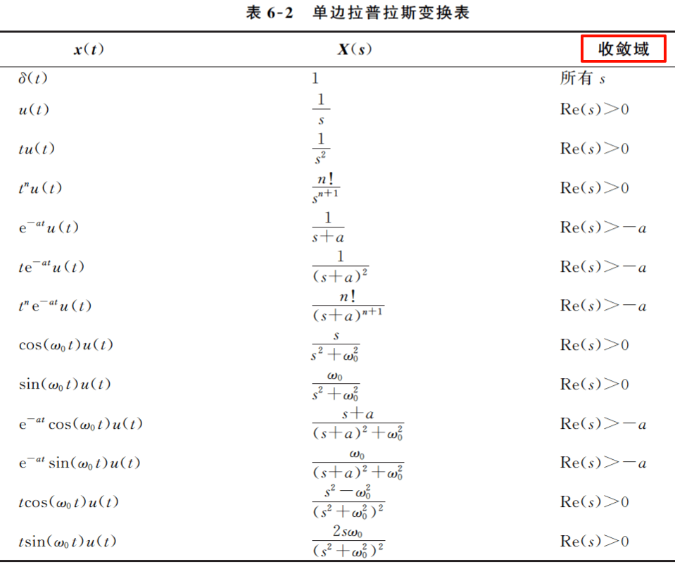
> 

> [!TIP]
> **拉氏变换，就是在原信号的基础上****先乘一个实数的衰减**$e^{-\sigma t}$**,再进行傅里叶变换**

### 概念引入

**类比傅里叶变换，得双边拉普拉斯变换**

$$
X(s)=\int_{-\infty}^{+\infty}x(t)\mathrm{e}^{-st}\mathrm{d}t
$$

**其中**

$$
s=\sigma+j\omega 
$$

因此拉式变换位于复频域（s 域），同时要注意多了 **ROC（收敛域）**
**因绝大多数工程信号为因果系统，故一般考虑单边 LT，即**

$$
X(s)=\int_{0^-}^{+\infty}x(t)\mathrm{e}^{-st}\mathrm{d}t
$$

从 LT 的特点出发 => 可计算完全响应、规避跳变，我们容易得到**单边的起始值为 0-**
同时我们得到 ILT 逆变换

$$
x(t)=\frac1{2\pi}\int_{-\infty}^{+\infty}X(\sigma+\mathrm{j}\omega)\mathrm{e}^{\mathrm{j}\omega t}\mathrm{d}\omega =\frac1{2\pi\mathrm{j}}\int_{\sigma-\mathrm{j}\infty}^{\sigma+\mathrm{j}\infty}X(s)\mathrm{e}^{st}\mathrm{d}s
$$

将$\sigma=0$即为 IFT
**使 LT 存在的**$\sigma$**的取值范围即为 ****ROC（收敛域）**
同时，我们类比 FT 中的 H(jw) {频响函数}，定义 H(s)为**传递函数**

$$
\begin{aligned}y(t)&=h(t)*x(t)\\&=H(s)e^{st}\end{aligned}
$$

由于 LT 的范围扩展到 **负频域｛**$\sigma,jw$**｝面，结合**

$$
X(s)=\frac{N(s)}{D(s)}=\frac{b_0+b_1s+\cdots+b_ms^m}{a_0+a_1s+\cdots+a_ns^n}=K\frac{\prod_{i=1}^m(s-z_i)}{\prod_{j=1}^n(s-p_j)}
$$

### 常见的单边 LT

> 收敛域 ROC 见上

1. $\delta(t)$ <- LT -> 1
2. $u(t) $  <- LT -> $\frac{1}{s}$
3. $tu(t) $ <- LT -> $\frac{1}{s^2}$  求导取负，后续同理
4. $\mathrm{e}^{-at}u(t)$ <- LT -> $\frac{1}{a+s}$
5. $t\mathrm{e}^{-at}u(t)$ <- LT -> $\frac{1}{(a+s)^2}$ 诶，怎么回事，**【*t ==  求导取负】**
6. $$
   \cos\omega_0tx(t)u(t)\overset{\mathrm{LT}}{\operatorname*{\leftarrow\rightarrow}}\frac12[X(s-\mathrm{j}\omega_0)+X(s+\mathrm{j}\omega_0)]
   $$
7. $cos(\omega_0t)u(t)$ <- LT -> $\frac s{s^2+\omega_0^2}$
8. $sin(\omega_0t)u(t)$ <- LT -> $\frac{\omega_0}{s^2+\omega_0^2}$
9. $\mathrm{e}^{-at}cos(\omega_0t)u(t)$ <- LT -> 您猜怎么着 $\frac{s+a}{(s+a)^2+\omega_0^2}$,频移特性喔。再看$\mathrm{e}^{-at}u(t)$ ，O.o

### LT 性质

1. **线性**
   可线性求和，叠加
2. **时移**

$$
x(t-t_0)\overset{\mathrm{LT}}{\operatorname*{\leftarrow\to}}X(s)\mathrm{e}^{-st_0},t_0>0
$$

## ILT

> 定义
> 一般不用

$$
x(t)=\frac1{2\pi}\int_{-\infty}^{+\infty}X(\sigma+\mathrm{j}\omega)\mathrm{e}^{\mathrm{j}\omega t}\mathrm{d}\omega =\frac1{2\pi\mathrm{j}}\int_{\sigma-\mathrm{j}\infty}^{\sigma+\mathrm{j}\infty}X(s)\mathrm{e}^{st}\mathrm{d}s
$$

注意与 IFT 的区别

### 常见类型

> 分式
> 拆拆拆，分母 s 都为一次，再待定系数，或者用 **留数【高阶情况下拆分好用】**
>
> $$
> \frac{1}{(m-1)!}\lim_{z\to z_{0}}\frac{d^{m-1}}{dz^{m-1}}[(z-z)^{m}f(z)]
> $$
>
> **共轭复数极点上的分子也是共轭的**

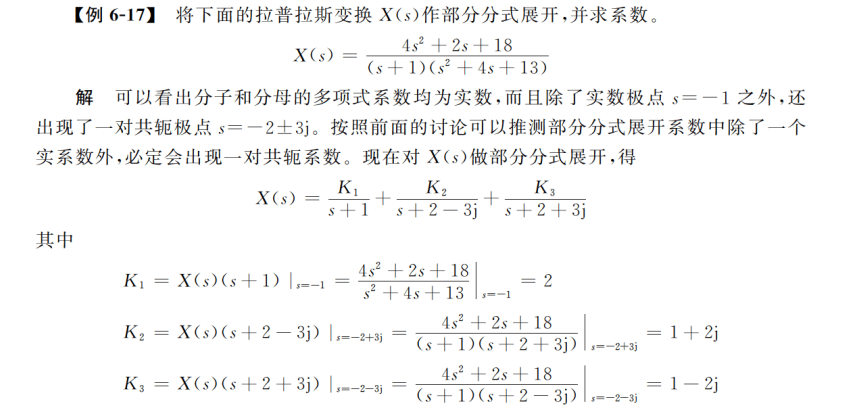

**正经解法**

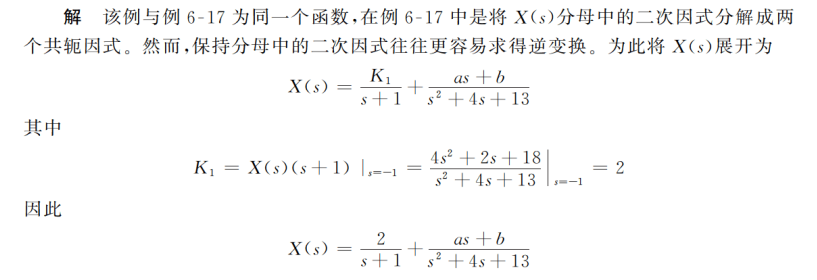

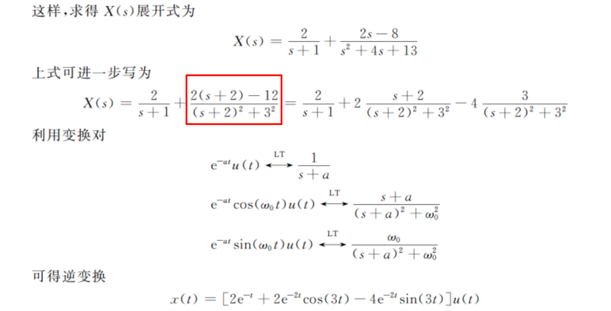

> 重极点，需要由高到低展开

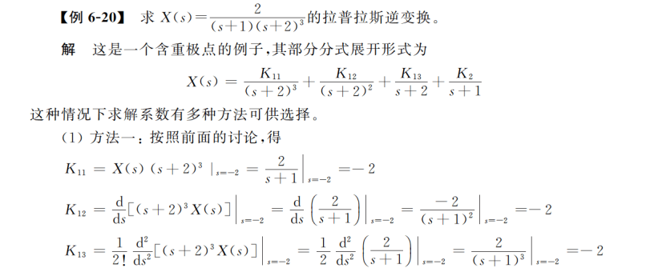

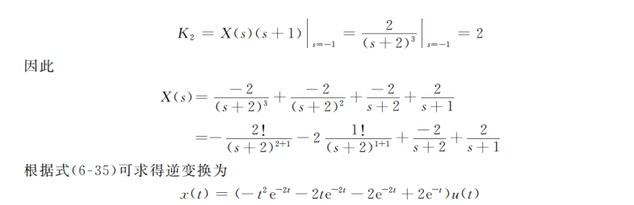

也可用下面的方法求解

> 假分数，需要用 长除法 化为真分数


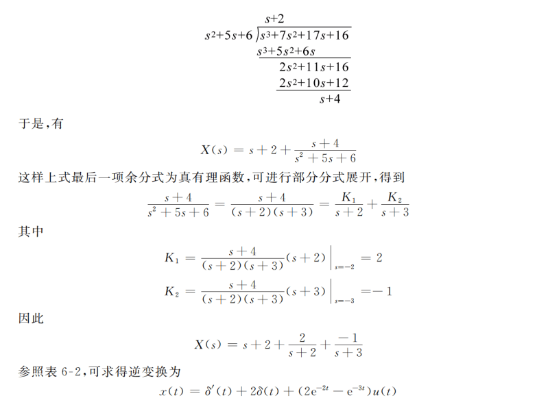

> 包含 e 的时移，拆开，放一边

> 如果有$X(s)=\frac{X_1(s)}{1-\mathrm{e}^{-sT}}$这样的开关
> 不提供例题，见书上 6-23

## 用 LT 解微分方程

> 回答了为什么可以解零输入响应

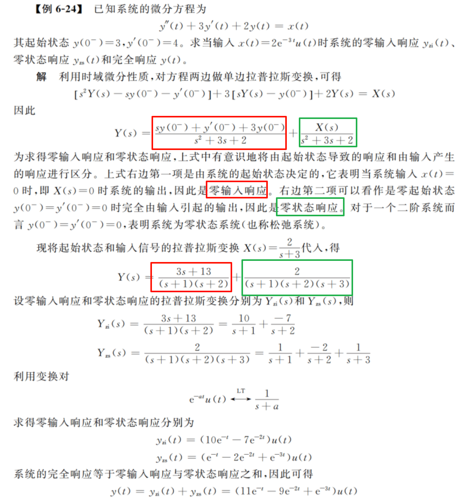

> 无需考虑 0+ 跳变

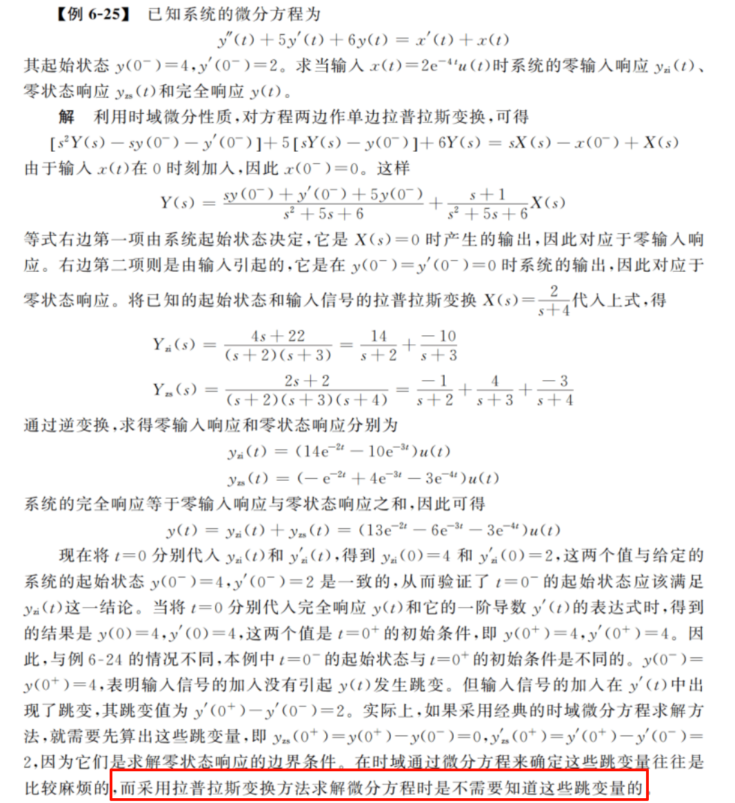

> 若直接给 0+ 也行，但注意 x0+

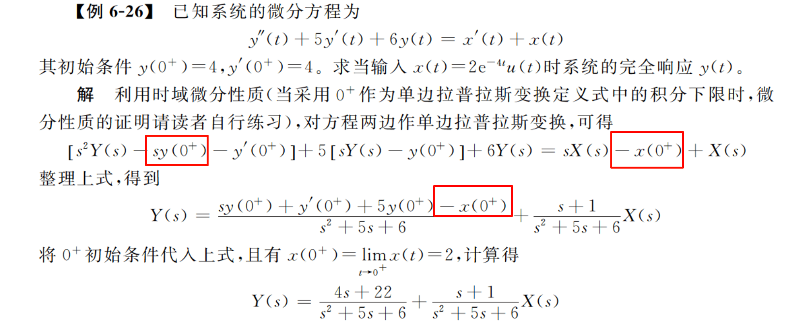

## 电路中的 s 域求解

> [!TIP]

#### 求电流的解法

1. $$
   I(t) = \frac{U}{R_{eq}}
   $$

$$
2. **U **通过 KVL 去解
	1. 其中，电容和电感都可等效为 **电压源+感抗**
	2. 注意，电容的电压源方向与流经电流方向相反
3. 等效电阻通过等效模型求解

**下面的公式可以不用管，重点关注例题**

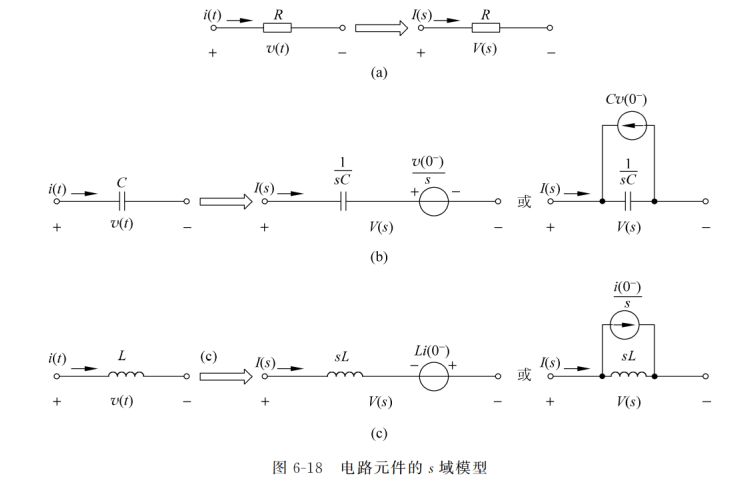
#### 电阻的 s 域等效模型
$$V(s)=RI(s)
$$

#### 电容的 s 域等效模型

有微分方程

$$
i(t)=C\frac{\mathrm{d}v(t)}{\mathrm{d}t}
$$

得 s 域有

$$
I(s)=sCV(s)-Cv(0^-)
$$

或者

$$
V(s)=\frac{1}{sC}I(s)+\frac{v(0^-)}{s}
$$

#### 电感的 s 域等效模型

同理有

$$
V(s)=sLI(s)-Li(0^{-})
$$

或者

$$
I(s)=\frac1{sL}V(s)+\frac{i(0^-)}s
$$

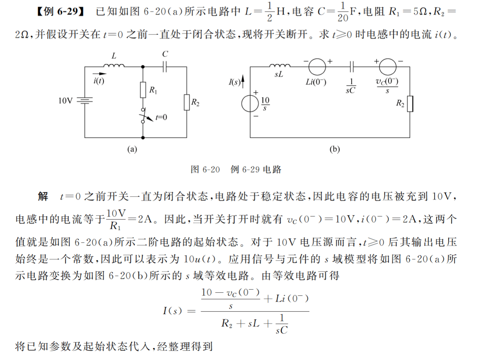

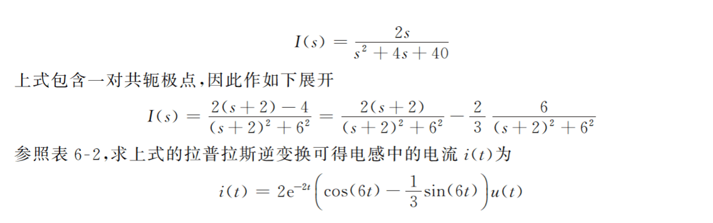

## 双边 LT

> 就注意一点
> **ROC**
> **双边 LT 一定是带状的**
> 求左边信号
> 如$e^{-2t}u(-t) = e^{2(-t)}u(-t)<-->\frac{1}{-s-2}$
> 【其实就是加个负号】
> 反向同理

### ROC 特性与双边性质

```
**不包括任何极点，即以极点作为边界**
**一定呈现为带状而非开域**
```

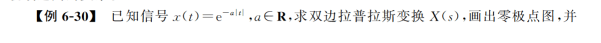
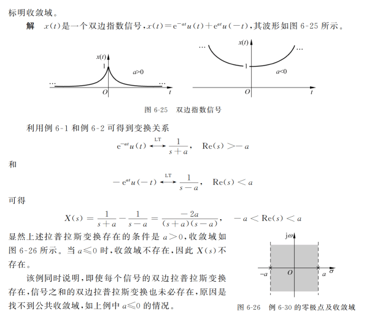

> [!TIP]
> 对 ROC 的影响：
> **线性叠加和卷积 需要 取交集**
> 频移收敛域也移，尺度变换$aR_x$
> 时移 / 微分不影响
> **积分 与 右半平面 取交集**
> 【逆变换】

## LTI 的系统函数 H(s) 与性质

> 套壳罢了，直接上例题

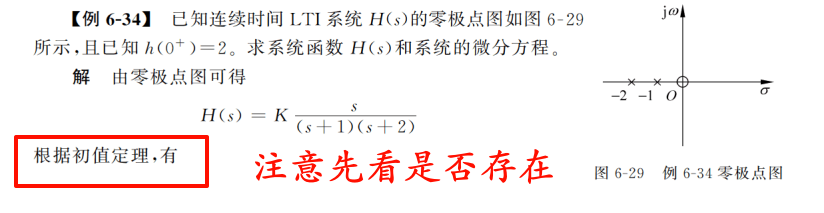

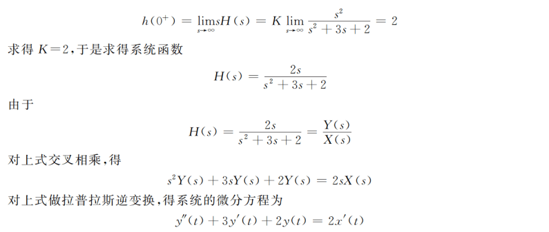

【**因果性**】

#### 强迫响应的求解

> 稳态响应可以是强迫响应，反之不成立
> 即为求解带有指数衰减的问题
> 从**定义出发 **$y(t)=H(s)\operatorname{e}^{st}$
> 也是一样，找极点代入即可

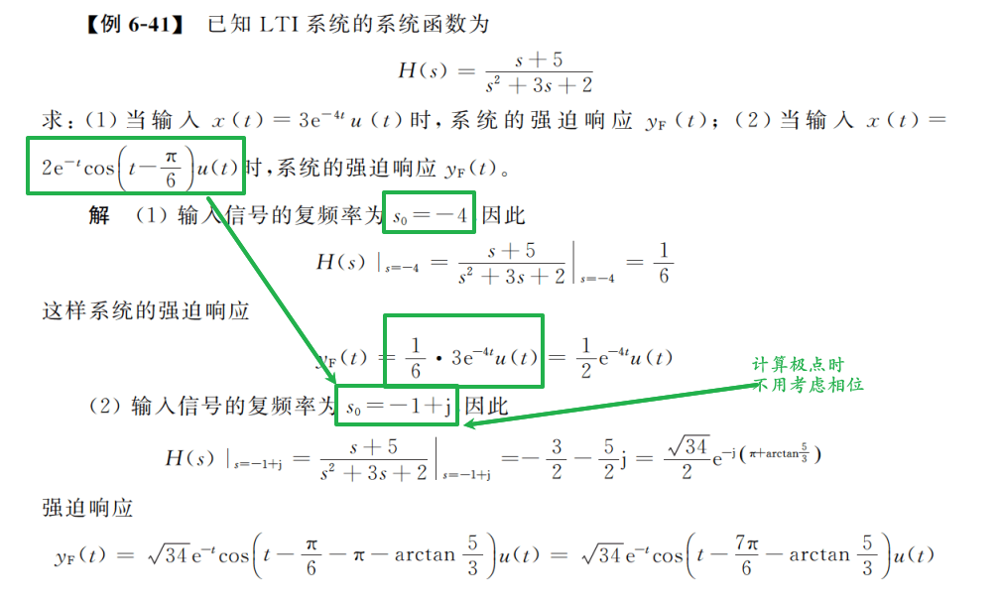

> [!TIP]

#### 有时拿来求 $y(0^-)$ = $H(0) x(0^-)$

## 框图表示

### 三种基本组态

> 对于反馈系统，有
>
> $$
> Y(s)\:=\:H_1(s)\:[\:X(s)+H_2(s)Y(s)\:]
> $$
>
> 整理得到图中式子
> 分别为串联、并联和反馈
> 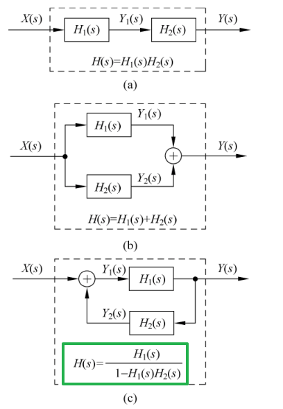
> 【积分器的框图表示】
> 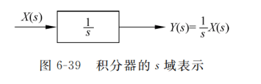
> 类比微分方程，其实就是一样的，s 的阶次即为几阶微分方程
> 【例 6-44】 说明 s 域 与此前的框图有所不同
> **方法为：上下同除**$s^n$**直到最高次为 1，此时有几个**$\frac{1}{s}$**就过几个积分器**
> 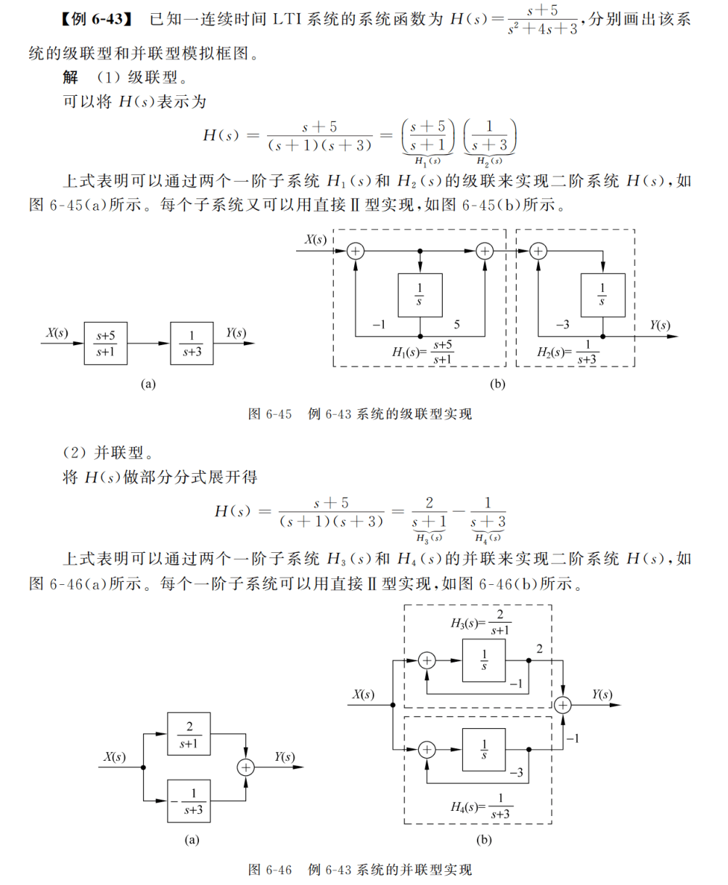
> 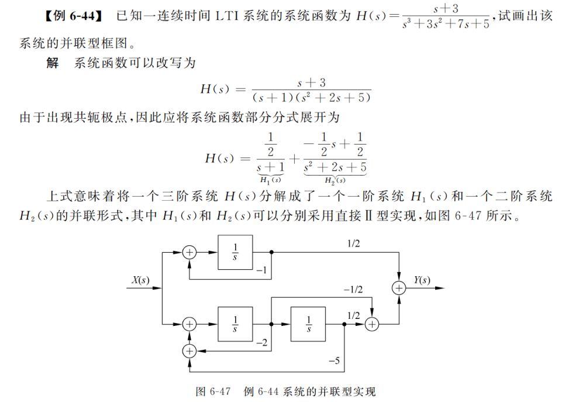

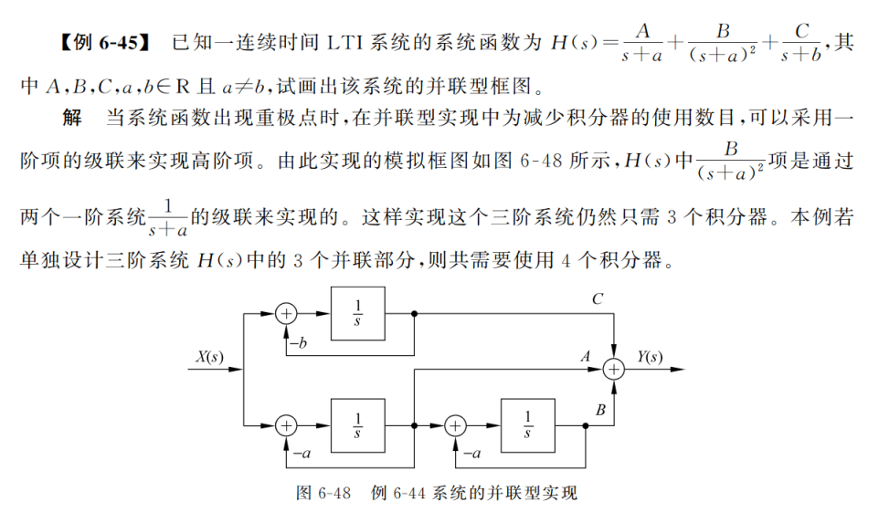

# Z 变换与离散时间系统

> 与拉式变换相似（乘一个指数衰减后求 FT）

> [!TIP]

### 先给结论

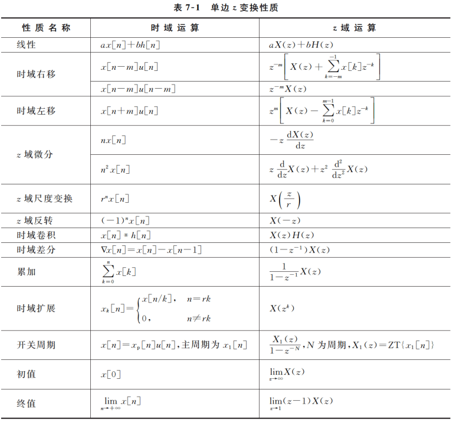


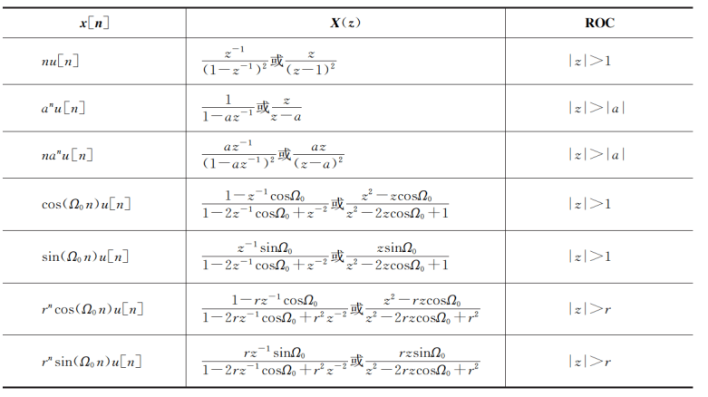

## 概念引入

定义：**乘一个收敛因子后求离散时间下 FT，即**

$$
\mathrm{DTFT}\langle x[n]r^{-n}\rangle=X(r\mathrm{e}^{\mathrm{i}\Omega})=\sum_{n=-\infty}^{+\infty}x[n]r^{-n}\mathrm{e}^{-\mathrm{j}n\Omega}=\sum_{n=-\infty}^{+\infty}x[n]\:(r\mathrm{e}^{\mathrm{j}\Omega})^{-n} , r>0
$$

**为了方便，令**$z=r\mathrm{e}^{\mathrm{j}\Omega}$**，于是有**

$$
X(z)\:=\:\sum_{n=-\infty}^{+\infty}x[\:n\:]z^{-n}
$$

**同样，也有 本征函数 和 传递函数**

$$
H(z)=\sum_{k=-\infty}^{+\infty}h[k]z^{-k}
$$

**于是有**

$$
y[\:n\:]=H(\:z\:)\: z^{n}
$$

**对于 逆变换 ，有**

$$
x[n]r^{-n}=\mathrm{IDTFT}\langle X(r\mathrm{e}^{\mathrm{i}\Omega})\rangle=\frac{1}{2\pi}\int_{-\pi}^{\pi}X(r\mathrm{e}^{\mathrm{i}\Omega})\mathrm{e}^{\mathrm{i}\Omega n}\mathrm{d}\Omega 
$$

**稍加修改**

$$
x[n]=\frac{1}{2\pi}\int_{-\pi}^{\pi}X(r\mathrm{e}^{\mathrm{j}\Omega})\:(r\mathrm{e}^{\mathrm{j}\Omega})^{n}\mathrm{d}\Omega 
$$

**换元后得线积分形式**

$$
x[n]=\frac{1}{2\pi\mathrm{j}}\oint_{C}X\left(z\right)z^{n-1}\mathrm{d}z
$$

$$
符号\oint_c表示 z 平面内以原点为中心沿闭合围线 C 的逆时针方向的积分。\\ 上式信号x[n]表示成了复指数 z^n 的加权叠加，其权值为\frac1{2\pi\mathrm{i}}X(z)z^{-1}dz。
$$

**同样的，存在 ROC【收敛域】，为复平面内的圆域**

**于是 可得**$Z$**平面和 零极点图**

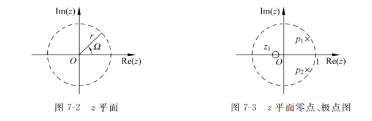

【例题】

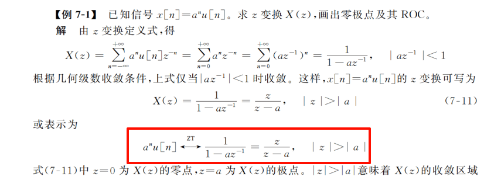

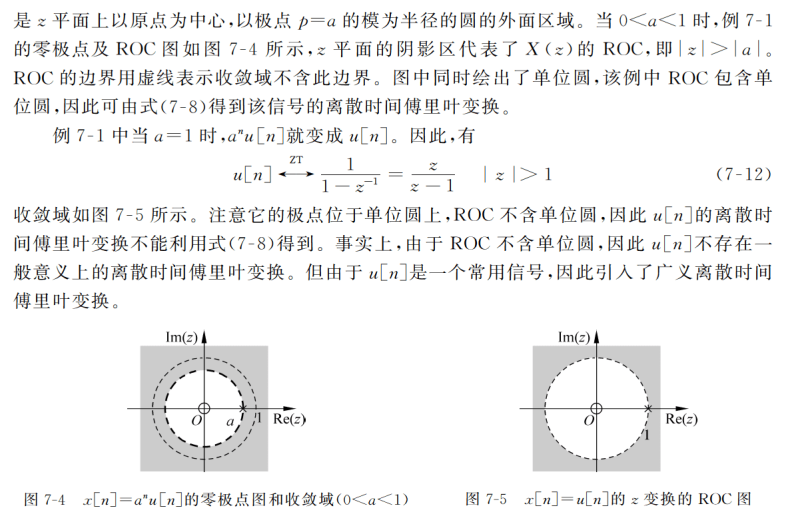

> **即因果系统 ROC 在圆外【拉式 ROC 在右侧】、稳定系统需要包含单位圆【拉式的虚轴】**

> [!TIP]

#### 对于 Z 变换也有双边/单边之分，即逆变换形式由 ROC 变换而不唯一，比如下面的两个变换

1. $$
   a^nu\begin{bmatrix}n\end{bmatrix}\overset{\mathrm{ZT}}{\longleftrightarrow}\frac{1}{1-az^{-1}}=\frac{z}{z-a}
   $$
2. $$
   -a^nu\begin{bmatrix}-n-1\end{bmatrix}\overset{\mathrm{ZT}}{\longleftrightarrow}\frac{1}{1-az^{-1}}=\frac{z}{z-a}
   $$

**二者的 Z 变换一致，但 ROC 不同**

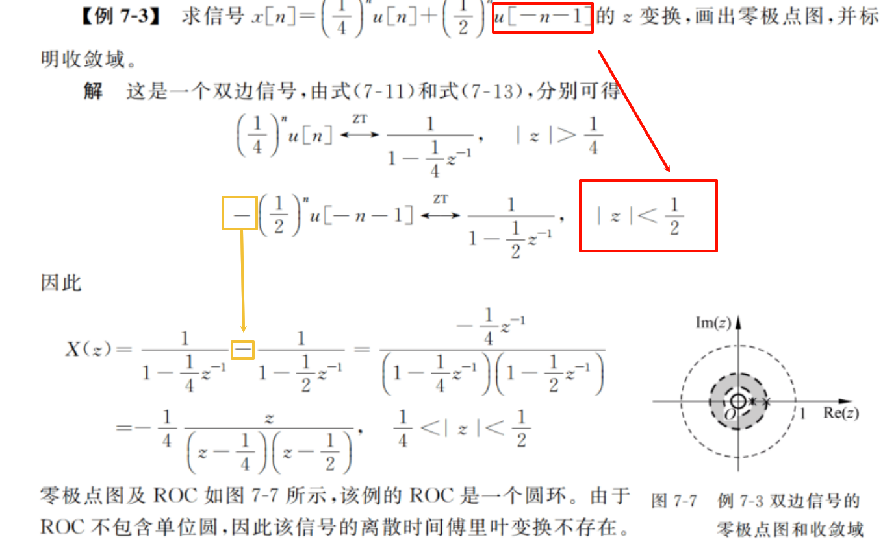

## 典型的单边 Z 变换

> 即对 **因果 **信号的分析

1. $$
   a^nu\begin{bmatrix}n\end{bmatrix}\overset{\mathrm{ZT}}{\longleftrightarrow}\frac{1}{1-az^{-1}}=\frac{z}{z-a}，|z|>|a|
   $$
2. $$
   \delta[n]\longleftrightarrow1\:,\quad\mathrm{ROC}\text{ 为全 }z\text{平面}
   $$
3. $$
   \cos(\Omega_{0}n)u[n]\overset{\mathrm{ZT}}{\operatorname*{\longleftrightarrow}}\frac{1-z^{-1}\cos\Omega_0}{1-2z^{-1}\cos\Omega_0+z^{-2}}=\frac{z(z-\cos\Omega_0)}{z^2-2z\mathrm{cos}\Omega_0+1},\quad\mid z\mid>1
   $$
4. $$
   \sin(\Omega_{0}n)u[n]\overset{\mathrm{ZT}}{\operatorname*{\longleftrightarrow}}\frac{z^{-1}\sin\Omega_0}{1-2z^{-1}\cos\Omega_0+z^{-2}}=\frac{z\sin\Omega_0}{z^2-2z\mathrm{cos}\Omega_0+1},\quad\mid z\mid>1
   $$

   > 三角比较难记，只能多用多练了
   >
5. $$
   u[n]-u[n-N] \overset{\mathrm{ZT}}{\operatorname*{\longleftrightarrow}}\frac{1-z^{-N}}{1-z^{-1}}
   $$

### ZT 性质

> **基于朴素的想法观察离散信号**

#### 线性

注意 ROC 为 **相交** 的部分

$$
ZT\{ax[n]+bh[n]\}=aX(z)+bH(z)
$$

#### 时移

> 向右移动，就是在 X(z)的基础上 **加上  **移动右边的 -m~-1 项，再给一个$Z^{-m}$
> 向左移动，就是在 X(z)的基础上** 减掉**  移到左边的 0~m-1 项，再给一个$Z^{m}$

$$
x[n-m]u[n]\overset{\mathrm{ZT}}{\operatorname*{\longleftrightarrow}}z^{-m}\Bigg[X(z)+\sum_{k=-m}^{-1}x[k]z^{-k}\Bigg]\\x[n+m]u[n]\overset{\mathrm{ZT}}{\operatorname*{\longleftrightarrow}}z^{m}\Bigg[X(z)-\sum_{k=0}^{m-1}x[k]z^{-k}\Bigg]
$$

**特别的，当信号为因果信号时**

$$
x[n-m]u[n]\overset{\mathrm{ZT}}{\longleftrightarrow}z^{-m}X(z)\\x[n+m]u[n]\overset{\mathrm{ZT}}{\longleftrightarrow}z^{m}\Bigg[X(z)-\sum_{k=0}^{m-1}x[k]z^{-k}\Bigg]
$$

$$
x[n-m]u[n-m]\overset{\mathrm{ZT}}{\longleftrightarrow}z^{-m}X(z)
$$

$$
X(z)=\frac{X_1(z)}{1-z^{-N}}=\frac{z^N}{z^N-1}X_1(z)
$$

#### Z 域微分

> **类比拉式变换，*t = 求导取反，不过多了一个* z**

$$
nx\begin{bmatrix}n\end{bmatrix}\overset{\mathrm{zr}}{\longleftrightarrow}-z\:\frac{\mathrm{d}}{\mathrm{d}z}X\left(z\right)
$$

**进一步推广**

$$
n^mx\begin{bmatrix}n\end{bmatrix}\overset{\mathrm{ZT}}{\longleftrightarrow}\left(-z\:\frac{\mathrm{d}}{\mathrm{d}z}\right)^{(m)}X(z)
$$

$$
\text{符号}\bigg(-z\:\frac{\mathrm{d}}{\mathrm{d}z}\bigg)^{(m)}\text{表示}-z\:\frac{\mathrm{d}}{\mathrm{d}z}\bigg(-z\:\frac{\mathrm{d}}{\mathrm{d}z}\bigg(-z\:\frac{\mathrm{d}}{\mathrm{d}z}\cdots\bigg(-z\:\frac{\mathrm{d}}{\mathrm{d}z}X(z)\bigg)\bigg)\bigg)\bigg)\text{共求导 }m\text{ 次}
$$

#### 尺度变换

$$
r^nx\begin{bmatrix}n\end{bmatrix}\overset{\mathrm{ZT}}{\longleftrightarrow}X\biggl(\frac{z}{r}\biggr),\quad r\neq0
$$

**特殊的，有反转性质**

$$
(-1)^nx\begin{bmatrix}n\end{bmatrix}\overset{\mathrm{ZT}}{\longleftrightarrow}X(-z)
$$

**进一步，得到**

$$
\begin{gathered}
r^{n}\cos(\Omega_{0}n)\:u[\:n\:]\longleftrightarrow\frac{1-rz^{-1}\cos\Omega_{0}}{1-2rz^{-1}\cos\Omega_{0}+r^{2}z^{-2}}=\frac{z^{2}-rz\cos\Omega_{0}}{z^{2}-2rz\cos\Omega_{0}+r^{2}} \\
r^{n}\sin\Omega_{0}nu\left[n\right]\overset{\mathrm{ZT}}{\longleftrightarrow}\frac{rz^{-1}\sin\Omega_{0}}{1-2rz^{-1}\cos\Omega_{0}+r^{2}z^{-2}}=\frac{rz\sin\Omega_{0}}{z^{2}-2rz\cos\Omega_{0}+r^{2}} 
\end{gathered}
$$

#### 卷积、差分、累加，时域扩展，自己看上面

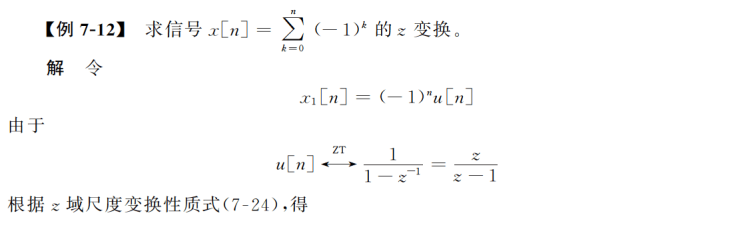


**类似于求和公式**

#### 初值定理

> **与拉式变换有些许区别**
> **初值定理不需要条件**
> **取极限不需要*s**

$$
x[0]=\lim_{z\to\infty}X(z)
$$

#### 终值定理

> 取 1 ，因为要考虑单位圆上的极点（思考复变函数中的域的原点与无穷远处的留数）
> 从 Z 域内分析
> 终值定理只有当 X(z)的**全部极点都落在单位圆之内 =>**$\lim_{n\to+\infty}x[n]=0$
> 或 X(z)在**单位圆上仅在 **$z=1$** 处有一阶极点**(此时 lim x[n]为一常数)才可应用
> **人家｛等式左边｝要存在你才能求啊**

$$
\lim_{n\to+\infty}x[n]=\lim_{z\to1}(z-1)X(z)
$$

## Z 逆变换

> [!TIP]

##### 长除法【yue~】【但如果是幂级数可以试试】

### 部分分式展开法【GOOOOOD】

> **下面介绍第二种方法，就和把大象装进冰箱一样简单**

```
**等式左右 /z**** ，等式左边变成 X(z)/z**
**右侧拆项（和LT一模一样）【注意重根，求导时极点值可能会结果系数】**
**把z乘回去，利用模块直接转换回去**
```

> 上例题

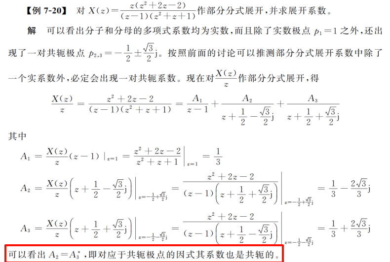

**红色框框处结论与 LT 一致**

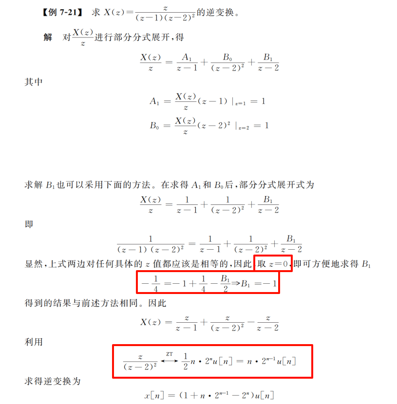

**注意两点：**

1. **如何优雅地求重根**
2. **重根的逆变换**

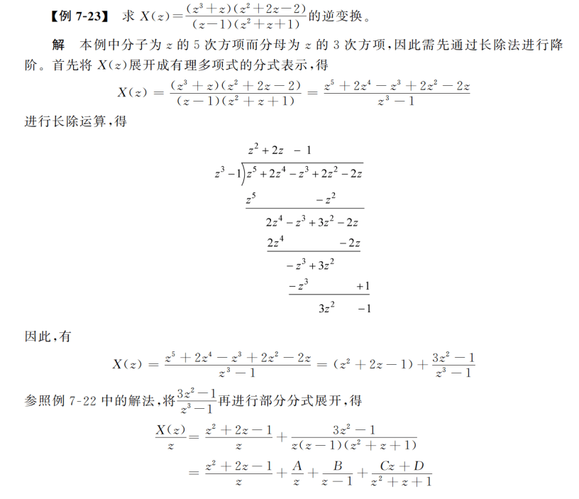
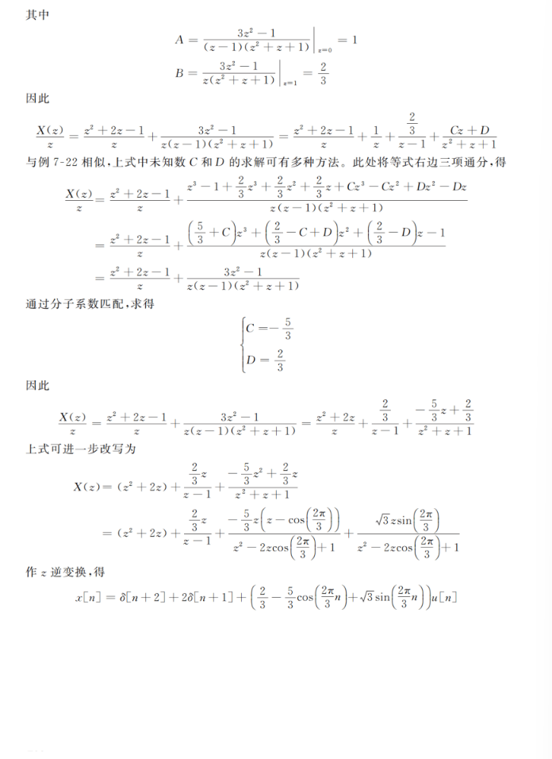

1. **长除法**
2. **留数 + 通分求系数**

## 差分方程的 Z 域求解

> 基于时移特性，有
>
> $$
> x[n-m]u[n] \longleftrightarrow z^{-m}\bigg[X(z)+\sum_{k=-m}^{-1}x[k]z^{-k}\bigg]
> $$
>
> 然后与 LT 一致【又是一样(─.─|||】，分为 零输入 和 零响应

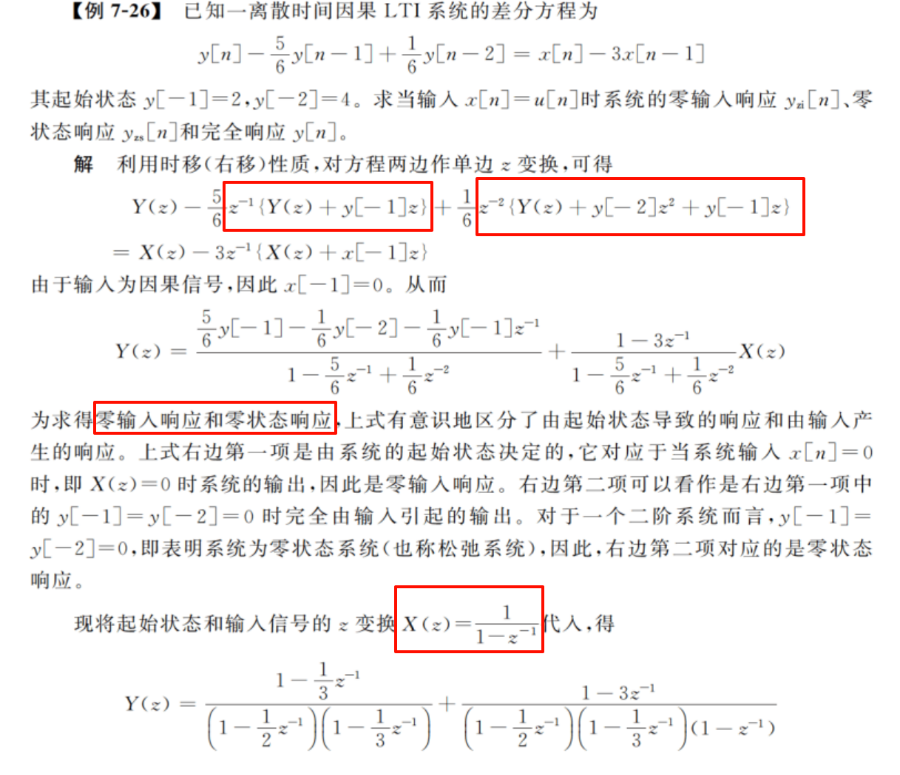
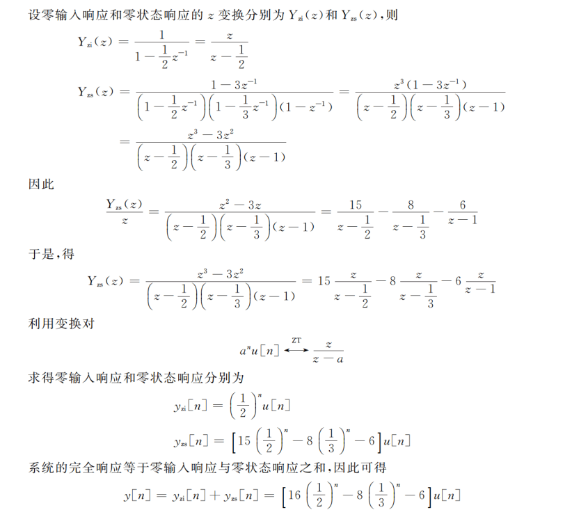

**注意区分 s 域微分方程的微分特性**

**若所给条件为正，则可通过迭代求出起始值**

## 双边 Z 变换

> **ROC**
> 同样的，只不过是将 S 域 向 **左卷曲成一个圆**
> 因果与非因果 【-n-1】 并添负号
>
> $$
> x[n]=a^nu[n] —— x[n]=-a^nu[-n-1]
> $$
>
> ---
>
> 稳定与因果：
> ROC **圆内**则为反因果，**反之因果**
> 稳定看极点位置，在单位圆内｛用脑子想想就能理解，收敛嘛｝

> **给点例题**
> 只说双边的，需要分类讨论

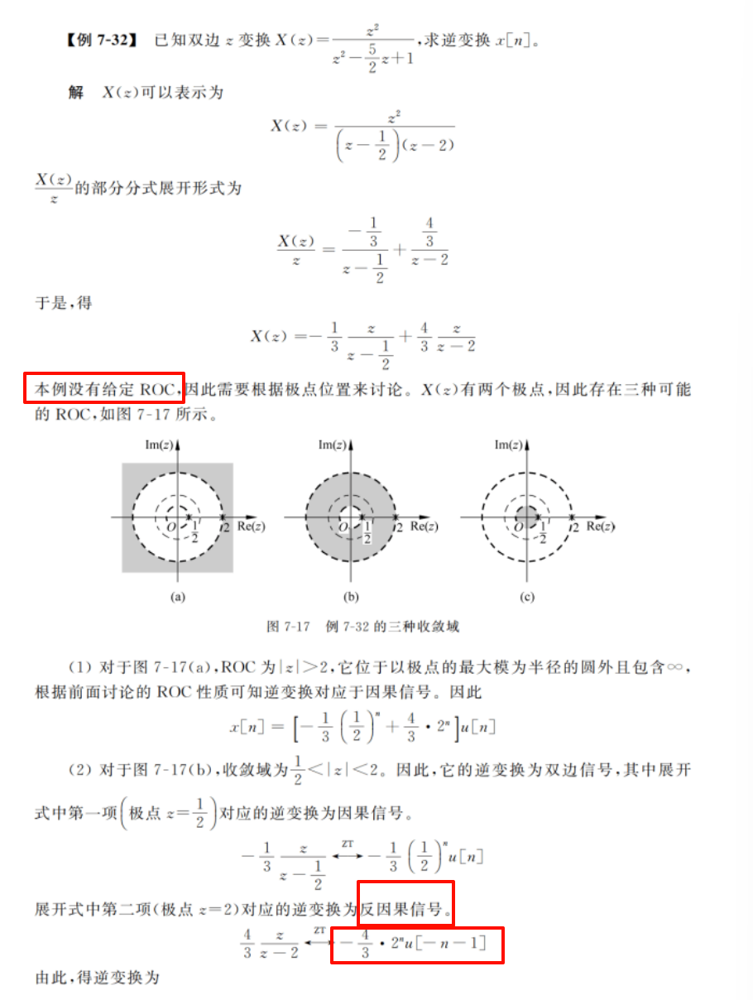
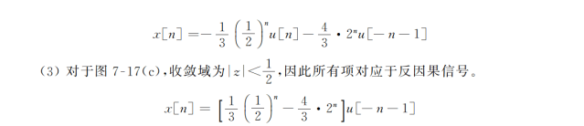

注意反因果信号的逆变换的**不同**

> 给了条件的

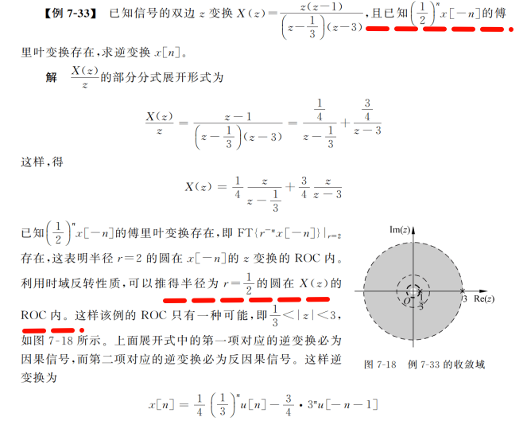

> 利用微分性质的


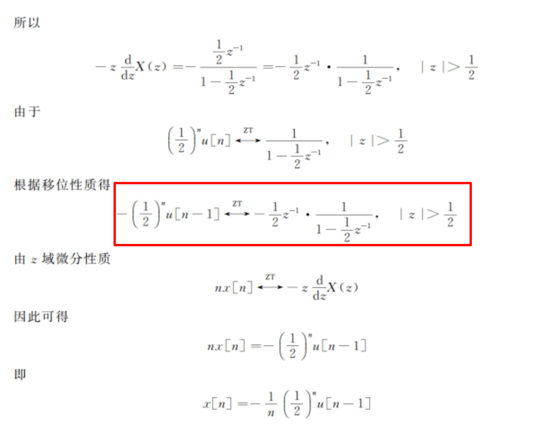

注意标注处为 x[n]u[**n-1**]，前面需要陪凑系数

> [!TIP]

## 补丁：

若形似三角逆变换，但$Z^{-2}$次系数不为 1 考虑${\bold{r}}^n x(z)$

## 系统函数 H(z)

> 已知 h[0] ，可以直接用** 初值定理** 确定 系统函数 的 增益系数 K

> 与 拉氏变换相似，但区别于 从虚轴的 0 到无穷，Z 域为沿着单元转一圈

> 容易得到：$H(z)\mid_{z=\mathrm{e}^{j\Omega}} = H(e^{j\Omega})$

**【则对因果稳定系统，可通过零极点图粗略分析频响】**

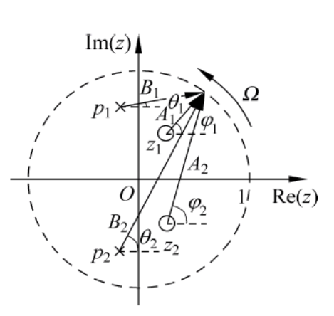

$$
\begin{aligned}&零点矢量：e^{j\Omega}-z_i=A_i\:\mathrm{e}^{\mathrm{j}\varphi_i}\\&极点矢量：e^{j\Omega}-p_i=B_i\:\mathrm{e}^{\mathrm{j}\theta_i}\end{aligned}
$$

**得到了模和幅角，于是可有**

$$
H(\mathrm{j}\omega)\:=\:|\:H(\mathrm{j}\omega)\:|\:\mathrm{e}^{\mathrm{j}\angle H(\mathrm{j}\omega)}
$$

其中

$$
\mid H(\text{j}\omega)\mid=\mid K\mid\frac{\prod\limits_{i=1}^MA_i}{\prod\limits_{i=1}^NB_i}
$$

$$
\angle H(\text{j}\omega)=\sum_{i=1}^M\varphi_i-\sum_{i=1}^N\theta_i
$$

【举个例子】

### 因果正弦信号的响应求解

> 就是求$H(e^{j\Omega_0})$

对系统函数有

$$
H(z)=\frac{N(z)}{D(s)}
$$

给一 cos[wn]u[n]，有

$$
Y(z)=H(z)X(z)=\frac{N(z)}{D(z)}\cdot\frac{z(z-\cos\Omega_0)}{(z-\mathrm{e}^{\mathrm{j}\Omega_0})(z-\mathrm{e}^{-\mathrm{j}\Omega_0})}
$$

展开

$$
Y(s)=\frac{N_1(s)}{D(s)}+\frac{A}{s-e^{\mathrm{j}\Omega_0}}+\frac{A^*}{s-e^{-\mathrm{j}\Omega_0}}
$$

系数 A 为

$$
A=Y(s)(s-\mathrm{j}\omega_0)_{|s=\mathrm{j}\omega_0}=\frac{1}{2}H(e^{\mathrm{j}\Omega_0})
$$

所以，Y(z)为

$$
\frac{Y(z)}{z}=\frac{N_1(z)}{D(z)}+\frac{1}{2}\:\frac{|\:H(\:\mathrm{e}^{\mathrm{i}\Omega_0}\:)\:|\:\mathrm{e}^{\mathrm{i}\angle H(\:\mathrm{e}^{\mathrm{i}\Omega_0}\:)}}{z-\mathrm{e}^{\mathrm{i}\Omega_0}}+\frac{1}{2}\:\frac{|\:H(\:\mathrm{e}^{-\mathrm{j}\Omega_0}\:)\:|\:\mathrm{e}^{-\mathrm{j}\angle H(\:\mathrm{e}^{-\mathrm{j}\Omega_0}\:)}}{z-\mathrm{e}^{-\mathrm{j}\Omega_0}}
$$

作逆变换

$$
y[n]=y_1[n]+\mid H(\mathrm{e}^{\mathrm{j}\Omega_0})\mid\cos(\Omega_0n+\angle H(\mathrm{e}^{\mathrm{j}\Omega_0}))u[n]
$$

若系统稳定,则 D(s)的根都落在 s 平面的左半平面,因此，$\operatorname*{lim}_{t\to+\infty}y_{1}\left(t\right)=0$，即暂态响应 = 0

**稳态响应为**

$$
y_{ss}[n]=\mid H(\mathrm{e}^{\mathrm{j}\Omega_0})\mid\cos(\Omega_0n+\angle H(\mathrm{e}^{\mathrm{j}\Omega_0}))u[n]
$$

观察发现生成额外的频率分量

### 单位阶跃响应的求解

> 就是求$H(1)$

同理有

$$
y[n]=y_1[n]+H(1)u[n]
$$

$$
y_{\mathrm{ss}}[n]=H(1)u[n]
$$

【例子】

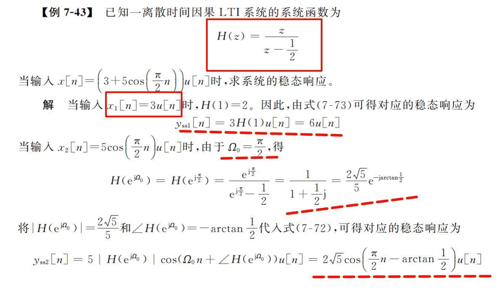


### 强迫响应的求解

> 稳态响应可以是强迫响应，反之不成立
> 也是一样，找极点代入即可
> 实在不行就 Y = H(z)·X(z)

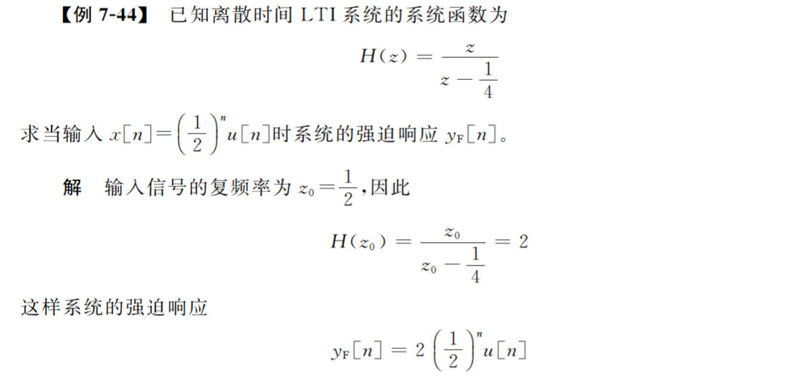

> **但当为极点时，为**$\delta[n-m]$

## 框图表示

> [!TIP]

## 计算切莫跳步，循规蹈矩而已

> 同样的，有串联、并联和反馈三种
> 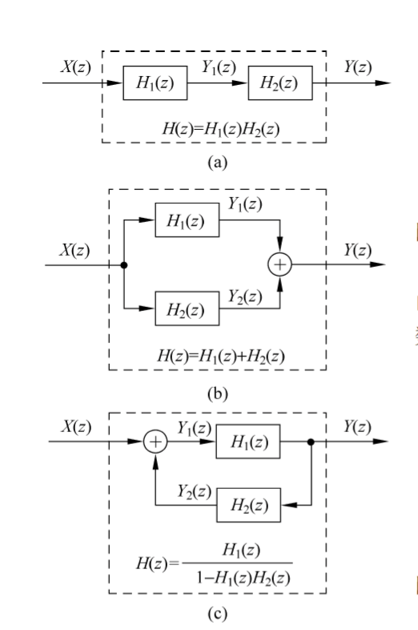

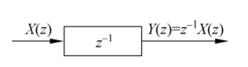

【例题】

> 同样的，需要把 **分母最高次**变成 1

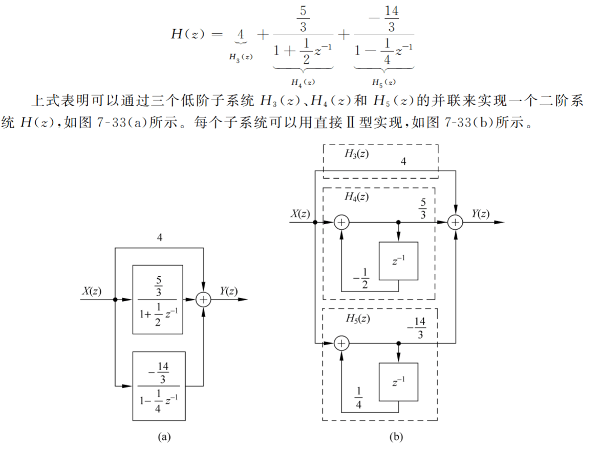

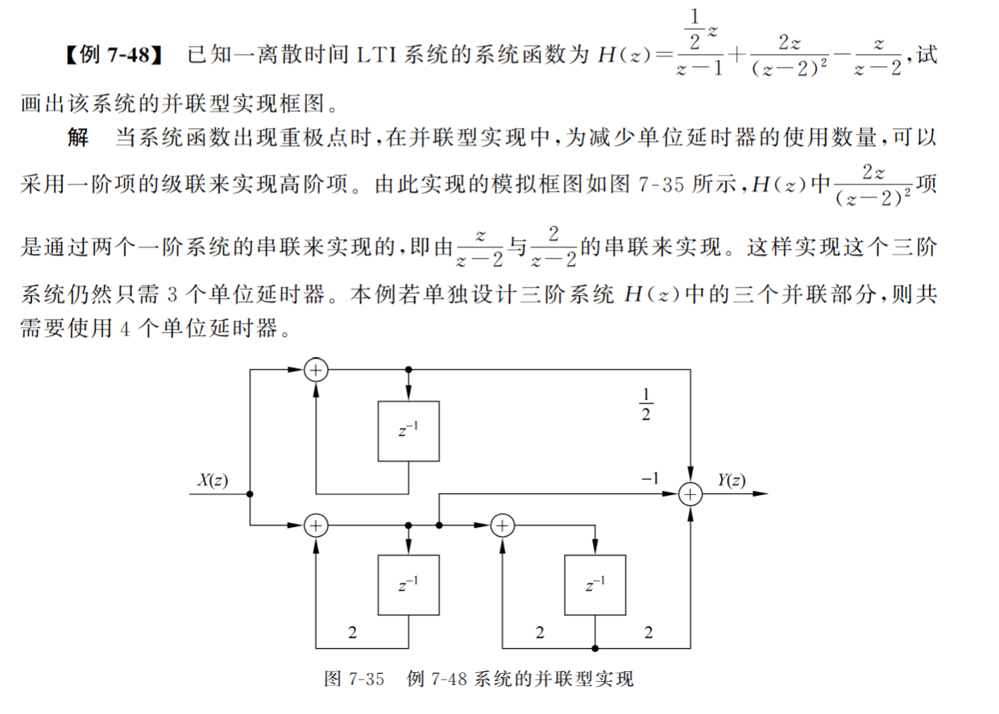
