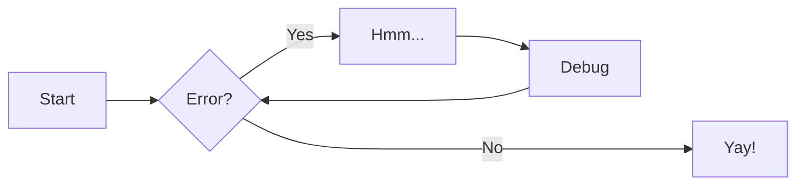
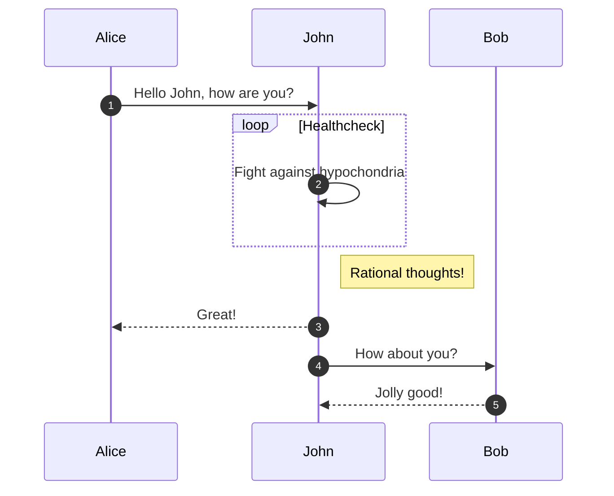
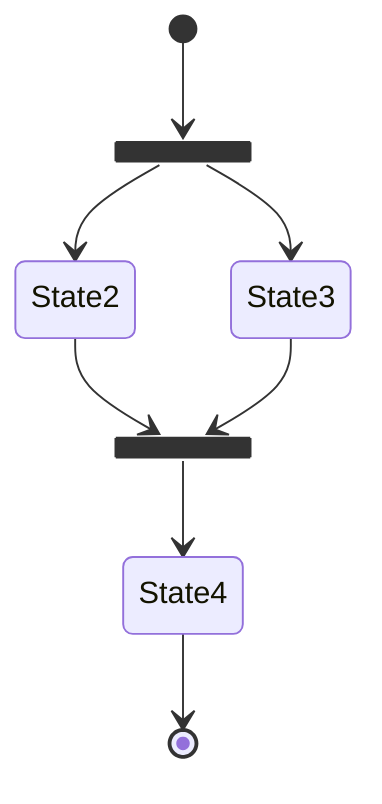
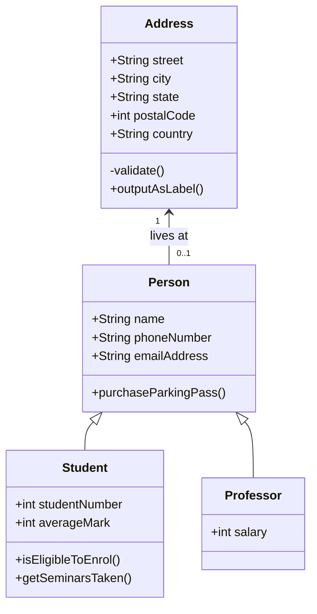

# pyMarkdown 速记

<div id="progress-container">
  <div id="progress-bar"></div>
</div>

!!! note "这是一个pyMarkdown速查表"

---

## markdown基本语法 {: #基本语法 }

>下面是一些常用的markdown操作记录。详细内容请点击 ***[Markdown 基本语法](https://markdown.com.cn/basic-syntax/)***

=== "标题" 

    ```
    # 这是一级标题
    ## 这是二级标题
    ### 这是三级标题
    ```

=== "强调"

    ```
    *斜体*  
    **粗体**  
    ***斜体加粗***  
    --- 分隔符  
    ~~删除线~~  
    ^^下划线^^
    ==高亮==
    ++shift+alt++ +`A`  
    ```
    
    ``` text title="效果"
    Text can be {--deleted--} and replacement text {++added++}. 
    This can also becombined into {~~one~>a single~~} operation. 
    {==Highlighting==} is also possible {>>and comments can be added inline<<}.
    ```
    ++shift+alt++ +`A`  

=== "引用"
    > 引用内容  

=== "列表"

    ```
    1. 有序列表
         - [x] 无序列表
             - [ ] 缩进
    2. 有序列表
    ```

    3. 有序列表
         - [x] 无序列表
              - [ ] 缩进
    4. 有序列表

=== "代码"

    `单行代码`

    ```text title="代码块标题"
        ```text title="代码块标题"  
        多行代码块  
        ```
    ```

    ```py
    print("hello world")
    ```

    ``` text title="Advanced code block"
        ``` py hl_lines="3-5" title="代码块标题"
        def bubble_sort(items):
            for i in range(len(items)):
                for j in range(len(items) - 1 - i):
                    if items[j] > items[j + 1]:
                        items[j], items[j + 1] = items[j + 1], items[j]
        ```
    ```

    ``` py hl_lines="3-5" title="代码块标题"
    def bubble_sort(items):
        for i in range(len(items)):
            for j in range(len(items) - 1 - i):
                if items[j] > items[j + 1]:
                    items[j], items[j + 1] = items[j + 1], items[j]
    ```

=== "链接"

    ```
    ***[链接名称](链接地址 "悬停label")***
    <直链>
    ```
    ***<u>[博客地址](https://dixilog.github.io/ "my blog")</u>***

    <https://dixilog.github.io>

=== "图片"

    ```
    [](超链接地址)
    {style="zoom: 75%;"}
    
    ```
    {style="zoom: 75%;"}


=== "表格"
    
     ```
     | 表头1 | 表头2 | 表头3 |
     | :--- | :---: | -----:|
     | 单元格 <br>  换行 | 单元格2222222 | 单元格333333 |
     | `左对齐` | **居中** | 右对齐 |
     ```
     <center>

     | 表头1 | 表头2 | 表头3 |
     | :--- | :---: | -----:|
     | 单元格 <br>  换行 | 单元格2222222 | 单元格333333 |
     | `左对齐` | **居中** | 右对齐 |

    </center>
=== "脚注"
    
     ```
     Here's a simple footnote.[^1]

     [^1]: 这是你的脚注。
     ```
    
     Here's a simple footnote.[^1]

     [^1]: 这是你的脚注🤣

-----

-----

## markdown-extensions

> display basic usage of markdown in python  
> details click ***[here](https://blog.csdn.net/P_LarT/article/details/55819896?ops_request_misc=&request_id=&biz_id=102&utm_term=python%20markdown&utm_medium=distribute.pc_search_result.none-task-blog-2~all~sobaiduweb~default-4-55819896.nonecase&spm=1018.2226.3001.4187)***  
> 关于 Reference，demo 取自[官方文档](https://squidfunk.github.io/mkdocs-material/reference/)
### 缩写

```text title="缩写格式,也可作注释(中文则需要空格分隔)"
The HTML specification is maintained by the W3C.

*[HTML]: Hyper Text Markup Language
*[W3C]:  World Wide Web Consortium

```

Example：The HTML specification is maintained by the W3C.

*[HTML]: Hyper Text Markup Language
*[W3C]:  World Wide Web Consortium

---

### 标题tag

```text title="标题tag，用于文档内跳转"
# 标题1{: #title1 }

[name_yourself](#title1)
```

Example:[跳转到基本语法部分](#基本语法)

>可能出现单点无效的情况，需要再次单击

---

### 段落缩进

```text title="冒号 + tab "
dixi
:   dixiLOG
    a magic bolg  
    :   what c i say?  
        amazing!
```

dixi
:   dixiLOG
    a magic bolg  
    :   what c i say?  
        amazing!

---

### 高亮块

>可能是使用最多的部分

```text title="格式"
标准高亮块
!!! type "name"
    content

高亮框
!!! type ""
    content

高亮分割线
!!! type ""

```
!!! info "info"
    这里是info块

!!! success "success"
    这里是success块

!!! tip "tip"
    这里是tip块

!!! quote "quote"
    这里是quote块

!!! note "note"
    这里是note块

!!! abstract "abstract"
    这里是abstract块

!!! question "question"
    这里是question块

!!! example "example"
    这里是example块

!!! warning "warning"
    这里是warning块

!!! failure "failure"
    这里是failure块

!!! bug "bug"
    这里是bug块

!!! danger "danger"
    这里是danger块

---

### 折叠与分栏

```text title="折叠格式"
??? type "name"
    content
```

```text title="分栏格式"
=== "name1"
    content

=== "name2"
    content
```

=== "分栏1"
    ??? danger "danger"
        这里是danger块

=== "分栏2"  
    !!! danger "danger"
        这里是danger块

---

### 目录生成

    ```text title="就一行"
    [TOC]
    ```
!!! success "渲染结果"
    [TOC]

---

### 注释

    ```text title="一般注释"
    Lorem ipsum dolor sit amet, 是时(1) consectetur adipiscing elit.
    { .annotate }

    1.  :man_raising_hand: 我`是`**注**^^释^^
    ```

Lorem ipsum dolor sit amet, (1) consectetur adipiscing elit.
{ .annotate }

1.  :man_raising_hand: ~~我~~`是`**注**^^释^^  

---

    ```text title="套娃注释"
    Lorem ipsum dolor sit amet, (1) consectetur adipiscing elit.
    { .annotate }

    1.  :man_raising_hand: I'm an annotation! (1)
        { .annotate }

        1.  :woman_raising_hand: I'm an annotation as well!
    ```

Lorem ipsum dolor sit amet, (1) consectetur adipiscing elit.
    { .annotate }

2.  :man_raising_hand: I'm an annotation! (1)
    { .annotate }

    1.  :woman_raising_hand: I'm an annotation as well!


---

### 按钮

```text title="格式"
[icon search :material-file-find:](https://squidfunk.github.io/mkdocs-material/reference/icons-emojis/#search){ .md-button }
```

[icon search :material-file-find:](https://squidfunk.github.io/mkdocs-material/reference/icons-emojis/#search){ .md-button }

Icon 和 Emojis :point_up_tone1:

---

### 图 diagrams

基于 mermaid 库，支持流程图、时序图、状态机、类图等

> 详细语法参见[开发文档](https://mermaid.nodejs.cn/)

```text title="流程图 Flow chart"
    ``` mermaid
    graph LR
    A[Start] --> B{Error?};
    B -->|Yes| C[Hmm...];
    C --> D[Debug];
    D --> B;
    B ---->|No| E[Yay!];
    ```
```



---

```text title="时序图 Sequence diagram"
    ``` mermaid
    sequenceDiagram
    autonumber
    Alice->>John: Hello John, how are you?
    loop Healthcheck
        John->>John: Fight against hypochondria
    end
    Note right of John: Rational thoughts!
    John-->>Alice: Great!
    John->>Bob: How about you?
    Bob-->>John: Jolly good!
    ```
```



---

```text title="状态机 State diagram"
    ``` mermaid
    stateDiagram-v2
    state fork_state <<fork>>
        [*] --> fork_state
        fork_state --> State2
        fork_state --> State3

        state join_state <<join>>
        State2 --> join_state
        State3 --> join_state
        join_state --> State4
        State4 --> [*]
    ```
```



---

```text title="类图 Class diagram"
    ``` mermaid
    classDiagram
    Person <|-- Student
    Person <|-- Professor
    Person : +String name
    Person : +String phoneNumber
    Person : +String emailAddress
    Person: +purchaseParkingPass()
    Address "1" <-- "0..1" Person:lives at
    class Student{
        +int studentNumber
        +int averageMark
        +isEligibleToEnrol()
        +getSeminarsTaken()
    }
    class Professor{
        +int salary
    }
    class Address{
        +String street
        +String city
        +String state
        +int postalCode
        +String country
        -validate()
        +outputAsLabel()  
    }
    ```
```



---

### Grid

```html title="格式"
<div class="grid cards" markdown>

-   :material-clock-fast:{ .lg .middle } **Set up in 5 minutes**

    ---

    Install [`mkdocs-material`](#) with [`pip`](#) and get up
    and running in minutes

    [:octicons-arrow-right-24: Getting started](#)

-   :fontawesome-brands-markdown:{ .lg .middle } **It's just Markdown**

    ---

    Focus on your content and generate a responsive and searchable static site

    [:octicons-arrow-right-24: Reference](#)

-   :material-format-font:{ .lg .middle } **Made to measure**

    ---

    Change the colors, fonts, language, icons, logo and more with a few lines

    [:octicons-arrow-right-24: Customization](#)

-   :material-scale-balance:{ .lg .middle } **Open Source, MIT**

    ---

    Material for MkDocs is licensed under MIT and available on [GitHub]

    [:octicons-arrow-right-24: License](#)

</div>
```

<div class="grid cards" markdown>

-   :material-clock-fast:{ .lg .middle } **Set up in 5 minutes**

    ---

    Install [`mkdocs-material`](#) with [`pip`](#) and get up
    and running in minutes

    [:octicons-arrow-right-24: Getting started](#)

-   :fontawesome-brands-markdown:{ .lg .middle } **It's just Markdown**

    ---

    Focus on your content and generate a responsive and searchable static site

    [:octicons-arrow-right-24: Reference](#)

-   :material-format-font:{ .lg .middle } **Made to measure**

    ---

    Change the colors, fonts, language, icons, logo and more with a few lines

    [:octicons-arrow-right-24: Customization](#)

-   :material-scale-balance:{ .lg .middle } **Open Source, MIT**

    ---

    Material for MkDocs is licensed under MIT and available on [GitHub]

    [:octicons-arrow-right-24: License](#)

</div>

---

### 公式

simpleTex 扫描复制粘贴即可