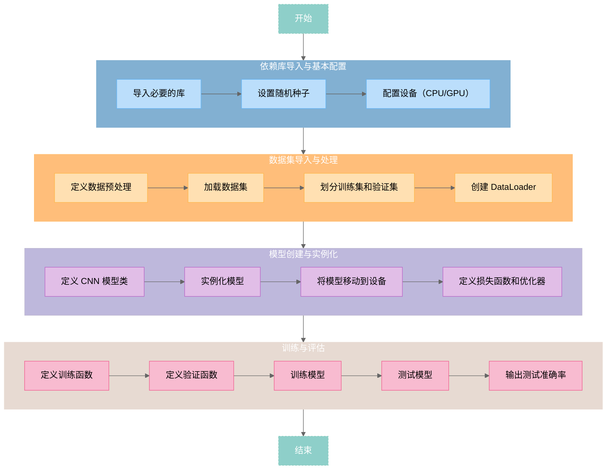

# 基于卷积神经网络的FashionMNIST分类

<div id="progress-container">
  <div id="progress-bar"></div>
</div>

##  写在前面

一直有再探ML的欲望，但一直没啥动力。正好以此次大作业为契机，基于项目督促自己学习

全文分为两个部分：[CNN介绍](#what-is-cnn)与[Fashion MNIST分类实战](#putting-cnn-to-work)

前者除了CNN的一些基本概念说明，还尝试通过逐行代码分析解构基本的机器学习框架

后者则是将理论运用于实践中，但较为粗糙


---

## WHAT IS CNN？

本节对卷积神经网络（Convolutional Neural Network，CNN），在算法与代码两个层面进行介绍。

### CNN 介绍

包括 CNN 基本概念与工作流程。

---


卷积神经网络（CNN）是一种专门用于处理具有网格结构数据（如图像）的深度学习模型。

CNN 的核心思想是通过卷积操作（Convolution Operation）提取图像的局部特征，并通过多层网络结构逐步组合这些特征，最终实现分类、检测等任务。CNN 在计算机视觉领域取得了巨大成功，广泛应用于图像分类（Image Classification）、目标检测（Object Detection）、语义分割（Semantic Segmentation）等任务。

----


#### CNN的一些基本概念

=== "**局部感受野（Local Receptive Field）**"

    CNN 通过卷积核（Filter/Kernel）在输入图像上滑动，每次只关注图像的一个局部区域（称为感受野），而不是整个图像。

    这种局部连接的方式大大减少了参数量，同时保留了图像的局部特征。

    比如，一个 3x3 的卷积核每次只处理输入图像的 3x3 区域。

=== "**权值共享（Weight Sharing）**"

    卷积核在图像上滑动时，使用的是相同的权重参数。这种权值共享机制进一步减少了模型的参数量，并增强了模型对平移不变性（Translation Invariance）的捕捉能力。这使得无论特征出现在图像的哪个位置，卷积核都能检测到它。

=== "**层次化特征提取（Hierarchical Feature Extraction）**"

    CNN 通过多层卷积和池化操作，逐步提取从低级到高级的特征。低级特征（如边缘、纹理）在浅层提取，而高级特征（如物体形状、语义信息）在深层提取。

=== "**非线性激活（Non-linear Activation）**"

    在卷积操作后，通常会使用非线性激活函数（如 ReLU）引入非线性，使模型能够学习更复杂的特征。常用激活函数有ReLU（Rectified Linear Unit）、LeakyReLU、ELU 等。

---


#### 工作流程

根据FashionMNIST数据集特点，介绍本实验使用的CNN模型工作流程，结构图[^1]见图1。

[^1]: 结构图绘制工具：http://alexlenail.me/NN-SVG/LeNet.html


<center style="font-size:14px;color:#C0C0C0;">图1 神经网络结构图</center>

1. **输入图像（Input Image）**  

   - 输入图像的尺寸为 `1@28x28`，表示单通道（灰度）的 28x28 像素图像


2. **第一层卷积（Convolution 1）**

   - 使用 32 个卷积核（Filters），每个卷积核的尺寸为 `3x3`，步长为 1，填充为 1

   - 输入图像经过卷积操作后，生成 32 个特征图（Feature Maps），每个特征图的尺寸为 `28x28`

   - **输出**：`32@28x28`


3. **第一层最大池化（Max-Pool 1）**

   - 对卷积后的特征图进行最大池化操作（Max Pooling），池化窗口尺寸为 `2x2`，步长为 2

- 池化操作将特征图的尺寸减半

  - **输出**：`32@14x14`

4. **第二层卷积（Convolution 2）**

   - 使用 64 个卷积核，每个卷积核的尺寸为 `3x3`，步长为 1，填充为 1

   - 输入为 `32@14x14` 的特征图，经过卷积操作后，生成 64 个特征图，每个特征图的尺寸为 `14x14`

   - **输出**：`64@14x14`


5. **第二层最大池化（Max-Pool 2）**

   - 对卷积后的特征图进行最大池化操作，池化窗口尺寸为 `2x2`，步长为 2

   - 池化操作将特征图的尺寸减半

   - **输出**：`64@7x7`


6. **展平（Flatten）**
   - 将池化后的特征图展平为一维向量

   - 输入为 `64@7x7`，展平后的向量长度为 `64 * 7 * 7 = 3136`
   - **输出**：`1x3136`

7. **第一层全连接（Fully Connected Layer 1）**
   - 将展平后的向量输入全连接层，全连接层的输出尺寸为 `1x128`

   - **输出**：`1x128`

8. **第二层全连接（Fully Connected Layer 2）**

   - 将第一层全连接层的输出输入第二层全连接层，输出尺寸为 `1x10`，表示 10 个类别的概率分布

   - **输出**：`1x10`

---

#### 还有什么？

> CNN的历史副本是不可能通过一个作业全部洞悉的，故最终选择抛出两个具有代表性的模型
>
> 在后续的模型对比中，你还会再看见他们~

=== "ResNet"

    ResNet 是一种基于卷积神经网络（CNN）的深度学习模型，其核心创新是引入了 **残差连接（Residual Connection）** ，使得网络可以构建非常深的网络（如 ResNet-152），并通过残差连接有效地训练这些深层网络，同时避免梯度消失问题。ResNet 在图像分类、目标检测等任务中表现优异，是计算机视觉领域的经典模型之一。

    ResNet 的基本概念包括 **残差块（Residual Block）** 和 **层次化特征提取** 。每个残差块包含两个卷积层和一个跳跃连接（Shortcut Connection），跳跃连接将输入直接加到卷积层的输出上，形成残差学习。通过多个残差块的堆叠，ResNet 能够逐步从图像中提取从低级到高级的特征。

    ResNet 的工作流程可以分为以下几个步骤：首先，通过 **初始卷积层** 对输入图像进行卷积操作，提取初步特征；接着，通过 **残差块堆叠** 逐步提取更复杂的特征；然后，使用 **全局平均池化** 对特征图进行下采样，降低维度；最后，将池化后的特征输入 **全连接层** ，完成分类任务。这种层次化的设计使得 ResNet 在图像分类、目标检测等任务中表现出色。

=== "VIT"

    Transformer 引入图像处理领域，突破了传统卷积神经网络（CNN）的局部感受野限制。ViT 通过自注意力机制（Self-Attention）捕捉图像的全局信息，能够更好地理解图像中的长距离依赖关系。与传统的 CNN 不同，ViT 完全基于 Transformer，不使用卷积操作，这使得它在处理高分辨率图像时表现出色。

    ViT 的基本概念包括 **图像分块（Patch Embedding）** 、 **位置编码（Positional Encoding）和 Transformer 编码器** 。首先，输入图像被分割成固定大小的块（如 16x16），每个块被展平为向量，并通过线性投影映射到嵌入空间。为了保留图像的空间信息，ViT 为每个图像块添加位置编码。随后，使用多层 Transformer 编码器对图像块进行特征提取，每层编码器包含自注意力机制和前馈神经网络。

    ViT 的工作流程可以分为以下几个步骤：首先，将输入图像 **分割成多个小块** ，并将这些块映射到嵌入空间；接着，为每个图像块 **添加位置编码** ，以保留空间信息；然后，通过 **多层 Transformer 编码器** 提取特征；最后，使用 **分类标记（CLS Token）** 的输出进行最终分类。这种基于 Transformer 的设计使得 ViT 在处理复杂图像和全局信息时表现出色，成为计算机视觉领域的重要创新。


!!! note "模型对比"
    两种模型，前者是现代CNN模型的<span style="border-bottom: 1.5px dashed orange;">守门员</span>，另一者则为计算机视觉领域的<span style="border-bottom: 1.5px dashed orange;">革新者</span>  

    在计算机视觉领域各有优势

    ResNet 在<span style="border-bottom: 1.5px dashed orange;">传统任务</span>中表现优异

    而 ViT 在处理<span style="border-bottom: 1.5px dashed orange;">复杂图像和全局信息</span>时表现出色


---

### 最简单的CNN分类模型：逐行解析


旨在厘清ML模型基本架构。

!!! tip "人生苦短，我选python"
    - 本节代码多为demo，可能跑不起来  
    - 带逐行的注释的完整代码见[附录](#_10)


按照惯例，先上图~



<center style="font-size:14px;color:#C0C0C0;">图2 pytorch典型ML代码流程图</center>

> 地图有了，就可以愉快的解构代码一一映射啦[^2]🫡

[^2]: https://github.com/junaidaliop/pytorch-fashionMNIST-tutorial

---

=== "依赖库导入与基本配置"

    > 巧妇难为无米之炊，一个项目往往需要数个功能各异的库协同合作

    **导入必要的库**

    - `torch`：PyTorch 的核心库，用于张量操作和深度学习模型
    - `torch.nn`：PyTorch 的神经网络模块，包含层和损失函数
    - `torch.nn.functional`：包含激活函数等操作
    - `torch.optim`：优化算法模块，如 SGD 和 Adam
    - `torchvision`：用于处理图像数据集和图像变换
    - `DataLoader` 和 `random_split`：用于加载和划分数据集
    - `einops`：用于张量操作的高级库
    - `matplotlib.pyplot`：用于绘制图表
    - `time`：用于计算时间

    ```python title="python"
    import torch
    import torch.nn as nn
    import torch.nn.functional as F
    import torch.optim as optim
    from torchvision import datasets, transforms
    from torch.utils.data import DataLoader, random_split
    from einops import rearrange
    import matplotlib.pyplot as plt
    import time
    ```

    **设置随机种子**

    设置随机种子为 99，确保~~代码复活~~每次运行代码时结果可重复。

    ```python title="python"
    # 固定随机种子
    torch.manual_seed(99)
    ```

    **设备配置**

    这一步是必要的，A卡就老老实实用CPU吧

    ```python title="python"
    # 获取设备（CPU 或 GPU）
    device = "cuda" if torch.cuda.is_available() else "cpu"
    print("Using {} device".format(device))
    ```


=== "数据集导入与处理"

    在介绍数据处理前，先简要说明一下大名鼎鼎的`Fashion MNIST`数据集。

    Fashion MNIST 数据集是 10 个时尚类别的灰度图像集合，每个图像大小为 ==28x28== 像素。它用作经典 MNIST 数据集的替代品。由于服装项目相似，因此它的分类问题比常规 MNIST 数字数据集更具挑战性。

    <center>
    
    

    </center>
    <center style="font-size:14px;color:#C0C0C0;">图3  数据集概览|图源网络</center>

    数据集中每幅图像对应一个0~9的标签，代表十个类别：

    <center>

    | Label | Description |
    | ----- | ----------- |
    | 0     | T-shirt/top |
    | 1     | Trouser     |
    | 2     | Pullover    |
    | 3     | Dress       |
    | 4     | Coat        |
    | 5     | Sandal      |
    | 6     | Shirt       |
    | 7     | Sneaker     |
    | 8     | Bag         |
    | 9     | Ankle boot  |

    </center>
    <center style="font-size:14px;color:#C0C0C0;">表1  Fashion MNIST数据集类别</center>

    **数据预处理**

    - `ToTensor()`：将图像转换为 PyTorch 张量
    - `Normalize((0.5,), (0.5,))`：将像素值从 [0, 1] 归一化到 [-1, 1]

    ```python title="python"
    transform = transforms.Compose([
        transforms.ToTensor(),
        transforms.Normalize((0.5,), (0.5,))  # 归一化到[-1, 1]
    ])
    ```

    **下载数据集**

    - `root='./data'`：数据集存储路径
    - `train=True`：加载训练集|`train=False`：加载测试集
    - `download=True`：如果数据集不存在，则自动下载
    - `transform=transform`：应用定义的数据预处理

    ```python title="python"
    train_dataset = datasets.FashionMNIST(
        root='./data', 
        train=True, 
        download=True, 
        transform=transform
    )
    test_dataset = datasets.FashionMNIST(
        root='./data', 
        train=False, 
        download=True, 
        transform=transform
    )
    ```

    **数据集划分**

    将训练集划分为训练集和验证集：

    - `train_size`：训练集大小（80%）
    - `val_size`：验证集大小（20%）
    - `random_split`：随机划分数据集

    ```python title="python"
    train_size = int(0.8 * len(train_dataset))
    val_size = len(train_dataset) - train_size
    train_dataset, val_dataset = random_split(train_dataset, [train_size, val_size])
    ```

    **创建DataLoader**

    - `batch_size=64`：每次加载 64 张图片
    - `shuffle=True`：训练集打乱顺序，验证集和测试集不打乱

    ```python title="python"
    # 创建DataLoader
    train_loader = DataLoader(train_dataset, batch_size=64, shuffle=True)
    val_loader = DataLoader(val_dataset, batch_size=64, shuffle=False)
    test_loader = DataLoader(test_dataset, batch_size=64, shuffle=False)
    ```
    !!! tip "题外话——数据处理用到的库"

        `torchvision`是 PyTorch 生态系统中的一个库，它提供了一套用于计算机视觉的实用程序。它提供：
        
        - 预训练模型（如 ResNet、VGG 和 AlexNet）
        - 流行的数据集和用于预处理这些数据集的转换
        - 用于创建自定义数据集和数据加载器的实用程序
        
        我们主要用于`torchvision`访问 Fashion MNIST 数据集并对图像应用转换
        
        ---
        
        `torch.utils`是 PyTorch 中的一个实用模块，它提供了多个子模块来协助完成各种任务。
        
        其最常用的子模块之一是`data`，它有助于处理数据集并提供工具来高效地加载和预处理数据。
        
        ---
        
        `DataLoader` `torch.utils.data`是一个包装数据集并提供小批量数据的类。它提供：
        
        - 数据分批：为了更好地优化和更快地进行训练，我们经常对小批量数据进行训练，而不是对整个数据集进行训练
        - 混洗：在每个时期开始时随机地重新排序训练数据，以减少模型方差
        - 并行加载：使用多线程在后台准备批次，确保 GPU/CPU 保持繁忙
        
        > 说人话，洗牌的🤪

=== "模型创建与实例化"

    以最典型的CNN为例，不涉及Dropout。工作流程在[上一节](#_2)已有所说明。

    **定义CNN模型类**

    - `conv1`：第一层卷积，输入通道 1，输出通道 32，卷积核大小 3x3
    - `conv2`：第二层卷积，输入通道 32，输出通道 64，卷积核大小 3x3
    - `fc1`：全连接层，输入大小为 64*7*7，输出大小为 128
    - `fc2`：全连接层，输入大小为 128，输出大小为 10（对应 10 个类别）

    ```python title="python"
    class CNN(nn.Module):
        def __init__(self):
            super(CNN, self).__init__()
            self.conv1 = nn.Conv2d(1, 32, kernel_size=3, stride=1, padding=1)
            self.conv2 = nn.Conv2d(32, 64, kernel_size=3, stride=1, padding=1)
            self.fc1 = nn.Linear(64 * 7 * 7, 128)
            self.fc2 = nn.Linear(128, 10)
    ```

    **前向传播**

    有以下过程：

    - 通过卷积层和 ReLU 激活函数提取特征
    - 通过最大池化层下采样
    - 将特征展平为一维向量
    - 通过全连接层和 ReLU 激活函数进行分类
    - 返回最终的输出

    ```python title="python"
    def forward(self, x):
        x = F.relu(self.conv1(x))
        x = F.max_pool2d(x, 2)
        x = F.relu(self.conv2(x))
        x = F.max_pool2d(x, 2)
        x = x.view(x.size(0), -1)
        x = F.relu(self.fc1(x))
        x = self.fc2(x)
        return x
    ```

    **模型实例化**

    即创建模型的一个实例并将其传输到适当的设备（CPU 或 GPU）

    ```python title="python"
    model = CNN().to(device)
    ```

    **优化器与损失函数**

    - 优化器：Adam 优化器是常用的，可在训练期间调整学习率
    - 损失函数：由于这是一个分类任务，我们使用交叉熵损失

    ```python title="python"
    optimizer = torch.optim.Adam(model.parameters(), lr=0.001)
    criterion = nn.CrossEntropyLoss()
    ```

    !!! tip "题外话——优化器与损失函数的选择"

        **优化器**

        优化器是根据损失函数的梯度来调整模型权重的算法。目标是最小化损失。有几种可用的优化器：

        1. **SGD（随机梯度下降）**：这是梯度下降算法的基本形式。它使用损失函数对每个权重的梯度来更新模型的权重。
        - 使用：`torch.optim.SGD(model.parameters(), lr=learning_rate)`
        2. **动量**：SGD 的一种变体，它考虑到了前面的步骤，有助于加速收敛并避免局部最小值。
        - 使用：`torch.optim.SGD(model.parameters(), lr=learning_rate, momentum=0.9)`
        3. **Adam**：结合了 SGD 的另外两个扩展，即 AdaGrad 和 RMSProp 的优点。它根据历史梯度信息调整每个权重的学习率。
        - 使用：`torch.optim.Adam(model.parameters(), lr=learning_rate)`
        4. **RMSProp**：保持梯度平方的移动平均值，并将梯度除以该平均值的根。
        - 使用：`torch.optim.RMSprop(model.parameters(), lr=learning_rate)`

        ---

        **损失函数**

        1. **交叉熵损失**：用于多类分类。它量化了预测概率分布和实际分布之间的差异。
        - 使用：`nn.CrossEntropyLoss()`
        2. **二元交叉熵损失**：专门用于二元分类任务。
        - 使用：`nn.BCELoss()`
        3. **Hinge Loss（或 Margin Loss）**：用于“最大边缘”分类，主要用于 SVM。
        - 使用：`nn.HingeEmbeddingLoss()`

        > 根据既定任务因地制宜

=== "模型训练与评估"

    **训练**

    训练神经网络涉及迭代更新其权重以最小化损失函数。此过程通常使用梯度下降优化算法来实现。

    一般包含：

    - **Epochs**：一个epoch代表所有训练样例的一次完整的前向和后向传递。周期数 (num_epochs) 是学习算法遍历整个训练数据集的次数。通常是自定义超参数
    - **模型训练模式**：神经网络可以以不同的模式运行——训练和评估
    - **批处理**：我们通常在一组称为批次的训练示例之后更新权重，而不是在每个训练示例（随机梯度下降）或整个数据集（批量梯度下降）之后更新权重
    - **梯度归零**：在 PyTorch 中，默认情况下梯度会累积。在计算当前批次中的新梯度之前，我们需要将先前的梯度设置为零
    - **前向传递**：输入数据（图像）通过网络逐层传递，直到得到输出。这个过程称为前向传播
    - **计算损失**：一旦我们有了网络的预测（输出），我们就使用损失函数将它们与真实标签进行比较。这可以衡量网络的预测与实际标签的匹配程度
    - **反向传播**：为了更新权重，我们需要知道损失函数相对于每个权重的梯度。向后传递计算这些梯度
    - **更新权重**：优化器根据向后传递中计算的梯度更新权重

    对于数据集中的每个批次重复此循环（前向传递、损失计算、后向传递、权重更新）。


    ```python title="python"
    # 迭代次数
    num_epochs = 1

    # Start the training loop
    for epoch in range(num_epochs):
        # 将模型设置为训练模式
        model.train()
        size = len(trainloader.dataset)
        # 迭代每批训练数据
        for batch, (images, labels) in enumerate(trainloader):
            # 将图像和标签移动到计算设备（CPU 或 GPU）
            images, labels = images.to(device), labels.to(device)   
            # 清除上一次迭代的梯度
            optimizer.zero_grad()  
            # 前向传递：将图像传递给模型以获得预测输出
            outputs = model(images)
            # 计算预测输出和真实标签之间的损失
            loss = criterion(outputs, labels)
            # 向后传递：计算损失 w.r.t 的梯度。模型参数
            loss.backward() 
            # 更新模型参数
            optimizer.step()
            # Print the loss every 100 batches
            if batch % 100 == 0:
                loss, current = loss.item(), batch * len(images)
                print(f"loss: {loss:>7f}  [{current:>5d}/{size:>5d}]")
    ```

    **评估（测试）**

    一旦我们的模型训练完成，评估其在未知数据上的表现就至关重要。

    - 使用测试集评估准确度与泛用性
    - 打印报告与绘制结果（如果你愿意的话）

    ```python title="python"
    import numpy as np
    # 将模型设置为评估模式
    model.eval()
    # 用于存储所有预测和真实标签的列表
    all_preds = []
    all_labels = []
    # 使用 torch.no_grad() 计算梯度
    with torch.no_grad():
        for images, labels in testloader:
            images, labels = images.to(device), labels.to(device)
            # 将图像传递给模型以获取预测
            outputs = model(images)
            # 获取具有最大概率的类作为预测类
            _, predicted = torch.max(outputs, 1)
            # 使用真实标签和预测计算混淆矩阵
            all_preds.extend(predicted.cpu().numpy())
            # 使用此批次中的真实标签扩展all_labels列表
            all_labels.extend(labels.cpu().numpy())
    # 打印报告
    # 绘制结果
    ```

## Putting CNN to Work

> 多说无益，在电脑风扇呼啸之前，你永远无法真切感受到ML的魅力！

!!! info "MY ENVIRONMENT"

     1. **Anaconda**：[环境管理器](https://anaconda.org/)，base八宝粥破坏者
     2. **Python**：最好是Python 3.x
     3. **PyTorch 和 torchvision**：[PyTorch](https://pytorch.org/) 是一个开源机器学习库，torchvision 提供计算机视觉的数据集和模型
     4. **Jupyter Notebook**：[交互式环境](https://jupyter.org/)，基于Vscode编译器
     5. **NumPy**：Python 中的数值运算库
     6. **scikit-learn**：Python 中的机器学习库。我们将使用它来获取性能指标
     7. **Seaborn 和 Matplotlib**：Python 中的可视化库
     8. **CUDA（可选）**：如果您有兼容的 NVIDIA GPU，则可以安装 CUDA 以实现 PyTorch 的 GPU 加速

!!! tip "可能需要的："

     - [Anaconda + Pytorch 超详细安装教程](https://blog.csdn.net/qq_45057249/article/details/130438318)
     - [conda常用命令：从入门到入土](https://blog.csdn.net/chenxy_bwave/article/details/119996001)
     - 对于`pip/pipx`下载，若遇到下载速度过慢，不妨给定镜像源（通常是清华/阿里），即

     ```powershell title="powershell"
     pip install torch -i https://pypi.tuna.tsinghua.edu.cn/simple
     ```

     - 非大项目，建议转战`Vscode`，ALL IN ONE它不香嘛😜

---

### RUNNING！

本节将从两个方面 ~~拷打~~ 测试CNN

- 控制模型，改变超参（学习率lr、优化器、激活函数）

  ```python title="python"
  # 定义不同的参数组合
  learning_rates = [0.001, 0.01, 0.1]
  optimizers = [optim.Adam, optim.SGD]
  activation_functions = [F.relu, F.leaky_relu]
  ```

- 控制超参，改变模型

  ```python title="python"
  # 定义模型列表
  models = {
      'CNN': CNN().to(device),
      'ResNet': ResNet().to(device),
      'ViT': ViT().to(device)
  }
  ```

=== "The Impact of Hyperparameters on Model Performance"

    **训练与测试结果**

    <center>

    {style="zoom:60%;"}

    </center>

    <center style="font-size:14px;color:#C0C0C0;">图4 不同超参下的模型性能结果对比</center>

    <center>

    | Learning Rate | Optimizer | Activation Function | Training Time (s) | Inference Time (ms) | Test Loss | Test Accuracy | Parameters | Model Size (Bytes) |
    | :-----------: | :-------: | :-----------------: | :---------------: | :-----------------: | :-------: | :-----------: | :--------: | :----------------: |
    |     0.001     |   Adam    |        relu         |      241.59       |        0.103        |  0.3053   |    0.9134     |   421642   |      1686568       |
    |     0.001     |   Adam    |     leaky_relu      |      240.98       |        0.106        |  0.2808   |    0.9161     |   421642   |      1686568       |
    |     0.001     |    SGD    |        relu         |      244.02       |        0.105        |  0.5782   |    0.7879     |   421642   |      1686568       |
    |     0.001     |    SGD    |     leaky_relu      |      245.92       |        0.107        |  0.5764   |    0.7905     |   421642   |      1686568       |
    |     0.01      |   Adam    |        relu         |      253.14       |        0.114        |  0.3572   |    0.8729     |   421642   |      1686568       |
    |     0.01      |   Adam    |     leaky_relu      |      267.85       |        0.115        |  0.3834   |    0.8640     |   421642   |      1686568       |
    |     0.01      |    SGD    |        relu         |      277.47       |        0.122        |  0.3529   |    0.8718     |   421642   |      1686568       |
    |     0.01      |    SGD    |     leaky_relu      |      273.44       |        0.119        |  0.3508   |    0.8704     |   421642   |      1686568       |
    |      0.1      |   Adam    |        relu         |      278.61       |        0.123        |  2.3124   |    0.1000     |   421642   |      1686568       |
    |      0.1      |   Adam    |     leaky_relu      |      258.18       |        0.105        |  2.3089   |    0.1000     |   421642   |      1686568       |
    |      0.1      |    SGD    |        relu         |      249.44       |        0.117        |  0.2546   |    0.9131     |   421642   |      1686568       |
    |      0.1      |    SGD    |     leaky_relu      |      252.32       |        0.110        |  0.2749   |    0.9087     |   421642   |      1686568       |

    </center>

    <center style="font-size:14px;color:#C0C0C0;">表2 不同超参下的模型测试结果与复杂度计算</center>


    **不同学习率对Loss的影响**

    **低学习率（如0.001）**：

    - 低学习率使模型每次更新的步幅较小，导致训练过程较稳定，但需要更多迭代次数才能收敛
    - 优势：能避免梯度爆炸或不稳定收敛
    - 缺点：训练时间长

    **高学习率（如0.1）**：

    - 高学习率使每次权重更新幅度较大，可能导致Loss在最优值附近振荡甚至发散
    - 实验中的验证集Loss较大波动，说明模型未能有效学习目标函数

    **最佳学习率（0.001）**：

    - 稳定下降且最终Loss最低，证明其兼顾了收敛速度和准确性。

    ------

    **不同优化器对Loss的影响**

    **Adam优化器**：

    - Adam结合了动量与自适应学习率的优点，能自动调整每个参数的学习率，特别在非凸优化问题中表现良好
    - 实验中，Adam收敛速度快，Loss曲线陡峭下降，验证集Loss也较低
    - 在高学习率时崩坏，不能使用

    **SGD优化器**：

    - SGD采用固定学习率，优化过程依赖于梯度的全局方向。
    - 在实验中，SGD表现出收敛慢的特性，训练时间较长，但在高lr时表现出更稳定更优秀的特性。

    ------

    **不同激活函数对Loss的影响**

    **ReLU激活函数**：

    - ReLU对正值保持线性，而对负值输出0，计算高效且收敛速度快
    - 实验中，ReLU的训练和验证Loss曲线平滑下降，且验证Loss较低，表明模型学到了有效的特征

    **Leaky ReLU激活函数**：

    - Leaky ReLU在负值区域提供了微小的负斜率，避免了“神经元死亡”的问题
    - 实验中，Leaky ReLU的验证Loss在初期低于ReLU，但中后期波动较大，可能因较复杂的负值梯度学习带来不稳定

    ------


    **测试Loss和准确率（Test Accuracy）**：

    - `lr=0.001, Adam, ReLU`的测试Accuracy最高（0.9134），表明其泛化能力最佳。
    - 高学习率（如0.1）或使用Adam时，测试Loss和准确率下降，说明模型可能过拟合或欠拟合。

    **训练时间与推理时间**：

    - Adam优化器需要更多计算量以动态调整学习率，因此训练时间略长。
    - 推理时间与模型大小无关，因此不同超参数配置下几乎相同。

    ------

    **一些结论**

    1. **学习率的平衡**：0.001提供了最佳的稳定性与收敛效果
    2. **优化器的选择**：Adam表现更快，但SGD在某些场景可实现竞争力
    3. **激活函数的取舍**：ReLU更稳健，而Leaky ReLU有潜在优势但波动较大
    4. **泛化能力**：测试集表现上，`lr=0.001, Adam, ReLU`显然是最优选择


=== "Who Wears the Crown of FashionMNIST Classification"

    **训练与测试结果**

    <center>

    {style="zoom:100%;"}

    </center>

    <center style="font-size:14px;color:#C0C0C0;">图5 不同模型的模型性能结果对比</center>

    | Model      | Parameters   | Model Size (Bytes) | Training Time (s) | Avg. Inference Time per Sample (ms) | Test Loss  | Test Accuracy |
    | ---------- | ------------ | ------------------ | ----------------- | ----------------------------------- | ---------- | ------------- |
    | CNN        | 421642       | 1686568            | 307.94            | 0.139                               | 0.3065     | 0.9116        |
    | **ResNet** | **11172810** | **44691240**       | **6906.87**       | **0.4027**                          | **0.3030** | **0.9189**    |
    | ViT        | 139018       | 556072             | 399.43            | 0.138                               | 2.3033     | 0.1000        |

    <center style="font-size:14px;color:#C0C0C0;">表3 不同模型下的性能结果对比</center>


    **训练和验证损失分析**

    - **CNN** 和 **ResNet** 的训练和验证损失整体较低，且变化趋势较为稳定。随着 epoch 增加，损失逐渐减小，但 **CNN** 训练后期可能出现轻微的过拟合现象（如验证损失略有增加）。
    - **ViT** 的训练损失与验证损失非常高，说明模型可能欠拟合。

    **参数量与模型大小**

    - **CNN** 参数量适中（421,642），表明 CNN 是一个轻量级模型，适合资源受限的设备
    - **ResNet** 的参数量显著增加（11,172,810），模型大小最大（~44.69 MB），表明它更复杂，更适合处理更复杂的数据或任务
    - **ViT** 的参数量最少（139,018），模型大小也最小（~0.56 MB），理论上应该具备更快的推理速度，但其性能可能受到数据集规模和模型架构的影响

    **训练时间与推理时间**

    - **CNN** 的训练时间最短（307.94 秒），推理时间也最低，表明它效率最高，非常适合快速迭代
    - **ResNet** 的训练时间超级长（6,906.87 秒），推理时间也相对较高，但它在分类任务中的表现优异
    - **ViT** 的训练时间则略长于 **CNN**（399.43 秒）

    **测试损失与准确率**

    - **CNN** 和 **ResNet** 在测试集上的损失较低（分别为 0.3065 和 0.3030），且测试准确率较高（分别为 91.16% 和 91.89%）
    - **ResNet** 的表现略优于 **CNN**
    - **ViT** 的测试损失高达 2.3033，测试准确率仅为 10%，这纯纯在猜啊🤣。这表明 **ViT** 未能很好地学习到 FashionMNIST 的特征

    **结论**

    - **CNN** 是一个轻量级、高效的模型，在准确率和推理时间之间取得了良好的平衡。
    - **ResNet** 是一个强大的模型，在性能上稍胜一筹，但需要更多的训练时间和资源。
    - **ViT** 的表现极差，可能是因为 ViT 对训练数据的规模和多样性更为敏感，而 FashionMNIST 数据集较小，导致模型未能充分发挥其优势。

    **==对于 FashionMNIST 数据集==**

    * **ResNet** 是综合表现最好的模型，其次是 **CNN**

    - **ViT** 在该任务中不适用，但在更复杂的任务中可能更有潜力。

    !!! abstract "补充"

        若服务器是A卡，即不能GPU加速，则很明显 **经典CNN** 才是 **Champion** 。相差不多的准确率，等 **ResNet** 跑完人都麻了。

        但实际上基本都是用的GPU，基本上是10倍效率往上，所以相对来说 **ResNet** 的时间是可以接受的，故其为最优解

        当然， **VIT** 本就是拿来划水了，这点样本量都不够剔牙捏~

---

## 最后

这是笔者第一次从查阅资料到实验结果分析，系统地走了一遍。

期末周匆匆忙忙赶出来的，也是漏洞百出。

但总算是结束啦~


## 附录

```python title="python"
# 导入必要的库
import torch  # PyTorch 核心库，用于张量操作和深度学习模型
import torch.nn as nn  # PyTorch 的神经网络模块，包含层和损失函数
import torch.nn.functional as F  # 包含激活函数等操作
import torch.optim as optim  # 优化算法模块，如 SGD 和 Adam
from torchvision import datasets, transforms  # 用于处理图像数据集和图像变换
from torch.utils.data import DataLoader, random_split  # 用于加载和划分数据集
from einops import rearrange  # 用于张量操作的高级库
import matplotlib.pyplot as plt  # 用于绘制图表
import time  # 用于计算时间

# 固定随机种子，确保每次运行代码时结果可重复
torch.manual_seed(99)

# 获取设备（CPU 或 GPU），优先使用 GPU
device = "cuda" if torch.cuda.is_available() else "cpu"
print("Using {} device".format(device))  # 打印当前使用的设备

# 数据预处理
transform = transforms.Compose([
    transforms.ToTensor(),  # 将图像转换为 PyTorch 张量
    transforms.Normalize((0.5,), (0.5,))  # 将像素值从 [0, 1] 归一化到 [-1, 1]
])

# 加载 Fashion MNIST 数据集
train_dataset = datasets.FashionMNIST(
    root='./data',  # 数据集存储路径
    train=True,  # 加载训练集
    download=True,  # 如果数据集不存在，则自动下载
    transform=transform  # 应用定义的数据预处理
)
test_dataset = datasets.FashionMNIST(
    root='./data',  # 数据集存储路径
    train=False,  # 加载测试集
    download=True,  # 如果数据集不存在，则自动下载
    transform=transform  # 应用定义的数据预处理
)

# 划分训练集和验证集
train_size = int(0.8 * len(train_dataset))  # 训练集大小（80%）
val_size = len(train_dataset) - train_size  # 验证集大小（20%）
train_dataset, val_dataset = random_split(train_dataset, [train_size, val_size])  # 随机划分数据集

# 创建 DataLoader
train_loader = DataLoader(train_dataset, batch_size=64, shuffle=True)  # 训练集 DataLoader，打乱顺序
val_loader = DataLoader(val_dataset, batch_size=64, shuffle=False)  # 验证集 DataLoader，不打乱顺序
test_loader = DataLoader(test_dataset, batch_size=64, shuffle=False)  # 测试集 DataLoader，不打乱顺序

# 标准 CNN 模型
class CNN(nn.Module):
    def __init__(self):
        super(CNN, self).__init__()
        # 第一层卷积，输入通道 1，输出通道 32
        self.conv1 = nn.Conv2d(1, 32, kernel_size=3, stride=1, padding=1)  
     	# 第二层卷积，输入通道 32，输出通道 64
        self.conv2 = nn.Conv2d(32, 64, kernel_size=3, stride=1, padding=1) 
     	# 全连接层，输入大小为 64*7*7，输出大小为 128	
        self.fc1 = nn.Linear(64 * 7 * 7, 128) 
        # 全连接层，输入大小为 128，输出大小为 10（对应 10 个类别）
        self.fc2 = nn.Linear(128, 10)  

    def forward(self, x):
        x = F.relu(self.conv1(x))  # 通过第一层卷积和 ReLU 激活函数
        x = F.max_pool2d(x, 2)  # 通过最大池化层下采样
        x = F.relu(self.conv2(x))  # 通过第二层卷积和 ReLU 激活函数
        x = F.max_pool2d(x, 2)  # 通过最大池化层下采样
        x = x.view(x.size(0), -1)  # 将特征展平为一维向量
        x = F.relu(self.fc1(x))  # 通过全连接层和 ReLU 激活函数
        x = self.fc2(x)  # 通过全连接层进行分类
        return x  # 返回最终的输出

# ResNet 模型
class ResidualBlock(nn.Module):
    def __init__(self, in_channels, out_channels, stride=1):
        super(ResidualBlock, self).__init__()
        self.conv1 = nn.Conv2d(in_channels, out_channels, kernel_size=3, stride=stride, padding=1, bias=False)  # 第一层卷积
        self.bn1 = nn.BatchNorm2d(out_channels)  # 批归一化层
        self.conv2 = nn.Conv2d(out_channels, out_channels, kernel_size=3, stride=1, padding=1, bias=False)  # 第二层卷积
        self.bn2 = nn.BatchNorm2d(out_channels)  # 批归一化层

        self.shortcut = nn.Sequential()  # 快捷连接
        if stride != 1 or in_channels != out_channels:  # 如果步长不为 1 或输入输出通道数不同
            self.shortcut = nn.Sequential(
                # 1x1 卷积调整维度
                nn.Conv2d(in_channels, out_channels, kernel_size=1, stride=stride, bias=False),  
                nn.BatchNorm2d(out_channels)  # 批归一化层
            )

    def forward(self, x):
        out = F.relu(self.bn1(self.conv1(x)))  # 通过第一层卷积、批归一化和 ReLU 激活函数
        out = self.bn2(self.conv2(out))  # 通过第二层卷积和批归一化
        out += self.shortcut(x)  # 将快捷连接的结果与卷积结果相加
        out = F.relu(out)  # 通过 ReLU 激活函数
        return out  # 返回最终的输出

class ResNet(nn.Module):
    def __init__(self, num_classes=10):
        super(ResNet, self).__init__()
        self.in_channels = 64  # 初始输入通道数
        self.conv1 = nn.Conv2d(1, 64, kernel_size=3, stride=1, padding=1, bias=False)  # 第一层卷积
        self.bn1 = nn.BatchNorm2d(64)  # 批归一化层
        self.layer1 = self._make_layer(64, 2, stride=1)  # 第一层残差块
        self.layer2 = self._make_layer(128, 2, stride=2)  # 第二层残差块
        self.layer3 = self._make_layer(256, 2, stride=2)  # 第三层残差块
        self.layer4 = self._make_layer(512, 2, stride=2)  # 第四层残差块
        self.linear = nn.Linear(512, num_classes)  # 全连接层，输出大小为 num_classes（10 个类别）

    def _make_layer(self, out_channels, num_blocks, stride):
        strides = [stride] + [1] * (num_blocks - 1)  # 每个残差块的步长
        layers = []  # 存储残差块的列表
        for stride in strides:
            layers.append(ResidualBlock(self.in_channels, out_channels, stride))  # 添加残差块
            self.in_channels = out_channels  # 更新输入通道数
        return nn.Sequential(*layers)  # 返回一个包含多个残差块的序列

    def forward(self, x):
        out = F.relu(self.bn1(self.conv1(x)))  # 通过第一层卷积、批归一化和 ReLU 激活函数
        out = self.layer1(out)  # 通过第一层残差块
        out = self.layer2(out)  # 通过第二层残差块
        out = self.layer3(out)  # 通过第三层残差块
        out = self.layer4(out)  # 通过第四层残差块
        out = F.avg_pool2d(out, 4)  # 通过平均池化层下采样
        out = out.view(out.size(0), -1)  # 将特征展平为一维向量
        out = self.linear(out)  # 通过全连接层进行分类
        return out  # 返回最终的输出

# Vision Transformer (ViT) 模型
class PatchEmbedding(nn.Module):
    def __init__(self, img_size=28, patch_size=7, in_channels=1, embed_dim=64):
        super(PatchEmbedding, self).__init__()
        self.img_size = img_size  # 输入图像大小
        self.patch_size = patch_size  # 每个 patch 的大小
        self.num_patches = (img_size // patch_size) ** 2  # patch 的数量
        # 卷积层，将图像分割为 patch 并投影到嵌入空间
        self.proj = nn.Conv2d(in_channels, embed_dim, kernel_size=patch_size, stride=patch_size)  

    def forward(self, x):
        x = self.proj(x)  # 通过卷积层将图像分割为 patch
        x = rearrange(x, 'b c h w -> b (h w) c')  # 使用 rearrange 将 patch 重新排列为序列
        return x  # 返回最终的输出

class TransformerEncoder(nn.Module):
    def __init__(self, embed_dim=64, num_heads=4, ff_dim=128, dropout=0.1):
        super(TransformerEncoder, self).__init__()
        self.attention = nn.MultiheadAttention(embed_dim, num_heads, dropout=dropout)  # 多头注意力机制
        self.norm1 = nn.LayerNorm(embed_dim)  # 层归一化
        self.norm2 = nn.LayerNorm(embed_dim)  # 层归一化
        self.ffn = nn.Sequential(
            nn.Linear(embed_dim, ff_dim),  # 前馈神经网络的第一层
            nn.GELU(),  # GELU 激活函数
            nn.Linear(ff_dim, embed_dim)  # 前馈神经网络的第二层
        )
        self.dropout = nn.Dropout(dropout)  # 随机丢弃部分神经元，防止过拟合

    def forward(self, x):
        attn_output, _ = self.attention(x, x, x)  # 通过多头注意力机制提取特征
        x = x + self.dropout(attn_output)  # 通过残差连接和 dropout
        x = self.norm1(x)  # 通过层归一化
        ffn_output = self.ffn(x)  # 通过前馈神经网络
        x = x + self.dropout(ffn_output)  # 通过残差连接和 dropout
        x = self.norm2(x)  # 通过层归一化
        return x  # 返回最终的输出

class ViT(nn.Module):
    def __init__(self, img_size=28, patch_size=7, in_channels=1, embed_dim=64, num_heads=4, ff_dim=128, num_layers=4, num_classes=10, dropout=0.1):
        super(ViT, self).__init__()
        # Patch Embedding 层
        self.patch_embedding = PatchEmbedding(img_size, patch_size, in_channels, embed_dim)  
        self.positional_embedding = nn.Parameter(torch.zeros(1, self.patch_embedding.num_patches + 1, embed_dim))  # 位置编码
        self.cls_token = nn.Parameter(torch.zeros(1, 1, embed_dim))  # 分类 token
        self.transformer_encoder = nn.ModuleList([
            # 多个 Transformer 编码器层
            TransformerEncoder(embed_dim, num_heads, ff_dim, dropout) for _ in range(num_layers)  
        ])
        self.norm = nn.LayerNorm(embed_dim)  # 层归一化
        self.fc = nn.Linear(embed_dim, num_classes)  # 全连接层，输出大小为 num_classes（10 个类别）

    def forward(self, x):
        x = self.patch_embedding(x)  # 将图像分割为 patch 并投影到嵌入空间
        cls_token = self.cls_token.expand(x.shape[0], -1, -1)  # 扩展分类 token
        x = torch.cat((cls_token, x), dim=1)  # 将分类 token 和 patch 序列拼接
        x = x + self.positional_embedding  # 添加位置编码
        for layer in self.transformer_encoder:  # 通过多个 Transformer 编码器层
            x = layer(x)
        x = self.norm(x)  # 通过层归一化
        cls_output = x[:, 0]  # 提取分类 token 的输出
        out = self.fc(cls_output)  # 通过全连接层进行分类
        return out  # 返回最终的输出

# 训练函数
def train(model, train_loader, val_loader, criterion, optimizer, epochs=10):
    train_losses, val_losses = [], []  # 存储训练和验证损失
    for epoch in range(epochs):
        model.train()  # 将模型设置为训练模式
        running_loss = 0.0  # 累计每个 epoch 的损失
        for inputs, labels in train_loader:
            inputs, labels = inputs.to(device), labels.to(device)  # 将数据移动到设备（GPU 或 CPU）
            optimizer.zero_grad()  # 清空梯度
            outputs = model(inputs)  # 前向传播，计算输出
            loss = criterion(outputs, labels)  # 计算损失
            loss.backward()  # 反向传播，计算梯度
            optimizer.step()  # 更新模型参数
            running_loss += loss.item()  # 累计损失
        train_losses.append(running_loss / len(train_loader))  # 记录每个 epoch 的训练损失

        model.eval()  # 将模型设置为评估模式
        val_loss = 0.0  # 累计验证集的损失
        with torch.no_grad():  # 不计算梯度，节省内存
            for inputs, labels in val_loader:
                inputs, labels = inputs.to(device), labels.to(device)  # 将数据移动到设备（GPU 或 CPU）
                outputs = model(inputs)  # 前向传播，计算输出
                loss = criterion(outputs, labels)  # 计算损失
                val_loss += loss.item()  # 累计损失
        val_losses.append(val_loss / len(val_loader))  # 记录每个 epoch 的验证损失
        print(f"Epoch {epoch+1}/{epochs}, Train Loss: {train_losses[-1]:.4f}, Val Loss: {val_losses[-1]:.4f}")  # 打印训练和验证损失
    return train_losses, val_losses  # 返回训练和验证损失列表

# 计算参数量
def count_parameters(model):
    return sum(p.numel() for p in model.parameters())  # 计算模型的参数量

# 计算模型大小
def get_model_size(model):
    return sum(p.numel() * p.element_size() for p in model.parameters())  # 计算模型的大小（以字节为单位）

# 计算平均推理时间 per sample
def measure_inference_time(model, test_loader):
    model.eval()  # 将模型设置为评估模式
    total_time = 0.0  # 累计推理时间
    num_samples = 0  # 累计样本数量
    with torch.no_grad():  # 不计算梯度，节省内存
        for inputs, labels in test_loader:
            inputs, labels = inputs.to(device), labels.to(device)  # 将数据移动到设备（GPU 或 CPU）
            start_time = time.time()  # 记录开始时间
            outputs = model(inputs)  # 前向传播，计算输出
            end_time = time.time()  # 记录结束时间
            total_time += end_time - start_time  # 累计推理时间
            num_samples += inputs.size(0)  # 累计样本数量
    avg_time_per_sample = total_time / num_samples  # 计算每个样本的平均推理时间
    return avg_time_per_sample  # 返回平均推理时间

# 评估测试集性能
def evaluate_on_test_set(model, test_loader, criterion):
    model.eval()  # 将模型设置为评估模式
    test_loss = 0.0  # 累计测试集的损失
    correct = 0  # 累计正确预测的数量
    total = 0  # 累计样本数量
    with torch.no_grad():  # 不计算梯度，节省内存
        for inputs, labels in test_loader:
            inputs, labels = inputs.to(device), labels.to(device)  # 将数据移动到设备（GPU 或 CPU）
            outputs = model(inputs)  # 前向传播，计算输出
            loss = criterion(outputs, labels)  # 计算损失
            test_loss += loss.item()  # 累计损失
            _, predicted = outputs.max(1)  # 获取预测结果
            total += labels.size(0)  # 累计样本数量
            correct += predicted.eq(labels).sum().item()  # 累计正确预测的数量
    test_loss /= len(test_loader)  # 计算平均测试损失
    test_accuracy = correct / total  # 计算测试准确率
    return test_loss, test_accuracy  # 返回测试损失和准确率

# 定义不同的参数组合
learning_rates = [0.001, 0.01, 0.1]  # 学习率列表
optimizers = [optim.Adam, optim.SGD]  # 优化器列表
activation_functions = [F.relu, F.leaky_relu]  # 激活函数列表

# 训练和评估不同参数组合
results = {}  # 存储不同参数组合的结果
for lr in learning_rates:
    for opt in optimizers:
        for activation in activation_functions:
            model = CNN().to(device)  # 初始化模型
            optimizer = opt(model.parameters(), lr=lr)  # 初始化优化器
            # 打印当前参数组合
            print(f"Training with lr={lr}, optimizer={opt.__name__}, activation={activation.__name__}") 
            start_time = time.time()  # 记录开始时间
            train_losses, val_losses = train(model, train_loader, val_loader, nn.CrossEntropyLoss(), optimizer, epochs=10)  # 训练模型
            training_time = time.time() - start_time  # 计算训练时间
            # 评估测试集性能
            test_loss, test_accuracy = evaluate_on_test_set(model, test_loader, nn.CrossEntropyLoss()) 
            avg_inference_time = measure_inference_time(model, test_loader)  # 计算平均推理时间
            results[(lr, opt.__name__, activation.__name__)] = {  # 存储结果
                'train_losses': train_losses,
                'val_losses': val_losses,
                'training_time': training_time,
                'test_loss': test_loss,
                'test_accuracy': test_accuracy,
                'parameters': count_parameters(model),
                'model_size': get_model_size(model),
                'avg_inference_time': avg_inference_time
            }

# 绘制所有 Loss 曲线
def plot_all_loss_curves(results):
    fig, axes = plt.subplots(3, 1, figsize=(10, 15))  # 创建一个大图，包含 3 行 1 列的子图

    # 绘制不同学习率的 Loss 曲线
    for lr in learning_rates:
        key = (lr, 'Adam', 'relu')
        if key in results:
            train_losses = results[key]['train_losses']
            val_losses = results[key]['val_losses']
            axes[0].plot(train_losses, label=f'Train Loss (lr={lr})')  # 绘制训练损失曲线
            axes[0].plot(val_losses, label=f'Val Loss (lr={lr})')  # 绘制验证损失曲线
    axes[0].set_title('Loss Curves for Different Learning Rates (Adam, ReLU)')  # 设置标题
    axes[0].set_xlabel('Epoch')  # 设置 x 轴标签
    axes[0].set_ylabel('Loss')  # 设置 y 轴标签
    axes[0].legend()  # 显示图例

    # 绘制不同优化器的 Loss 曲线
    for opt in optimizers:
        key = (0.001, opt.__name__, 'relu')
        if key in results:
            train_losses = results[key]['train_losses']
            val_losses = results[key]['val_losses']
            axes[1].plot(train_losses, label=f'Train Loss (optimizer={opt.__name__})')  # 绘制训练损失曲线
            axes[1].plot(val_losses, label=f'Val Loss (optimizer={opt.__name__})')  # 绘制验证损失曲线
    axes[1].set_title('Loss Curves for Different Optimizers (lr=0.001, ReLU)')  # 设置标题
    axes[1].set_xlabel('Epoch')  # 设置 x 轴标签
    axes[1].set_ylabel('Loss')  # 设置 y 轴标签
    axes[1].legend()  # 显示图例

    # 绘制不同激活函数的 Loss 曲线
    for activation in activation_functions:
        key = (0.001, 'Adam', activation.__name__)
        if key in results:
            train_losses = results[key]['train_losses']
            val_losses = results[key]['val_losses']
            # 绘制训练损失曲线
            axes[2].plot(train_losses, label=f'Train Loss (activation={activation.__name__})')  
            # 绘制验证损失曲线
            axes[2].plot(val_losses, label=f'Val Loss (activation={activation.__name__})')  
    axes[2].set_title('Loss Curves for Different Activation Functions (lr=0.001, Adam)')  # 设置标题
    axes[2].set_xlabel('Epoch')  # 设置 x 轴标签
    axes[2].set_ylabel('Loss')  # 设置 y 轴标签
    axes[2].legend()  # 显示图例

    plt.tight_layout()  # 调整布局，避免重叠
    plt.show()  # 显示绘制的图表

# 调用函数绘制所有 Loss 曲线
plot_all_loss_curves(results)

# 计算复杂度分析
for params, result in results.items():
    print(f"Params: {params}")  # 打印当前参数组合
    print(f"  Training Time: {result['training_time']:.2f} seconds")  # 打印训练时间
    print(f"  Parameters: {result['parameters']}")  # 打印参数量
    print(f"  Model Size: {result['model_size']} bytes")  # 打印模型大小
 	# 打印平均推理时间
    print(f"  Average Inference Time per Sample: {result['avg_inference_time']:.6f} seconds") 
    # 打印测试损失和准确率
    print(f"  Test Loss: {result['test_loss']:.4f}, Test Accuracy: {result['test_accuracy']:.4f}")  
    print()

# 定义模型列表
models = {
    'CNN': CNN().to(device),  # CNN 模型
    'ResNet': ResNet().to(device),  # ResNet 模型
    'ViT': ViT().to(device)  # ViT 模型
}

# 训练和评估每个模型
model_results = {}  # 存储每个模型的结果
for name, model in models.items():
    optimizer = optim.Adam(model.parameters(), lr=0.001)  # 初始化优化器
    print(f"Training {name} model")  # 打印当前模型名称
    start_time = time.time()  # 记录开始时间
    train_losses, val_losses = train(model, train_loader, val_loader, nn.CrossEntropyLoss(), optimizer, epochs=10)  # 训练模型
    training_time = time.time() - start_time  # 计算训练时间
    test_loss, test_accuracy = evaluate_on_test_set(model, test_loader, nn.CrossEntropyLoss())  # 评估测试集性能
    avg_inference_time = measure_inference_time(model, test_loader)  # 计算平均推理时间
    model_results[name] = {  # 存储结果
        'train_losses': train_losses,
        'val_losses': val_losses,
        'training_time': training_time,
        'test_loss': test_loss,
        'test_accuracy': test_accuracy,
        'parameters': count_parameters(model),
        'model_size': get_model_size(model),
        'avg_inference_time': avg_inference_time
    }

# 绘制对比图
for name, result in model_results.items():
    plt.plot(result['train_losses'], label=f'{name} Training Loss')  # 绘制训练损失曲线
    plt.plot(result['val_losses'], label=f'{name} Validation Loss')  # 绘制验证损失曲线
plt.xlabel('Epoch')  # 设置 x 轴标签
plt.ylabel('Loss')  # 设置 y 轴标签
plt.legend()  # 显示图例
plt.show()  # 显示绘制的图表

# 计算复杂度分析
for name, result in model_results.items():
    print(f"{name} - Parameters: {result['parameters']}, Model Size: {result['model_size']} bytes, Training Time: {result['training_time']:.2f} seconds, Average Inference Time per Sample: {result['avg_inference_time']:.6f} seconds, Test Loss: {result['test_loss']:.4f}, Test Accuracy: {result['test_accuracy']:.4f}")  # 打印复杂度分析结果
```


